While Pantheon provides Git repositories for all sites on the platform, many teams need to use an external repository hosted at a provider, like GitHub or Bitbucket, as the canonical version of the site's codebase. This guide will show you how to get up and running using a GitHub account as the example, although the steps should be similar for any provider.

## Git Repositories on Pantheon

The codebase for your site is stored in a Git repository. This includes our versions of Drupal or WordPress core, and all of the custom and contributed modules, plugins, and themes that work together to power your site. It doesn’t include the `/sites/default/files/` or `/wp-content/uploads/` directories, or your database.

This repository will be a clone of one of the **upstreams** running on the platform, usually [Drupal 7](https://github.com/pantheon-systems/drops-7/ "Pantheon's Drupal 7 repository at GitHub") or [WordPress](https://github.com/pantheon-systems/WordPress/ "Pantheon's WordPress repository at GitHub"),
or one of their forks that our users manage as [custom upstreams](/custom-upstream/ "Documentation article about running custom upstreams on Pantheon"). Your site’s repository on our platform will track one of these upstream repositories as a Git remote. To see which repo your site is tracking, go to your Site Dashboard, click the **Settings tab**, then **About site**. The name of the upstream will be linked to the repository's hosted location.

These repositories control the common codebase for several sites. The most common change to an upstream is in the event of a core version release. These changes to the upstream repository become available to the sites running them within a day. For individual sites, using GitHub to collaborate on custom code is often a requirement for teams. In order to do so, you’ll need a quick and efficient way to keep your Pantheon repo in sync with GitHub.

This guide will show you the basics for collaborating with others if your site:

* is only on Pantheon and you’re moving development to GitHub
* exists on GitHub and you want to deploy to Pantheon
* isn’t using Git
* doesn’t yet exist

## Synchronizing Existing Pantheon Sites to GitHub

From your Site Dashboard's Development environment, copy the Git SSH clone URL and clone it to your local machine. Your local copy will now track the Pantheon repository as origin.

```bash{outputLines: 2-8}
git clone <ssh://codeserver.dev.UUID@codeserver.dev.UUID.drush.in:2222/~/repository.git d7-ci>
Cloning into 'd7-ci'...
remote: Counting objects: 298630, done.
remote: Compressing objects: 100% (59210/59210), done.
remote: Total 298630 (delta 208616), reused 298143 (delta 208186)
Receiving objects: 100% (298630/298630), 67.23 MiB | 479.00 KiB/s, done.
Resolving deltas: 100% (208616/208616), done.
Checking connectivity... done.
```

Change directory into the site repository, and verify your connection to the Pantheon server.

```bash{outputLines: 2-4}
cd d7-ci
git remote -v
origin  ssh://codeserver.dev.UUID@codeserver.dev.UUID.drush.in:2222/~/repository.git (fetch)
origin  ssh://codeserver.dev.UUID@codeserver.dev.UUID.drush.in:2222/~/repository.git (push)
```

The output lists "origin" as the remote with Pantheon SSH Git clone connection information as it's address.

### Create a Repository on GitHub

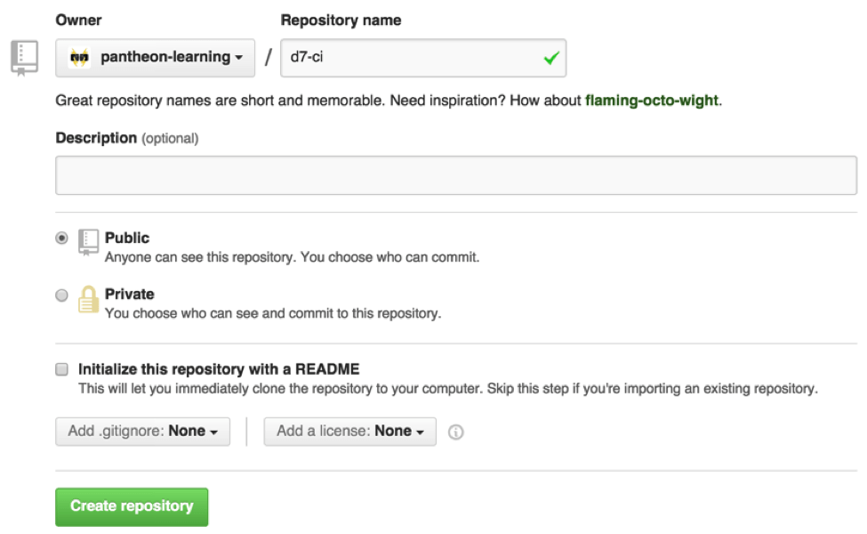

### Add the GitHub Repository as a Remote

As long as you keep “Initialize this repository with a README” unchecked, you will see options for adding code to your repo. You need to replace the word “origin” in this case, because your local clone is already tracking the Pantheon site repository as origin.

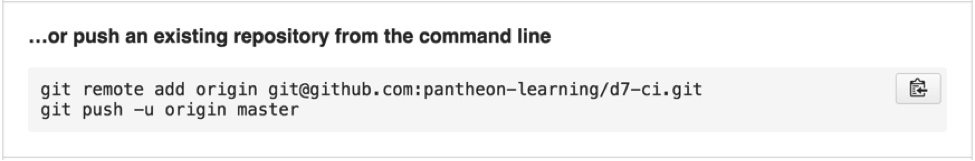

I chose to name this remote "github".

```bash{outputLines: 3-6}
git remote add github git@github.com:pantheon-learning/d7-ci.git
git remote -v
github  git@github.com:pantheon-learning/d7-ci.git (fetch)
github  git@github.com:pantheon-learning/d7-ci.git (push)
origin  ssh://codeserver.dev.UUID@codeserver.dev.UUID.drush.in:2222/~/repository.git (fetch)
origin  ssh://codeserver.dev.UUID@codeserver.dev.UUID.drush.in:2222/~/repository.git (push)
```

#### Configure Origin as a Multi-Remote Destination (Optional)

Another option is to add another push URL for origin within `.git/config`:

```none:title=.git/config
[remote "origin"]
  url = ssh://codeserver.dev.<SITE_UUID>@codeserver.dev.<SITE_UUID>.drush.in:2222/~/repository.git
  url = git@github.com:systemseed/example.git
```

Commits will be pushed to both remote destinations automatically on `git push origin`. Enforce this configuration with all team members when working collaboratively. Props to [Tom Kirkpatrick](/contributors/mrfelton) for contributing this tip in the [Pantheon Community](/pantheon-community).

### Push the Pantheon Site's Codebase to GitHub

```bash{outputLines: 2-6}
git push -u github master
Writing objects: 100% (120046/120046), 31.88 MiB | 3.26 MiB/s, done.
Total 120046 (delta 89679), reused 120039 (delta 89679)
To git@github.com:pantheon-learning/d7-ci.git
 * [new branch]      master -> master
Branch master set up to track remote branch master from github.
```

The repository on GitHub now has all of the same code as my site.

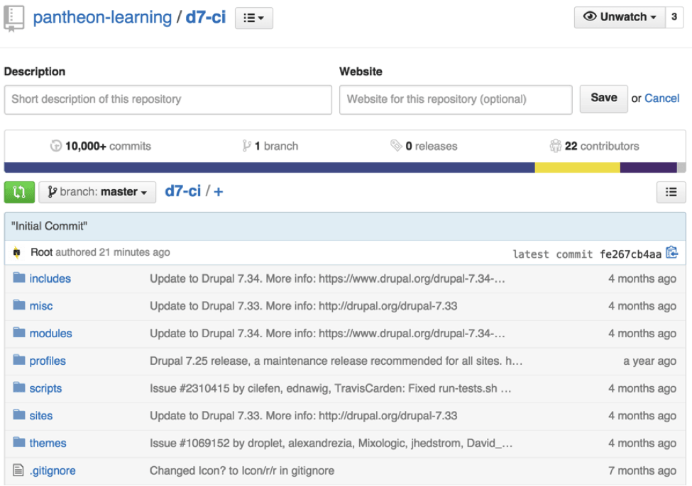

## Synchronizing Existing Site Repositories on GitHub With Pantheon

This process will follow the same general procedures as moving your repo from Pantheon to GitHub, in reverse.

### Create the Site

At our [site creation page](https://dashboard.pantheon.io/sites/create/ "Pantheon's site creation page, used to select an upstream"), name your site. On the next page, `/sites/UUID/configure` select the upstream your site will track. If you need a Custom Upstream, like one managed by your organization, or one of the public upstreams running on the platform, it is important that you create it as a new site based on that upstream. This will set the upstream for your site, which cannot be changed.

### Pull in Pantheon's Upstream

As long as you've chosen the same codebase (Drupal 7, WordPress, Commerce Kickstart, etc.) as the starting point of your Pantheon site, you can use Git to import your existing code with your commit history intact, while also preserving Pantheon's [upstream update](/core-updates) function.

1. From your Site Dashboard, go to the Dev environment.

1. Click **Settings**, then select **About Site**.

1. Copy the Upstream URL and modify it by replacing `https` with `git` and appending `.git master` to the end of the string.
  For example, a site running Drupal 7, `https://github.com/pantheon-systems/drops-7` will change to `git://github.com/pantheon-systems/drops-7.git master` in the Git command used to pull in the upstream.

  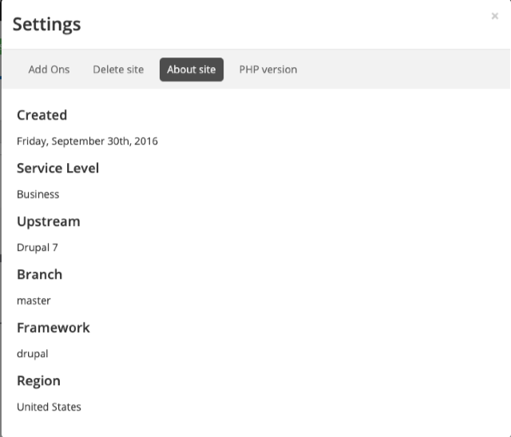

1. At the root of your local clone of the site repository, run

  ```bash{promptUser: user}
  git pull --no-rebase -Xtheirs --allow-unrelated-histories --squash git://github.com/pantheon-systems/drops-7.git master
  ```

  <Alert title="Note" type="info">

  For versions of Git 2.8 and below, the command is:

  ```bash{promptUser: user}
  git pull --no-rebase -Xtheirs --squash git://github.com/pantheon-systems/drops-7.git master
  ```

  </Alert>

If you need something other than Drupal 7 in the above command, replace the upstream URL with the one you copied from the Site Dashboard and modified.

Once executed, that command will pull in the Pantheon core files, but not commit them; you will be able to do a final review before doing so. You will see this message when it's done:

```none
Squash commit -- not updating HEAD
Automatic merge went well; stopped before committing as requested
```

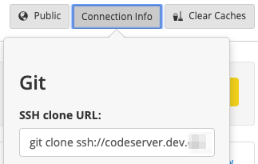

### Add the Pantheon Site as a Git Remote

1. From your terminal within the site directory, use the Git `remote add` command with a remote name (such as "pantheon") to make sure you know when you are moving code to or from Pantheon.

  ```bash{promptUser: user}
  git remote add pantheon ssh://codeserver.dev.{site-id}@codeserver.dev.{site-id}.drush.in:2222/~/repository.git
  ```

1. Run a Git add and commit to prepare the Pantheon core merge for pushing to the repository:

  ```bash{promptUser: user}
  git add -A
  git commit -m "Adding Pantheon core files"
  ```

1. Now pull from your Pantheon repository master branch: `git pull pantheon master --allow-unrelated-histories`. Handle any conflicts as needed.

1. Git push back to your Pantheon site repository: `git push pantheon master`

1. Go to the **Code tab** of your Dev environment. You should now see your site's pre-existing code commit history, plus the most recent commits adding Pantheon's core files.

1. Push the repo with the newly updated core files to GitHub.

  ```bash{promptUser: user}
  git push origin master`
  ```

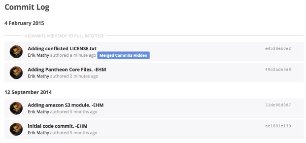

## Developing in Sync

For this example, we’ll create the settings.php file:

```bash{promptUser: user}
cd sites/default
touch settings.php
```

Add the file to version control and Push to both remotes:

```bash{outputLines: 2-9, 12-18, 20-22}
git status
On branch master
Your branch is up-to-date with 'github/master'.
Untracked files:
  (use "git add <file>..." to include in what will be committed)

  settings.php

nothing added to commit but untracked files present (use "git add" to track)
git add .
git status
On branch master
Your branch is up-to-date with 'github/master'.
Changes to be committed:
  (use "git reset HEAD <file>..." to unstage)

  new file:   settings.php

git commit -m “Create settings.php”
master b802550] Create settings.php
 1 file changed, 577 insertions(+)
 create mode 100644 sites/default/settings.php
```

You’re ready to push the change to GitHub and Pantheon:

```bash{outputLines: 2-8}
git push github master
Counting objects: 4, done.
Delta compression using up to 4 threads.
Compressing objects: 100% (4/4), done.
Writing objects: 100% (4/4), 384 bytes | 0 bytes/s, done.
Total 4 (delta 2), reused 0 (delta 0)
To git@github.com:pantheon-learning/d7-ci.git
   fe267cb..b802550  master -> master
```

```bash{outputLines: 2-17}
git push origin master
Counting objects: 4, done.
Delta compression using up to 4 threads.
Compressing objects: 100% (4/4), done.
Writing objects: 100% (4/4), 384 bytes | 0 bytes/s, done.
Total 4 (delta 2), reused 0 (delta 0)
remote:
remote: PANTHEON NOTICE:
remote:
remote: Environment 'dev' (branch: master) is currently in SFTP mode.
remote: It cannot receive git pushes until you disable this via the Pantheon dashboard.
remote: If you are trying to push changes to a different branch or environment, try:
remote:     git push origin [branch-name]
remote:
To ssh://codeserver.dev.59b2dd69-2305-4ca2-a745-4f00e4100c88@codeserver.dev.59b2dd69-2305-4ca2-a745-4f00e4100c88.drush.in:2222/~/repository.git
 ! [remote rejected] master -> master (pre-receive hook declined)
error: failed to push some refs to 'ssh://codeserver.dev.59b2dd69-2305-4ca2-a745-4f00e4100c88@codeserver.dev.59b2dd69-2305-4ca2-a745-4f00e4100c88.drush.in:2222/~/repository.git'
```

This push to Pantheon failed, because the Development environment was in SFTP mode.

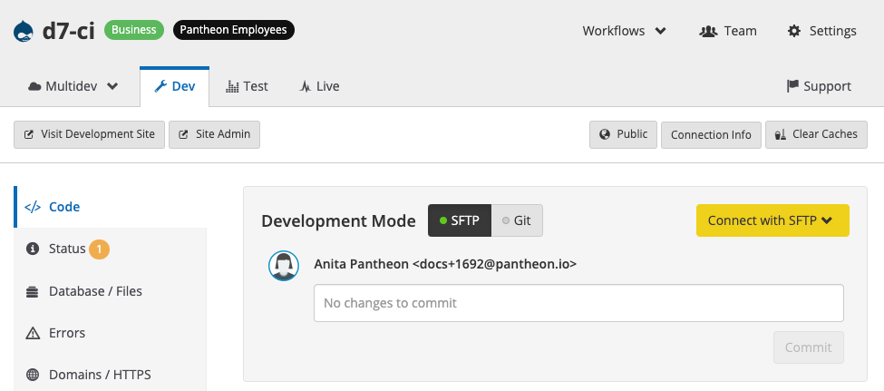

Switch the connection mode to Git by clicking on the toggle, or via the command line:

```bash{promptUser: user}
terminus connection:set <site>.<env> git
```

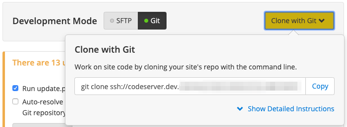

Push to Pantheon:

```bash{outputLines: 2-8}
git push origin master
Counting objects: 4, done.
Delta compression using up to 4 threads.
Compressing objects: 100% (4/4), done.
Writing objects: 100% (4/4), 384 bytes | 0 bytes/s, done.
Total 4 (delta 2), reused 0 (delta 0)
To ssh://codeserver.dev.59b2dd69-2305-4ca2-a745-4f00e4100c88@codeserver.dev.59b2dd69-2305-4ca2-a745-4f00e4100c88.drush.in:2222/~/repository.git
   fe267cb..b802550  master -> master
```

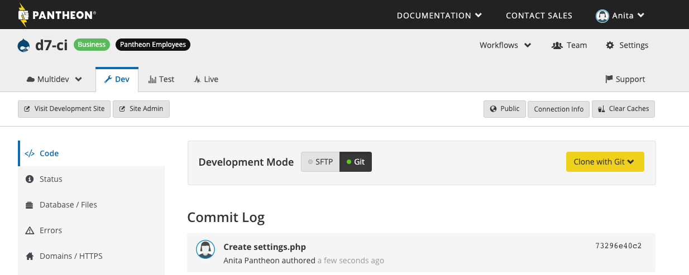

The GitHub repo and Pantheon site both now have a settings.php file. This will allow for environment-specific configuration to enable modules via remote Drush calls and other essential functionality.

Before I continue having to remember which remote, GitHub or Pantheon, is the "origin", I'm going to rename my remote from origin to pantheon and verify.

```bash{outputLines: 3-8}
git remote rename origin pantheon
git remote -v
github  git@github.com:pantheon-learning/d7-ci.git (fetch)
github  git@github.com:pantheon-learning/d7-ci.git (push)
pantheon  ssh://codeserver.dev.59b2dd69-2305-4ca2-a745-4f00e4100c88@codeserver.dev.59b2dd69-2305-4ca2-a745-4f00e4100c88.drush.in:2222/~/repository.git (fetch)
pantheon  ssh://codeserver.dev.59b2dd69-2305-4ca2-a745-4f00e4100c88@codeserver.dev.59b2dd69-2305-4ca2-a745-4f00e4100c88.drush.in:2222/~/repository.git (push)
```

## Feature Branching

Working with teams on GitHub requires a branching strategy. We are fans of GitHub flow and continuous integration here at Pantheon. In order to collaborate, I need to add my colleagues to the site we’re developing, both [on GitHub](https://help.github.com/enterprise/2.0/admin/guides/user-management/organizations-and-teams/) and [on Pantheon](/team-management).
Locally, our codebase is in sync with both repositories. In order to start working on a new feature, we’ll checkout a branch. Since my site is associated with a supporting organization that has Multidev, I can test out any feature in a Multidev environment. These environments have an 11-character limit for branch names, so I'm choosing to use short branch names for my feature branches.  

```bash{outputLines: 2}
git checkout -b configs
Switched to a new branch 'configs']
```

I’m responsible for adding the configuration management module as a feature of this site and tracking initial configurations with it.
In my local environment, I'm going to download the module and its dependencies:

```bash{promptUser: user}
drush dl configuration-7.x-2.x-dev xautoload
```

After I enable the module, I test and verify that the module is working. Next I'll add, commit, and push to branches on Pantheon and GitHub.

```bash{outputLines: 2-13}
git status
On branch configs
Untracked files:
  (use "git add <file>..." to include in what will be committed)

  sites/all/modules/configuration/
  sites/all/modules/xautoload/

nothing added to commit but untracked files present (use "git add" to track)
Brians-Pantheon-Mac-2:d7-ci brian$ git add .
Brians-Pantheon-Mac-2:d7-ci brian$ git commit -m "install configuration and xautoload"
[configs 0f85fbd] install configuration and xautoload
 284 files changed, 25781 insertions(+)
```

```bash{outputLines: 2-13}
git push pantheon configs
Counting objects: 365, done.
Delta compression using up to 4 threads.
Compressing objects: 100% (325/325), done.
Writing objects: 100% (365/365), 199.00 KiB | 0 bytes/s, done.
Total 365 (delta 70), reused 0 (delta 0)
remote:
remote: PANTHEON NOTICE:
remote:
remote: Skipping code sync, no multidev environments were found for branch "configs".
remote:
To ssh://codeserver.dev.59b2dd69-2305-4ca2-a745-4f00e4100c88@codeserver.dev.59b2dd69-2305-4ca2-a745-4f00e4100c88.drush.in:2222/~/repository.git
 * [new branch]      configs -> configs
```

The platform is telling me that no Multidev environments were found associated with the Git branch. I can stay on the command-line and quickly create one with Terminus.

```bash{promptUser: user}
terminus multidev:create <site>.dev <to_env>
```

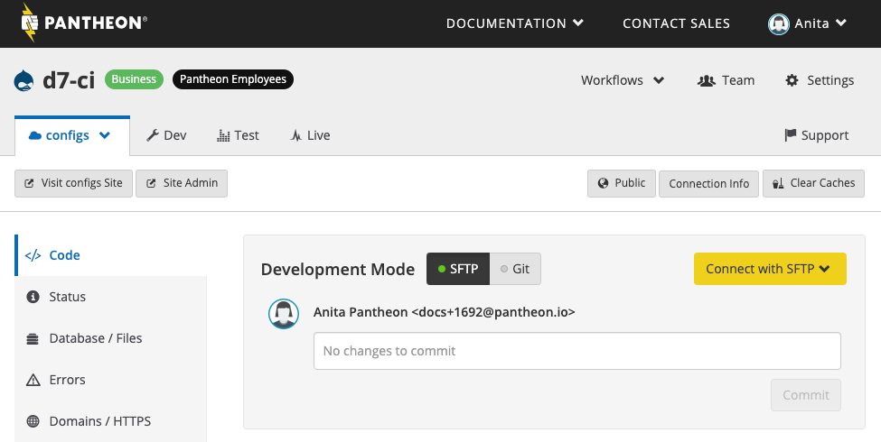

The module will now be available to activate and test on Pantheon for my colleagues to experience. I'll add a link to the module's configuration page on the Multidev environment on my GitHub pull request.


### Create Pull Request

We’re now ready to create a pull request on GitHub. The pull request can include things like links to the Multidev environment where the team can view the effects of the commits, @-mentions of team members, and a list of tasks for team members to perform before merging.

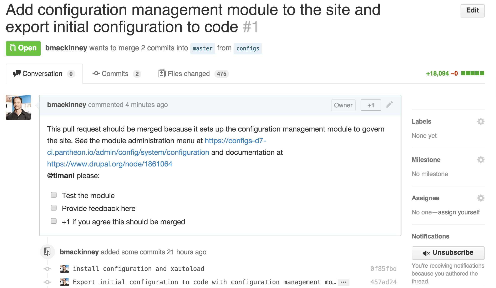

Timani completed the tasks, we discussed a bit in person, and he merged the PR.

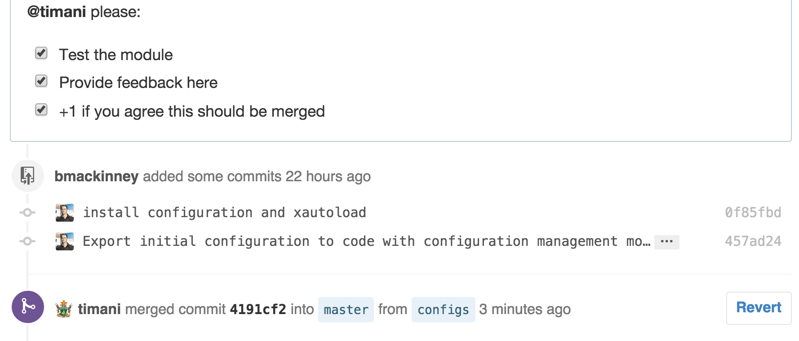

## Deploy to Pantheon
Locally, I now checkout the master branch, pull from github master, and push to pantheon master.

```bash{promptUser: user}
git checkout master
git pull github master
git push pantheon master
```


## Optional Tools to Optimize Workflows

Once we have the basic setup, there are other options to further optimize workflows:

* A continuous integration server like Jenkins, Travis CI, Bamboo, or CircleCI
* A suite of automated acceptance tests using Behat or PHPUnit

These tools will allow your team to fully implement continuous delivery with automated testing and continuous integration.

## Additional Resources

[Starting with Git](/git)

[Git FAQs](/git-faq)
