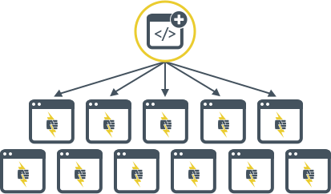

<Youtube src="b1lNrZL0xxM" title="Pantheon Custom Upstreams" />

## Benefits

### Standardize Design and Functionality Across Many Sites

Custom Upstreams act as a scaffold for new sites, allowing developers and site owners of any skill level to kickoff projects at warp speed.

Instead of repeating the same technical work on each individual site, you can build and maintain a common user interface with unified branding and functionality once, in a single source.

### Efficient Update Strategy

The Custom Upstream workflow frees up developer time, and establishes a sustainable and scalable process for handling updates across massive site portfolios.

New features and functionality can be continuously developed in the Custom Upstream repository, then distributed to each site, where they can be applied with a single click by site owners.

> See how Forum One uses this process to build, launch, and manage nearly 200 satellite sites for Fairfax County Public Schools in [this case study](https://pantheon.io/resources/forum-one-pantheon-fairfax-county-public-schools-edu-drupal-case-study).

### Scale Client Services

Spend less time doing non-core activities and reclaim lost billable hours where it counts most. Custom Upstreams help improve support efficiency by empowering non-technical clients and junior developers to handle lower-level support issues, such as creating a new site or applying updates. This gives advanced developers more time to focus on higher-level support work and new features.

> Hear from Kalamuna how this process liberates developers and empowers newbies to provide ridiculously awesome support in [this case study](https://pantheon.io/resources/kalamuna-pantheon-drupal-agency-case-study).

## Workflow Overview

There are three levels of repositories in play here, and updates flow "downstream" from one level to another.

<ul class="upstream">
<li>Core Updates</li>
</ul>

<h3>Level 1: Pantheon's Core Upstream</h3>

The top level repository will be one of Pantheon's core upstreams (either [WordPress](https://github.com/pantheon-systems/wordpress),[Drupal (Latest Version)](https://github.com/pantheon-upstreams/drupal-composer-managed), or [Drupal 7](https://github.com/pantheon-systems/drops-7)). Core upstream updates are distributed by Pantheon and must be applied downstream.

<ul class="upstream">
<li>Parent Theme</li>
<li>Common plugins / Contrib modules</li>
</ul>

<h3>Level 2: Your Custom Upstream</h3>

The second level repository is a Custom Upstream. This is where core updates from Pantheon are pulled in and modifications to your common codebase are distributed (e.g. parent theme and plugin/module version updates).

The Custom Upstream repository is hosted outside of Pantheon using a provider like [GitHub](https://github.com/), [Bitbucket](https://bitbucket.org/), or [GitLab](https://gitlab.com/). The Custom Upstream repository is connected to Pantheon and associated with your organization, allowing fellow team members the option to select this repository as a starting point when creating new sites.

To create a Custom Upstream from another Git hosting provider (like Azure DevOps or a self-hosted Bitbucket server), [contact support](/guides/support).

<ul class="upstream">
<li>Child Theme</li>
<li>Site-specific plugins / Custom code</li>
</ul>

<h3>Level 3: Site Repository</h3>

Core updates and changes to the common codebase make their way down to the site repository for each site that uses the Custom Upstream.

The site repository allows separation between common code across all sites, tracked in the Custom Upstream, and site specific customizations, tracked in each individual site. This facilitates rolling out updates quickly and easily.

## Custom Upstreams for Digital Agencies and Pantheon Resellers

Download the [Partner Program guide](https://pantheon.io/resources/pantheon-partner-program-guide?docs) to learn more about getting Custom Upstreams and some of the other benefits of becoming a Pantheon Partner. Digital agencies that serve clients and resellers of Pantheon are qualified to join the Partner program.

## Custom Upstreams for Corporate and Higher Education Customers 

Custom Upstreams are included for [Pantheon Enterprise](https://pantheon.io/plans/elite) Gold Accounts and higher, and all [Pantheon EDU](https://pantheon.io/edu) accounts. You can learn more by reaching out to our accounts team using the forms on the pages linked here.

<Alert title="Note" type="info">

Support for Custom Upstreams requires that the externally hosted upstream repository is connected to the platform correctly. For details, see [Get Support](/guides/support/#custom-upstreams). Refer to [Composer Fundamentals and Workflows](/guides/composer) if you are considering a Composer based workflow.

</Alert>

## Terminology

Here are definitions for commonly used terms:

### Upstream

An <dfn id="upstream">upstream</dfn> is a repository that acts as a parent for another repository, like <a href="https://github.com/pantheon-systems/wordpress">Pantheon's WordPress Upstream</a>.

### Custom Upstream

A <dfn id="custom-upstream">custom upstream</dfn> is a repository restricted to members of an organization, containing a common codebase for new sites. This type of repository is a child repository to Pantheon's core upstreams (<a href="https://github.com/pantheon-systems/wordpress">WordPress</a>, <a href="https://github.com/pantheon-upstreams/drupal-composer-managed">Drupal (Latest Version)</a>, <a href="https://github.com/pantheon-systems/drops-7">Drupal 7</a>) and acts as a parent for site level repositories.

### Public Upstream

A <dfn id="public-upstream">public upstream</dfn> is a repository that is open to all Pantheon users which contains a common codebase for new sites, like <a href="https://github.com/populist/panopoly-drops-7">Panopoly</a>.

### Repository

A<dfn id="repository">repository</dfn> is a collection of files packaged in a single directory under version control.

### Remote Repository

A <dfn id="remote-repository">remote repository</dfn> is the central version control location, such as a repository residing on GitHub, Bitbucket, or GitLab.

### Upstream Updates

<dfn id="upstream-updates"> Upstream Updates</dfn> are code changes that are made once in a parent (upstream) repository, then applied "downstream" to child repositories. This is how Pantheon's one-click updates work.

### Site Repository

A <dfn id="site-repository">site repository</dfn> is a child repository where upstream updates are applied and site specific customizations are tracked, similar to your site's codebase on Pantheon.

### Framework

The <dfn id="framework">framework</dfn> determines the server configuration for a given CMS. It includes things like Nginx configuration, the relevant CLI tool to install (Drush or WP-CLI), etc. This setting is visible to users via Terminus and in the Site Settings. Once a framework has been set, it cannot be changed at the site level through the UI or Terminus. If you need to change your upstream's framework, you would need to contact Support.

## More Resources

- [Best Practices for Maintaining Custom Upstreams](/guides/custom-upstream/maintain-custom-upstream)

- [Static Sites and Empty Upstreams](/static-site-empty-upstream)

- [WordPress and Drupal Core Updates](/core-updates)

- [Autopilot for Custom Upstreams](/guides/autopilot-custom-upstream)
