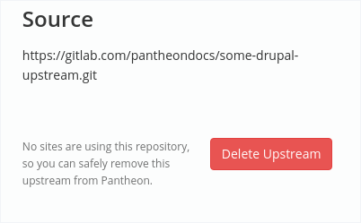

This section provides steps to delete a Custom Upstream. A Custom Upstream cannot be deleted if there are sites using it.

Follow these steps to delete your Custom Upstream.

1. Access the **Organization Dashboard** from your Admin dashboard.

1. Select **Debug** > click the ** Upstreams** tab.

1. Click Delete Upstream and confirm.

  

## More Resources

- [Switch an Existing Site to Custom Upstream](/guides/custom-upstream/switch-custom-upstream)

- [Troubleshoot a Custom Upstream](/guides/custom-upstream/troubleshooting)

- [Edit an Existing Custom Upstream](/guides/custom-upstream/edit-custom-upstream)