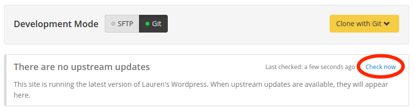

This section provides troubleshooting solutions for Custom Upstreams.

## Resolve Conflicts

### Automatically Resolve from the Command Line

If you receive the error that you have conflicts while updating core, the fastest resolution is often the `-Xtheirs` flag. This will attempt to automatically resolve the conflicts with a preference for upstream changes, and is safe to run if you don't have your own changes in any of the conflicting files (for example, problems with `.gitignore`).

1. Navigate to the Custom Upstream's root directory using the command line and add Pantheon's Upstream as a [remote](https://git-scm.com/docs/git-remote), if you haven't done so already:

  <TabList>

  <Tab title="WordPress" id="wp2" active={true}>

  ```bash
  git remote add pantheon-wordpress https://github.com/pantheon-systems/WordPress.git
  ```

  </Tab>

  <Tab title=" Drupal 7" id="d72">

  ```bash
  git remote add pantheon-drops-7 https://github.com/pantheon-systems/drops-7.git
  ```

  </Tab>

  </TabList>

2. Pull down changes from the appropriate upstream and attempt to resolve automatically:

  <TabList>

  <Tab title="WordPress" id="wp-xtheirs" active={true}>

  ```git
  git fetch pantheon-wordpress
  git merge pantheon-wordpress/master -Xtheirs
  ```

  </Tab>

  <Tab title="Drupal 7" id="d7-xtheirs">

  ```git
  git fetch pantheon-drops-7
  git merge pantheon-drops-7/master -Xtheirs
  ```

  </Tab>

  </TabList>

1. Double-check the conflicted files before moving forward to make sure no bugs were introduced.


### Manually Resolve from the Command Line

You must manually resolve the conflict using the command line and a text editor if attempts to automatically resolve conflicts fail, or if you want your changes to persist instead of the upstream's changes.


1. Navigate to the Custom Upstream's root directory using the command line and add Pantheon's Upstream as a [remote](https://git-scm.com/docs/git-remote), if you haven't done so already:

  <TabList>

  <Tab title="WordPress" id="wp2" active={true}>

  ```bash
  git remote add pantheon-wordpress https://github.com/pantheon-systems/WordPress.git
  ```

  </Tab>

  <Tab title=" Drupal 7" id="d72">

  ```bash
  git remote add pantheon-drops-7 https://github.com/pantheon-systems/drops-7.git
  ```

  </Tab>

  </TabList>

2. Pull down changes from the appropriate upstream:

  <TabList>

  <Tab title="WordPress" id="wp-2conflict" active={true}>

  ```git
  git fetch pantheon-wordpress
  git merge pantheon-wordpress/master
  ```

  </Tab>

   <Tab title="Drupal 7" id="d7-2conflict">

   ```git
   git fetch pantheon-drops-7
   git merge pantheon-drops-7/master
   ```

  </Tab>

  </TabList>


3. Resolve any conflicts introduced using the output details. For example:

  ```bash
  $ git merge pantheon-wordpress/master
  First, rewinding head to replay your work on top of it...
  Applying: Adjust rendering of version release notes
  Using index info to reconstruct a base tree...
  M	wp-admin/about.php
  Falling back to patching base and 3-way merge...
  Auto-merging wp-admin/about.php
  CONFLICT (content): Merge conflict in wp-admin/about.php
  error: Failed to merge in the changes.
  Patch failed at 0001 Adjust rendering of version release notes
  The copy of the patch that failed is found in: .git/merge-apply/patch

  When you have resolved this problem, run "git merge --continue".
  If you prefer to skip this patch, run "git merge --skip" instead.
  To check out the original branch and stop rebasing, run "git merge --abort".
  ```

   In this example, you would:
  
   1. Open `wp-admin/about.php` in your preferred text editor.
  
   1. Locate the conflict markers starting with `<<<<<< HEAD` and manually edit the file to merge changes between Pantheon's upstream (shown first between `<<<<<< HEAD` and `=======`) and changes made downstream in the Custom Upstream repository (shown second between `=======` and `>>>>>> Adjust rendering of version release notes`).

   1. Delete the conflict markers and double-check the changes.

4. Run `git status` to see conflicting files in the current index > add the files to your index and continue pulling in updates after all conflicts have been addressed.

  ```git
  git add .
  git merge --continue
  ```

## One-Click Updates Do Not Appear After Rewriting Git History

Squashing and rewriting history may cause one-click updates to break. Updates will no longer appear on your Site Dashboard when they become available in this case. Instead of using squash and rebase to clean up commits from merges occurring upstream, we recommend reviewing history locally with `git log --first-parent`. This provides the same history shown on the Site Dashboard and prevents conflicts with our one-click updates.

If you are in a situation where you've altered the commit history in such a way that the dashboard is no longer able to determine if your site is up to date with the upstream, the simplest course of corrective action is to use `git reset --hard` to reset the site repository to the last known good commit before the squash/rebase/revert was applied. This *will* result in losing *all* changes that have happened since this commit. You will need to re-apply all custom/contributed code updates that occurred in the interim. Be sure to take note of these changes first and develop a plan to reapply them with the corrected Git history.

## One-Click Update Not Appearing for Sites Using a Custom Upstream

Core updates for Custom Upstreams are initiated by the repository maintainer, not Pantheon. Please report issues directly to the project maintainer for expected updates.

It's important that you relay the need for updating core to maintainers, even if you plan on manually pulling in core version updates. First, file an issue in the queue of your repository and reach out to a maintainer. Even better - submit a pull request for the update.

You can [manually apply updates from the command line](#apply-upstream-updates-manually-from-the-command-line-to-resolve-merge-conflicts) after you have communicated the issue.

## Custom Upstream Updates Not Available

Click **Check now** in the Site Dashboard if you know your site's Custom Upstream has updated code that is not visible in the dashboard.



This will trigger a "Code Cache Clear" to verify that the Site Dashboard has fetched the most recent commit. Please note that even after the workflow completes, it might take up to a minute before updates appear on the dashboard.

It might be necessary to reset the site's upstream via [Terminus](/terminus/examples/#switch-upstreams) if updates are still not showing on the site. Please note that only the Site Owner or owning Organization Administrators can change a site's upstream.

## More Resources

- [Clear Upstream Cache](/terminus/commands/site-upstream-clear-cache)

- [Test Custom Upstream Changes](/guides/custom-upstream/test-custom-upstream)