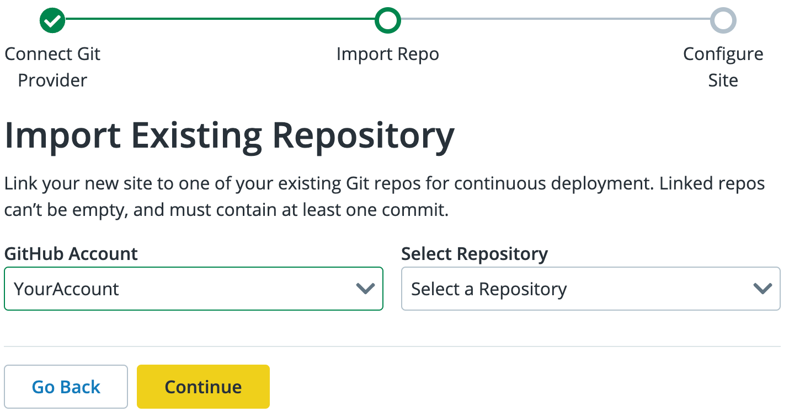

## Before You Begin

You should have the **Decoupled** tab enabled in your Sites dashboard after onboarding. To begin creating a Front-End Site, ensure you meet the following prerequisites:

* You have a GitHub account

* If you will be connecting a GitHub organization, you must have owner permissions to the organization

* You have a domain to use for the Front-End site.

* You will use Next.js or Gatsby as the Front-End framework.

* (Optional) You are using Drupal 9 or WordPress for the CMS.

* (Optional) If using a preconfigured starter kit template, you will use one of the following combinations:

    * Drupal 9 and Next.js
    
    * WordPress and Next.js

    * WordPress and Gatsby

    > **NOTE**: Other configurations are not currently supported but you are welcome to try them

### Compatibility

You can create an application from scratch by importing a repository or you can use the Pantheon starter kit templates to develop a decoupled site. The starter kit will create a repository on GitHub for you.

You can also create a site without a CMS. Create a site from scratch by importing the repository and using Next.js or Gatsby as the static site generator and optionally use a 3rd-party API.

The versions that are supported include:

|  Tooling   |      Version    |
|  :---:     |       :---:     |
|  Gatsby    |    4 or higher  |
| Next.js    |   12 or higher  |
|  Drupal    |   9 or higher   |
| WordPress  |   5.9 or higher |

## Site Setup

Front-End Site is available in the New Dashboard, after it is enabled during the onboarding process. To access the Front-End Site decoupled architecture and start developing the frontend application, perform the following steps:

1. Log in to your Pantheon Dashboard and navigate to the **Sites** page.

1. Select **Sites** in the the New Dashboard. 

1. Click the **Decoupled** tab, then click **+Create New Site**.

Under the Decoupled Site section on the Site Creation page, click the option that best suits your needs. Ensure you are using compatible versions for the associated tooling before you proceed (e.g. Drupal 9, Next.js v12, etc.).
 

### Connect your GitHub Account

You may connect either a personal or organizational GitHub account. This will be used to either import an existing front-end site repository or to create a new one based on a starter kit. 

1. After you select the front-end site option that best suits your needs, you will be prompted to connect your GitHub account. 

1. Select the GitHub option and click **Connect**. If not already signed in, you will be prompted to log in to GitHub.  A window for GitHub.com is displayed, and you are prompted **“Where do you want to install Pantheon?”**. 

1. Select the GitHub account or Organization that you will use to develop your front-end site. 

1. Specify the permission configurations and click **Install & Authorize**. Your GitHub repository is now connected and you can continue with the front-end site creation on the Pantheon dashboard. 

### Create a Site 

<TabList>

<Tab title="Without a Starter Kit" id="import-create-site" active={true}>

#### Create a Site by Importing a Repository

Connect to your Git provider and select an existing repository.

##### Prerequisites 

* You have an existing GitHub repository with a Next.js or Gatsby front-end, or your own experimental framework

* The repository should not be empty.

* The repository needs to contain only one of the following files:

    * `package-lock.json`
    * `yarn.lock`

##### Site Creation without a Starter Kit 

Create a site without configuring the backend and link to a frontend framework. To connect your GitHub repository, click **Import Repository** on the _What kind of site are you creating?_ page.

1. If you have not already connected your GitHub account, follow the steps in the Connect your Account section. Otherwise, if your GitHub account is already connected you can proceed to the next step and select your Git provider.

1. Select a Git provider from the **Choose your Git provider** options and click **Continue**.

1. Select your desired account from the GitHub Account dropdown.

1. Choose the repository name from the Select Repository dropdown and click **Continue**.
    

1. Add to the General Info section.

    * Specify the Site Name: The site name is the title of your site. You can edit the site name in **Settings** after creation. 
    * Select the frontend framework. You can choose either Next.js or Gatsby as the static site generator. 
        If you are testing out a static React.js application, you may try selecting Gatsby. If the application is using the Node runtime then you will want to select Next.js as the framework. Please note we will not be able to provide support for frameworks outside of Next.js or Gatsby.

1. (Optional) Link your CMS.

    > **NOTE**: If you are using a back-end CMS on Pantheon, you can link your CMS and the site environment from which to source content. However, this is optional and more applicable when using the Decoupled starter kit templates to set up an integration with previewing from within the CMS. Any existing configured API endpoint or external CMS does not require linking here.

1. Ensure **Make this a private repository** is selected.

1. (Optional) Add configurations.

    * You can add specifications to help manage your root directory, build settings, and set environment variables. 
    * You can set the Environment Variables in the Advanced Setting section. 

    > **NOTE**: Basic builds will function without setting environment variables if the CMS site was selected during decoupled site creation. Environment variables are not necessary for optional features like preview.

1. Click **Continue**.

You are directed to a new page with the site name, deployment, and build information / status. You will receive a message that you decoupled site has successfully been added to Pantheon. You can view the build log by clicking **Build Details**.

</Tab>

<Tab title="Drupal and Next.js Starter Kit" id="drupal-next-create-site">

#### Create a Site with Drupal and Next.js

##### Prerequisites

* You are using Drupal as your CMS. You have installed and configured your Drupal site using the starter kit configuration.

#### Site Creation with Drupal and Next.js Starter Kit Template Configuration

1. After clicking the **Next.js + Drupal** option, select a Git provider from the **Choose your Git provider** options and click **Continue**.

1. Select your desired GitHub account and enter a name for the new repository. You can select **Make this a private repository** to provide greater security for your Git repository.

1. Select the desired **Drupal** CMS backend from the dropdown menu.

1. Select the site environment from which to source the content.

1. (Optional) Set any custom Environment Variables in the Advanced Setting section.

1. Click **Continue**. You are directed to a new page with the site name, deployment, and build information / status. Now, you can view the build log by clicking **Build Details**.

1. Click **View Site** after the build completes to launch your frontend site.

</Tab>

<Tab title="WordPress and Next.js Starter Kit" id="wordpress-next-create-site">

#### Create a Site with WordPress and Next.js

##### Prerequisites

* You are using a Git repository and the repository is already connected.
* You are using WordPress as your CMS. You have installed and configured your WordPress site using the starter kit configuration.

##### Site Creation with WordPress and Next.js Starter Kit Template Configuration

1. After clicking the **WordPress and Next.js** option, select a repo listed under **Choose your Git provider**. Click **Continue**.

1. Select your desired GitHub account and enter a name for the new repository. You can select **Make this a private repository** to provide greater security for your Git repository.

1. Select the desired **WordPress** CMS backend from the dropdown menu.

1. Select the site environment from which to source the content.

1. (Optional) Set any custom Environment Variables in the Advanced Setting section.

1. Click **Continue**. You are directed to a new page with the site name, deployment, and build information / status. Now, you can view the build log by clicking **Build Details**.

1. Click **View Site** after the build completes to launch your frontend site.

</Tab>

<Tab title="WordPress and Gatsby Starter Kit" id="wordpress-gatsby-create-site">

#### Create a Site with WordPress and Gatsby

##### Prerequisites

* You are using a Git repository and you have connected your GitHub account. 

* You are using WordPress as your CMS. You have installed your WordPress site using the Decoupled WordPress Recommended Project configuration, which has the `wp-graphql` plugin enabled.

##### Site Creation with WordPress and Gatsby Starter Kit Template Configuration

1. Click the **Gatsby + WordPress** template and select a Git provider listed under **Choose your Git provider**. Click **Continue**.

1. Select your desired GitHub account and enter a name for the new repository. You can select **Make this a private repository** to provide greater security for your Git repository.

1. Select the WordPress CMS backend from the dropdown menu.

1. Select the site environment from which to source the content. You can source content from Live, Test, or Dev environment. 

1. Optionally, you can set the Environment Variables in the **Advanced Setting** section.

1. Click **Continue**. You are directed to a new page with the site name, deployment, and build information and status. Now, you can view the build log by clicking **Build Details**.

</Tab>
</TabList>
