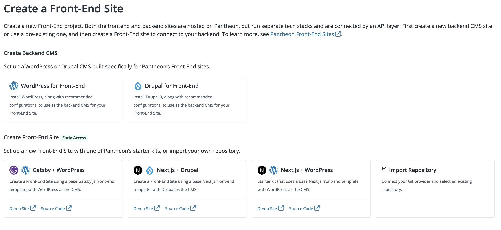

This section provides information on how to use the Drupal Backend Starter for Front-End Sites.

## Choose an Installation Option

You can install the backend starter kit with Build Tools or with the Dashboard Upstream. Review the information below to select the right option for your setup.

### Use the Dashboard Upstream if:

- You require a simpler setup

- The Pantheon repository is your source of truth

### Use Build Tools if:

- Testing is an important part of your workflow

- You don’t want to manually push changes to your code repo

## Install with Dashboard Upstream

1. Log in to your Pantheon Dashboard and select the **Sites** page.

1. Click the Decoupled tab and then click **+Create New Site**.

1. Select **Drupal for Front-End** under **Create Backend CMS**.

    - You can also follow the [Decoupled Drupal Composer Managed](https://dashboard.pantheon.io/sites/create?upstream_id=c76c0e51-ad85-41d7-b095-a98a75869760) link to create your site in the Pantheon Dashboard.

    

1. Name your site, select your decoupled environment from the **Choose a Workspace for the Site** drop-down menu, and then click **Continue**.

1. Confirm your organization selection when prompted in the **Confirm Organization Selection** dialogue box. The Deploying Decoupled Drupal Composer Managed progress indicator displays while your site is spinning up.

1. Click **Visit your Pantheon Dashboard** when the site spin up completes.

1. Click the **Visit Development Site** button to install Drupal.

1. Select either the `Pantheon Decoupled Profile`, or the
`Pantheon Decoupled Umami Demo` profile. The same can be done via
[`terminus remote:drush`](/terminus/commands/remote-drush).

  - The Umami Demo contains additional demo data, and is not intended for use in a production site build.

Your backend starter is ready to develop!

Note that you can also use Terminus to initiate the site spin up in the Pantheon Dashboard:

Run the command below in Terminus:

```bash{promptUser: user}
terminus site:create my-new-site "Describe Site" --org='My Team Name' c76c0e51-ad85-41d7-b095-a98a75869760
```

<Alert title="Note"  type="info" >

Replace `'{My Team Name}'` with your team name. For example, `My Agency`. This can also be omitted.`c76c0e51-ad85-41d7-b095-a98a75869760` is `upstream_id` for Decoupled Drupal Composer Managed.

</Alert>

## Install with Build Tools

### Prerequisites

- Composer (required for CMS backends):
  [Install Globally](https://getcomposer.org/download/)
- [Generate machine token](https://pantheon.io/docs/machine-tokens#create-a-machine-token)
  & [Authenticate into Terminus](https://pantheon.io/docs/machine-tokens#authenticate-into-terminus)
- [Install Terminus](https://pantheon.io/docs/terminus/install) (3.0.0 above
  required)
- Also install the following plugins:
  - `terminus self:plugin:install terminus-build-tools-plugin`
  - `terminus self:plugin:install terminus-secrets-plugin`
  - Reload the terminus plugins: `terminus self:plugin:reload`
  - Clear cache for composer: `composer clear-cache`
  - Validate that the required plugins are installed:
    `terminus self:plugin:list`

### Build Tools Installation

- For all steps below:

  - Replace `{PROJECT_NAME}` with your project name. For example,
    `decoupled-drupal`.

  - Replace `'{My Team Name}'` with your team name. For example, `My Agency`.
    This can also be omitted.

  - Build Tools should prompt you for the credentials required to create these assets. While GitHub and CircleCI are the defaults, other providers are supported as well. Refer to [available services](https://github.com/pantheon-systems/terminus-build-tools-plugin#available-services)
    for more information.

1. Create your project using the `build:project:create` command as shown below:

    ```
    terminus build:project:create \
      --team='{My Team Name}' \
      --template-repository="git@github.com:pantheon-upstreams/decoupled-drupal-composer-managed.git" pantheon-upstreams/decoupled-drupal-composer-managed \
      --visibility private {PROJECT_NAME} \
      --profile="pantheon_decoupled_profile" \
      --stability=dev
    ```

    - This command will create:

      - A Pantheon site
      - A GitHub repository
      - A CircleCI test configuration

1. Refer to [Commands available as part of the Build Tools plugin](https://github.com/pantheon-systems/terminus-build-tools-plugin#commands)for additional options for repository or CI providers.

#### Known Issues

- If you encounter errors during the [Installation](#installation) process,
  please check if you have the `terminus-power-tools` plugin installed. If so
  you should remove the terminus-power-tools plugin and go through Installation again.


### Additional Options

#### Install with Umami Demo Data

The installation command above will create a backend with limited example
content. You can create a site with Drupal's Umami demo data set instead.

Change the profile flag to `--profile="pantheon_decoupled_umami_demo"` in your `terminus build:project:create` command.

#### Use Other Git Hosts or CI Services

Terminus Build Tools supports other Git hosts and CI services.

For example, to use GitHub actions as your CI service, you can add the
following additional flag to your `terminus build:project:create` command:

`--ci=githubactions`

Other possible values are:

- `circleci`
- `gitlab-pipelines`
- `bitbucket-pipelines`

<Alert title="Note"  type="info" >

Your token should have the `workflow` scope if using GitHub Actions.

</Alert>

Refer to the [available services section of the build tools documentation](https://github.com/pantheon-systems/terminus-build-tools-plugin#available-services) for more information.

#### Use a GitHub Organization

`--org="{My Organization Name}"`

If you would like the repo created to be under a GitHub organization instead of the authenticated user's namespace, you can use the `--org` option.

For information on additional options, consult the
[command options section of the build tools documentation](https://github.com/pantheon-systems/terminus-build-tools-plugin#command-options).

## Update to Drupal 10

Follow the steps below to update a [Decoupled Drupal Composer Managed](https://dashboard.pantheon.io/sites/create?upstream_id=c76c0e51-ad85-41d7-b095-a98a75869760)
site to Drupal 10.

1. Clone the backend site repo.

1. Update to PHP 8.1 or greater if you have not already done so, by editing
   `pantheon.yml` and adding the following, with your chosen version of PHP:
   ```yaml
   php_version: 8.1
   ```
1. Update packages in your `composer.json` to the appropriate new versions:
   ```bash
   composer config platform.php 8.1
   git commit -am "composer config platform.php 8.1"
   composer config minimum-stability dev
   git commit -am "composer config minimum-stability dev"
   composer require --no-update --dev drupal/core-dev:^10
   composer require --no-update drupal/core-composer-scaffold:^10
   composer require --no-update pantheon-systems/drupal-integrations:^10
   composer require --no-update drupal/core-recommended:^10
   composer require --no-update drupal/pantheon_decoupled_profile:^2
   composer require --no-update drupal/pantheon_decoupled_umami_demo:^2
   composer update
   git commit -am "Update to Drupal 10"
   ```
1. Push the changes up to Pantheon.

   ```bash{promptUser: user}
   git push origin master
   ```

1. Run database updates if you are updating an existing Drupal install. This can be done with Terminus or via the Drupal web UI.

   With Terminus:

   ```bash{promptUser: user}
   terminus drush <BACKEND_SITE>.<ENV> updatedb
   ```

   Via the Drupal web UI: Visit `/update.php` on your Drupal backend site, e.g.

   ```
   https://dev-my-decoupled-backend.pantheonsite.io/update.php
   ```
