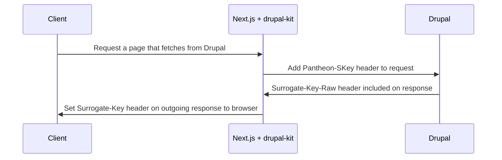

## Before You Begin

This guide explains the how to set Cache-Control headers using
`@pantheon-systems/drupal-kit` in the `next-drupal-starter`, or any Next.js
application using the `drupal-kit`.

## Cache Control Headers

Our `@pantheon-systems/drupal-kit` exports DrupalState, a class that includes a
local store and helper methods to fetch data from Drupal. Included in these
methods is a default Cache-Control header that is set on the response object
that is passed into the DrupalState helper.

The default Cache-Control header value is as follows:

```http
Cache-Control: public, s-maxage=600
```

In the next section, we will explain how to override this default value.

### Overriding Drupal Kit's Default Cache-Control Headers

The `@pantheon-systems/drupal-kit`'s Drupal State store sets the default header
when you pass in the response object to any of the data fetching methods like
`getObject` and `getObjectByPath`.

To override this default with your own Cache-Control header value, use the
Next.js `res.setHeader` method as shown in the example:

```jsx title=src/pages/articles/index.jsx
import { DrupalState } from '@pantheon-systems/drupal-kit';

export default function MyPage(props) {
	// Page Component here...
}

export async function getServerSideProps(context) {
	const { res } = context;
	// For the sake of the example, we will create a new instance in getServerSideProps,
	// but usually this should be done once somewhere and imported
	const store = new DrupalState({
		apiBase: 'https://my-drupal-site.com',
		defaultLanguage: 'en',
	});

	const articles = store.getObject({
		objectName: 'node--article',
	});

	const myCacheControlHeader = 'public, max-age=604800, must-revalidate';

	// The headers must be set AFTER calling any data fetching methods on the store
	// or they will be overridden by those methods.
	res.setHeader('Cache-Control', myCacheControlHeader);

	// Return props...
}
```

## In Production

Depending on where you deploy, these headers may or may not be respected with
regards to caching at the edge. See your platform's documentation to verify.

## Purge Surrogate Key-based Cache

## Before You Begin

You should be familiar with the concept of surrogate key based caching and
purging.

See https://docs.fastly.com/en/guides/working-with-surrogate-keys for more
information on working with surrogate keys.

This guide uses Drupal with the
[Pantheon Advanced Page Cache module](https://www.drupal.org/project/pantheon_advanced_page_cache)
installed.

## How It Works



The `PantheonDrupalState` class from our `@pantheon-systems/drupal-kit` npm
package includes an adapted fetch method which adds the `Pantheon-SKey` header
to each request to Drupal. Responses from Drupal will contain the
`Surrogate-Key` header. With these keys, your frontend can be instructed to
purge content from a cache when the content in Drupal changes.

## How To Ensure Headers Are Set On Custom Routes

- The Drupal backend has the
  [Pantheon Advanced Page Cache module](https://www.drupal.org/project/pantheon_advanced_page_cache)
  installed. installed and configured
- Create an instance of `PantheonDrupalState` imported from
  `@pantheon-systems/drupal-kit` in your application.
- Use the fetch methods available (see
  [`drupal-kit`](../../../Packages/drupal-kit/) for more information). The
  Surrogate-Key header should be set automatically if Drupal is configured
  correctly.
- Pass the
  [`context.res`](https://nextjs.org/docs/api-reference/data-fetching/get-server-side-props#context-parameter)
  from `getServerSideProps` into the `PantheonDrupalState` fetch method so that
  the headers are added to the outgoing response.
