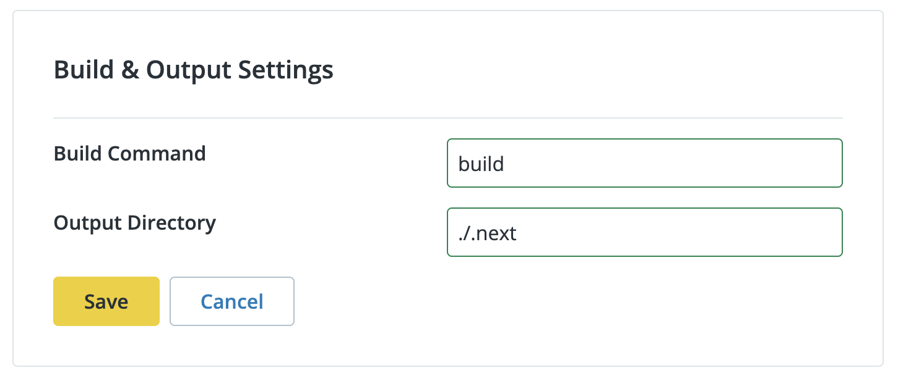

<Youtube src="_3d8ID01UhQ" title="Configuring Your Front End Site" />

This section provides information on Settings. You can configure Front-End Site settings in the Pantheon dashboard, including:

- General Settings: Site Details, Connected Git repository, and site deletion
- Build and Output settings
- Site Environment Variables
- Build Hooks
- Deployment settings

## General Settings

You can change the Site Name, connect or disconnect your Git repository, and delete your Front-End Site in General Settings.

### Node.js Version

As of the release of our [V1 build pipeline](/guides/decoupled/overview/v1-pipeline), Front-End Sites runs can run v16, v18, or v20 of Node.js as specified in your `package.json` file.

[Odd-numbered Node.js releases, such as v17, never enter "Active LTS" status](https://nodejs.org/en/about/previous-releases#previous-releases). They are not available on Pantheon.

Pantheon inspects the engines field in `package.json` when selecting a specific Node.js version for the build (Gatsby.js and Next.js) and runtime (Next.js) of your Front-End Site. For example, to select Node.js 16 for a given deployment, you should do the following:

```json:title=package.json
"engines": {
  "node": ">=16.0.0 <18.0.0"
},
```

To break down that example, the `package.json` file for the project declares it expects something greater than or equal to 16.0.0 and less than 18.0.0. As of the writing of this documentation, this declaration would result in 16.20.2 being used.

Note that if you select a range of major Node.js versions, Pantheon will select the most recent Node.js major version for that deployment. For example, the following configuration would result in Node.js 18.x being selected:

```json
"engines": {
  "node": ">=16.0.0 <20.0.0"
},
```
We recommend that when you need to change the version of Node.js for your Front-End Site, that you test the new version by pushing the updated `package.json` to a branch first and create a pull request. Pantheon will create an environment for your site specific to that pull request.

Sites made prior to **November 13th, 2023** set the Node.js version via  `.nvmrc` and can select via:

- Node.js 14
- Node.js 16
- Node.js 18

We recommend switching to the [V1 build pipeline](/guides/decoupled/overview/v1-pipeline) to access higher versions of Node.js and get faster build times.

### Change Site Name

1. [Go to the workspace](/guides/account-mgmt/workspace-sites-teams/workspaces#switch-between-workspaces), click **Sites**, then select the site you want to change the name of.

1. Click **Settings** or **General**.

1. Click the **Edit** button in the **Site Details** section.

1. Enter the new name and click **Save**.

### Connect or Disconnect a Git Repository

Note that a repository cannot be connected to more than one Front-End Site.
There are known issues around disconnecting and reconnecting a repository.

1. [Go to the workspace](/guides/account-mgmt/workspace-sites-teams/workspaces#switch-between-workspaces), click **Sites**, and then select the site you want to connect or disconnect with your Git repository.

1. Click **Settings** or **General**.

1. Click the **Connect** or **Disconnect** button in the **Connected Git Repository** section. Confirm your selection when prompted if you are disconnecting your Git repository.


### Delete a Front-End Site

This feature only deletes your Front-End Site. Your CMS backend and connected Git repository are not affected. Visitors will not be able to access the site, and site team members will not be able to work on the site after deletion.

You can [contact Support](/guides/support/contact-support/) to restore a site if it is accidentally deleted.

1. [Go to the workspace](/guides/account-mgmt/workspace-sites-teams/workspaces#switch-between-workspaces), click **Sites**, and then select the site you want to delete.

1. Click **Settings** or **General**.

1. Click the **Edit** button in the **General Settings** section and select **Delete Site**.

    

1. Confirm your selection when prompted by entering site name, then click **Delete Site**.

    

1. [Update your DNS records](/guides/launch/configure-dns/) to stop pointing to the deleted site.

## CMS Settings

You can link your CMS to your Front-End Site if you’re already managing content through a Pantheon-hosted site. Changes made in Drupal or WordPress will automatically render on the page. Linking your CMS is optional.

Note that you cannot trigger a Front-End Sites build from your CMS settings. You can trigger a build in your Front-End Sites dashboard or with GitHub merges.

### Configure CMS Connections

1. [Go to the workspace](/guides/account-mgmt/workspace-sites-teams/workspaces#switch-between-workspaces), click **Sites**, and then select the site you want to configure CMS Connections for.

1. Click **Settings** and then click **CMS**.

1. Click the **Get Started** or **Make Changes** button in the **CMS Connections** section. The Get Started button displays if you have not added a CMS connection yet.

1. Select your **CMS backend** from the drop-down menu.

1. Select the **environment** to source content from.

1. Click **Save**.


## Build and Output Settings

You can configure and edit the Build Command and Output Directory in Build and Output Settings. You do not need to modify these settings if you are using a recommended [starter kit](/guides/decoupled/overview/site-options#pantheon-front-end-site-starter-kits).

Adjustments to these settings might be required if you are not using a starter kit. Refer to [Use a Non-official Frontend Framework](/guides/decoupled/no-starter-kit/any-framework) for more information.

### Configure Build and Output Settings

1. [Go to the workspace](/guides/account-mgmt/workspace-sites-teams/workspaces#switch-between-workspaces), click **Sites**, and then select the site you want to configure **Build and Output** settings for.

1. Click **Settings** and then click **Builds**.

1. Click the **Edit** button in the **Build & Output Settings** section.

1. Enter your desired settings and click **Save**.



## Build Cache

The first build on [any environment](/guides/decoupled/overview/considerations#types-of-environments) runs without a cache. During the first build, Pantheon caches the following assets based on the framework you’ve selected:

*  `.node_modules` (all sites)
* `.next/cache` (when a site is build using Next.js)
* `.cache` and `public/` (when a site is built using Gatsby)

Subsequent builds on the same environment will use this cache, unless you have taken steps to bust or purge the cache.

These assets are cached for 365 days or until they are purged.

For sites using Gatsby as a framework, please note that when you publish or edit post, the cache from the previous build will be used, but new and edited content will be included in the final deployment.

### Purging the Build Cache

Pantheon caches assets during the build process based on the project framework. To see more about what is cached and how, please see the Build Cache reference.

During the development and management of a project you might want to run a build with a clean cache. There are several ways to do this.

### Purge the Build Cache in the UI

Each environment in the Pantheon dashboard includes an option to clear cache and build again from the most recent commit. For the live environment:


For a Multidev and Pull Request environments, you can access the same option from the listing in the dashboard:


### Bust the Build Cache through Code Changes

In addition to clearing the cache in the Dashboard, the following changes to your project will invalidate the existing build cache for an environment:

* Changes to your `package.json` file
* Changes to the Node.js version (Which presently only happens through `package.json` changes too)

## Site Environment Variables

Environment variables are key-value pairs configured outside your source code. This means that each value changes depending on the environment.

### Environment Variable Naming Restrictions

<Partial file="decoupled-site-environment-variables.md" />

### Add Site Environment Variables

1. [Go to the workspace](/guides/account-mgmt/workspace-sites-teams/workspaces#switch-between-workspaces), click **Sites**, and then select the site you want to configure Site Environment Variables for.

1. Click **Settings** and then click **Builds**.

1. Click the **Get Started** or **Make Changes** button in the **Site Environment Variables** section. The Get Started button displays if you have not added any Site Environment Variables yet.

1. Enter your desired key-value pairs and click **Save**.


## Build Hooks

Build Hooks allow you to trigger a build automatically when you update the content in your CMS. You can use Build Hooks for your Front-End site if your CMS is hosted on Pantheon or hosted elsewhere.

Your Pantheon Front-End Site will rebuild and include your new content when a Build Hook is triggered. Each Build Hook you generate has a unique URL.

You can create and manage Build Hooks in the Pantheon Dashboard. You must
 [configure your Drupal backend](/guides/decoupled/drupal-backend-starters/build-hooks) or [WordPress backend](/guides/decoupled/wp-backend-starters/build-hooks) to use the Build Hooks you create in the Pantheon dashboard.

### Add a Build Hook

1. [Go to the workspace](/guides/account-mgmt/workspace-sites-teams/workspaces#switch-between-workspaces), click **Sites**, and then select the site you want to add a Build Hook to.

1. Click **Settings** and then click **Builds**.

1. Scroll down to the **Build Hooks** section and click **Add**.

1. Name your Build Hook and then select the branch from the **Branch to Build** drop-down menu.

1. Click **Generate**. You will see the Build Hook listed under the Build Hooks section in the dashboard.

1. Click **Show URL** and then click **Copy** to copy your unique Build Hooks URL.

1. Optional. Copy the cURL code under **Test** if you want to test triggering a build with your hook.


### Edit a Build Hook

1. [Go to the workspace](/guides/account-mgmt/workspace-sites-teams/workspaces#switch-between-workspaces), click **Sites**, and then select the site with the Build Hook you want to edit.

1. Click **Settings** and then click **Builds**.

1. Scroll down to the **Build Hooks** section, then select **Edit** from the **Edit** drop-down menu next to the Build Hook you want to make changes to.

1. Update the Build Hook information and then click **Save Changes**.

### Regenerate a Build Hook

The Build Hook name will remain the same, but your URL will be updated each time you regenerate your Build Hook. Take note of the new URL and update it where needed.

1. [Go to the workspace](/guides/account-mgmt/workspace-sites-teams/workspaces#switch-between-workspaces), click **Sites**, and then select the site you want to regenerate a Build Hook for.

1. Click **Settings** and then click **Builds**.

1. Scroll down to the **Build Hooks** section, then select **Regenerate** from the **Edit** drop-down menu next to the Build Hook you want to regenerate.

1. Click **Yes** to confirm your selection and then click **Regenerate Hook**.

1. Click **Show URL** and then click **Copy** to copy your new unique Build Hooks URL.


### Delete a Build Hook

1. [Go to the workspace](/guides/account-mgmt/workspace-sites-teams/workspaces#switch-between-workspaces), click **Sites**, and then select the site with the Build Hook you want to delete.

1. Click **Settings** and then click **Builds**.

1. Scroll down to the **Build Hooks** section, then select **Delete** from the **Edit** drop-down menu next to the Build Hook you want to delete.

1. Click **Yes** to confirm your selection and then click **Delete Hook**.

### Use Build Hooks with a Backend Starter Kit

#### Drupal Backend Starter Kit and Build Hooks

Refer to [Configure Build Hooks](/guides/decoupled/drupal-backend-starters/build-hooks) for information on how to configure your Build Hook on your Drupal backend.

#### WordPress Backend Starter Kit and Build Hooks

Refer to [Configure Build Hooks](/guides/decoupled/wp-backend-starters/build-hooks) for information on how to configure your Build Hook on your WordPress backend.

## Deployment Settings

You can provide a deployment path if your static site lives in a subdirectory of your domain. For example, `/blog` or `/products`. Note that this is an optional setting.

### Set Deployment Path

1. [Go to the workspace](/guides/account-mgmt/workspace-sites-teams/workspaces#switch-between-workspaces), click **Sites**, and then select the site you want to configure the Deployment Settings for.

1. Click **Settings** and then click **Builds**.

1. Click the **Get Started** or **Make Changes** button in the **Deployment Settings** section. The Get Started button displays if you have not added any deployment settings yet.

1. Enter your desired **Deployment Path** and click **Save**.


