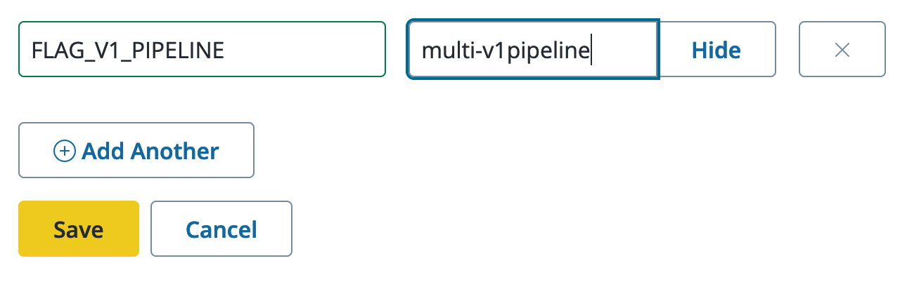
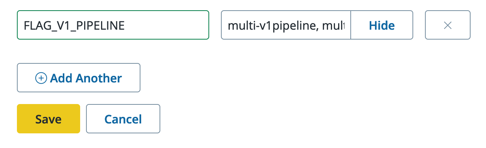

In the Fall of 2023 Pantheon introduced a new build pipeline for Front End Sites.
Among under-the-hood-optimizations, like [caching of folders between builds](/guides/decoupled/overview/manage-settings#build-cache), [the new pipeline now uses your `package.json` file](/guides/decoupled/overview/manage-settings#nodejs-version) to select the appropriate version of Node.js for your build and your runtime environments.

Beginning on **November 13th, 2023**, newly created sites will automatically use the new pipeline and cannot opt back to the old pipeline. Sites made prior to that date can opt-in to the new pipeline to take advantage of the new features.

On or around **January 15th, 2024**, all new builds for all previously created sites will use the new pipeline.

## How to Opt-In

We recommend trying the new pipeline with a branch or pull request before switching over all brances and builds.

To switch over a single multidev environment, set an environment variable in your site's dashboard named `FLAG_V1_PIPELINE` to the name of a Multidev branch that you can make next like `multi-v1pipeline`.

To see the improvement in build times, you will need to make at least two pushes to the branch.
The first push will be a full build, and the second push will be a cached build.
For our own Docs site, we saw a reduction of many minutes in build time.

If you are satisfied with the results, you can switch over all branches and builds by setting the environment variable to `ANY`. If you wish to test across multiple branches, you can set the environment variable to a comma-separated list of environment names like `multi-v1pipeline, multi-v1pipeline2, pr-123`.

