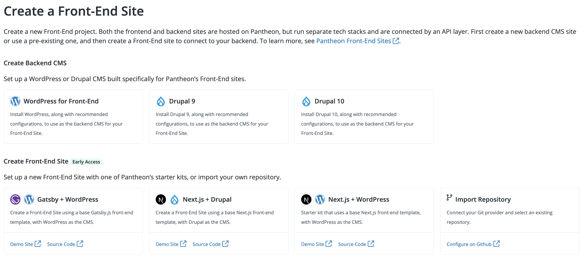

This section provides information on how to use the Gatsby + WordPress starter kit.

## Before You Begin

The Pantheon `gatsby-wordpress-starter` uses Gatsby v4 and has been tested using [nodejs v16 with npm v8](https://nodejs.org/en/download/). Make sure you meet the prerequisites below before you continue.

- You are using a Git repository and you have connected your GitHub account.

- You are using WordPress as your CMS.

- You have installed your WordPress site using the [Decoupled WordPress Recommended Project](https://github.com/pantheon-upstreams/decoupled-wordpress-composer-managed) configuration, which has the `wp-graphql` and `wp-gatsby` plugins installed as dependencies.

- Optional. You may want to install the Gatsby CLI globally, or [use `npx`](https://www.npmjs.com/package/npx)

## Create Your Project on Pantheon

1. [Go to the workspace](/guides/account-mgmt/workspace-sites-teams/workspaces#switch-between-workspaces), then select the **Sites** page.

1. Click the **Front-End Sites** tab and then click **+Create New Site**.

1. Click the **Gatsby + WordPress** template, select your Git provider under **Choose your Git provider**, and then click **Continue**.

  

1. Select your desired GitHub account and enter the repository name. You can select **Make this a private repository** to provide greater security for your Git repository. You cannot use a . (period) or _ (underscore) for site and Multidev names.

1. Select the desired WordPress CMS backend from the **Link Your CMS** drop-down menu.

1. Select the site environment from which to source the content. You can source content from the Live, Test, or Dev environment.

1. Optional. Click **Advanced Settings** to set your:

    - Output directory
    - Build command
    - Environment variables
    - Deployment path

1. Click **Continue**. You are directed to a new page with the site name, deployment, and build information and status.

1. Click **Build Details** to view the build log.

1. Click **View Site** after the build completes to launch your Front-End Site.

### Set Gatsby pathPrefix

You can configure a site served from a subpath in the Pantheon dashboard so that Gatsby automatically reads this set subpath. This allows you to avoid setting this in both Pantheon and Gatsby.

Refer to [Gatsby's documentation](https://www.gatsbyjs.com/docs/how-to/previews-deploys-hosting/path-prefix/#instructions) for more information on how Gatsby uses the `pathPrefix` in the `gatsby-config` file.

1. [Go to the Site Dashboard](/guides/account-mgmt/workspace-sites-teams/sites#site-dashboard) and select the site you want to set the `pathPrefix` for.

1. Click **Settings** and then click **Builds**.

1. Click the **Edit** button in the **Build & Output Settings** section.

1. Set the appropriate subpath build and output. A new site deployed using the Gatsby WordPress starter kit will now automatically be available within your subdirectory.

## Create with Node.js CLI

<Partial file="decoupled-nodejs-cli.md" />

## Connect to a Multidev Environment

Refer to [Multidev Workflow and Configuration](/guides/decoupled/overview/fes-multidev) for instructions on how to connect your Front-End Site to a Multidev environment.