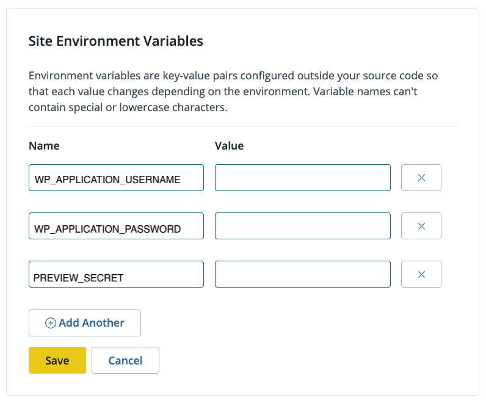

This section provides information on how to configure decoupled content preview for your site. This allows you to preview your content changes in the Next.js app before publishing to your live site.

## Before You Begin

Make sure you have:

- Installed and activated the [Pantheon Decoupled WordPress Preview Plugin](https://github.com/pantheon-systems/wp-decoupled-preview) on your instance
- Installed and activated the [Pantheon Decoupled Plugin](https://github.com/pantheon-systems/wp-pantheon-decoupled) on your instance
## Configure Environment Variables

1. [Go to the Site Dashboard](/guides/account-mgmt/workspace-sites-teams/sites#site-dashboard) and click **Builds**.

1. Scroll down to **Site Environment Variables** and click the **Get Started** or **Make Changes** button. The Get Started button displays if you have not added any Site Environment Variables yet.

    

    <Alert title="Note"  type="info" >

    If you have not already created a preview site within your WordPress instance, refer to the [Decoupled Kit preview configuration documentation](https://decoupledkit.pantheon.io/docs/backend-starters/decoupled-wordpress/configuring-preview-site) before proceeding.

    </Alert>

1. Add the keys below and the corresponding values and then click **Save**. These are the secure preview key-value pairs associated with your site. Their values can be found under the **Environment Variables** action in the **Settings** >> **Pantheon Front-End Sites** section of your WordPress instance. Refer to [Decoupled Kit project creation documentation](https://decoupledkit.pantheon.io/docs/backend-starters/decoupled-wordpress/creating-a-new-project#completing-your-configuration) for more information.

    - `WP_APPLICATION_USERNAME`
    - `WP_APPLICATION_PASSWORD`
    - `PREVIEW_SECRET`

1. Go to the **Overview** page and click the **Trigger Build** button to start a new build and deployment.

1. Locate your live build in the **Multidev** section, click **Actions**, and then select **View Latest Build Logs** to confirm that your environment variables are set on your live Front-End Site.

1. Log in to your WordPress dashboard.

1. Navigate to **Users** and either create a new user profile or use an existing user profile. The user name is your `WP_APPLICATION_USERNAME`.

    <Alert title="Note"  type="info" >

    This user must have at least an **Editor** role. This is necessary for the user to access revisions and private posts.
    </Alert>

1. Hover over the user name and click **Edit** to open the user's profile page.

1. Scroll down to the **Application Passwords** section and add your application password. Your new `WP_APPLICATION_PASSWORD` will display on the screen. Copy and store this value somewhere safe.

    - You now have a client that can use the preview site, however, you must configure the preview site.

1. Navigate to **Settings**, select **Preview Sites**, and then click the **ADD PREVIEW SITE** button.

    <Alert title="Note"  type="info" >

    You must have the [Pantheon Decoupled WordPress Preview Plugin](https://github.com/pantheon-systems/wp-decoupled-preview) installed and activated on your instance.

    </Alert>

1. Set the URL to point to `http(s)://{YOUR_SITE_URL}/api/preview` replacing `{YOUR_SITE_URL}` with the URL of your Front-End Site.

1. Set a secret for the Preview Site and note this value down as your `PREVIEW_SECRET`.

You can now preview content and make other authenticated requests to your WordPress instance.