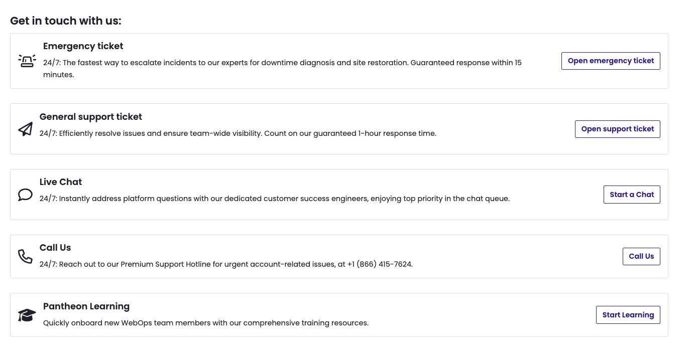

## Open a Support Ticket

In cases of downtime or significant functional failure in the live environment, the first step is to open a support ticket. Even if you escalate the incident to your dedicated Customer Success Manager (available to all Enterprise contract customers), our support engineers will be the ones diagnosing the cause of the downtime and working to restore your site. Opening a ticket is the fastest way to get them up to speed and engaged.

From the Support tab in the workspace of the affected site:

* **Diamond** and **Platinum** customers can open an **emergency ticket** to report and escalate business-critical site downtime.
  * In cases where the dashboard is inaccessible, a support ticket can be filed using a telephone ticketing service, accessible at 1(866)415-7624. Note that this is strictly for filing a ticket, and you will not reach our support engineers by using this method.
* **Gold** customers can open a **general support ticket** to report site downtime.
* **Silver** customers can start a **live chat** to report site downtime.

Please provide as much detail as possible. Our support engineers will work with you to diagnose the cause of the issue, and any information you provide will help shorten the investigation time.

To learn more about the support features for different account tiers, see also the following:
* [Scope of Support](/guides/support/#support-features-and-response-times)
* [Contact Support](/guides/support/contact-support/)

## Check for Ongoing Platform Incidents

Sites can go down for various reasons, and although the support team aims to diagnose the cause of downtime, customers can perform their own diagnostics.

Pantheon platform status is tracked at [status.pantheon.io](https://status.pantheon.io/), and all customers are encouraged to sign up for status page updates. Although a site can be taken down by isolated platform issues that are not systemic enough to warrant a platform status alert, these are rare. Tickets should still be filed even when the downtime is caused by an identified platform incident - we need to know who has been affected, and how it is affecting their sites.

Because incidents are declared when a platform issue meets a minimal downtime or service degradation threshold, it is possible that you will receive a notification for an incident that is not affecting your site. Conversely, there are cases where a site is affected by an issue with the platform, but this issue is isolated to resources specific to the site, and a platform incident is not declared.

## Incident Escalation

Filing an emergency ticket will escalate your downtime incident within the Support team and ensure you receive the fastest response. However, you may also want to alert your broader Pantheon account team. Depending on the situation, your escalation path may vary.

### Support Channels

* **Ticket**: In cases of downtime or significant functional failure in the live environment, the first step is to open a support ticket. While live chat generally offers a quicker response time, emergency tickets (for **Diamond** and **Platinum** customers) are escalated and should have comparable response times.

* **Slack**: Diamond tier accounts can have access to a dedicated Slack channel in which customers can interact directly with their CSM, AM, and primary support resources. This is primarily intended as a means for quick communication and collaboration, and should not be used in lieu of the ticketing system, as there are no SLOs associated with Slack channels.

* **Phone/Teleconference**: You can request a phone call or teleconference for emergency support. This can be done either when filing the emergency ticket or within the ticket thread once it is open.

  <Alert title="Note" type="info" >

  Tickets and live chat have account tier-specific response times, whereas email, phone, and Slack channels do not. Learn more about [support features for different account tiers](/guides/support/#support-features-and-response-times).

  </Alert>

* **Premium Support Hotline**: Diamond and Platinum customers can call the 24/7 Premium Support Hotline for any technical issues, escalations, site, billing, or overages queries. You can find the phone number in the Support tab of your workspace.

### Escalation Paths

Depending on the account tier, your escalation path may differ. Escalation paths include the following:

* Diamond Support Team: All Diamond tier accounts have the Diamond support team, and tickets and issues are routed preferentially to them. This escalation is an automatic part of the intake process once a ticket is opened.

* Customer Success Manager (CSM): Included for all Enterprise (contract) customers, CSMs serve as a coordinator when support involves multiple teams, or when additional subject matter experts need to be brought into the process. The CSM is also responsible for any post-incident Customer Incident Analysis or performance reviews.

* Managed Updates: If the issue arises from a [Managed Updates](/guides/professional-services/managed-updates) deployment, the first point of escalation is the MU Engagement Manager currently involved in deploying the updates, and secondarily the Manager of the Managed Updates team.

### Professional Services Escalation

Incidents may involve managed services like the Advanced Global CDN, WAF Integration, and Managed Updates. Support for these layers is handled by the core Support team, and escalation to the appropriate Professional Services team is at the discretion of the support engineers. The support engineers have been trained to handle many AGCDN issues and have tooling that gives them access directly to edge configurations, but there are aspects that may need to be handled by Professional Services.

Dedicated CSMs (included for all Enterprise contract customers) have the ability to escalate these issues and have access to resources that can assist with expediting the triaging and remediation of issues. If you need to speak with additional teammates at Pantheon that work in our professional services team, CSMs can facilitate those conversations.

### Executive Escalation

In cases where regular emergency support is not resolving the issues and the incident is causing significant customer business impact, Pantheon executive involvement may become necessary. Note that these parties may already be notified and involved through internal escalation by the Account team.

## Ongoing Diagnosis

Incident management is a collaboration between Pantheon Support and the customer, and we will work with you on recovery.

Key tools that you can use for ongoing diagnosis of issues include:

* New Relic gives you real-time insight into application performance, and the slowest transactions are profiled with full stack traces that can isolate specific code, query, or external services bottlenecks. The New Relic Application Performance Monitor can be used to track current-state performance and dig into transaction traces to isolate bottlenecks and break points. Refer to the [New Relic](/guides/new-relic) documentation for more information.

* MySQL, PHP, and Nginx logs provide forensic data for incident review. Refer to [Log Files on Pantheon](/guides/logs-pantheon)

* AGCDN logs can be piped directly into customer-managed log management applications. Setup by Professional Services is required.

Support engineers will work with you through the existing emergency ticket. If additional issues are uncovered you may want to open a new ticket to allow for a cleaner set of interactions, especially if additional Pantheon resources are brought in for review and assistance.
