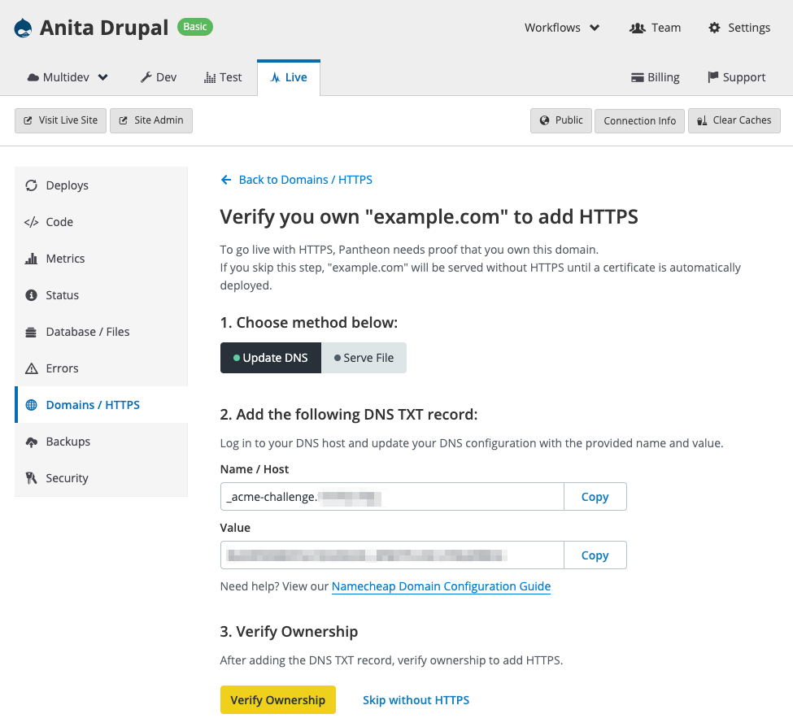

This section provides information on how to add a custom domain to the Pantheon platform.

## Custom Domains

If you don't already own a domain name, register one with a third-party provider. Pantheon is not a domain registrar, but we've created documentation for several popular DNS managers:

<Accordion title="DNS Host-Specific Instructions" id="host-specific2" icon="info-sign">

<DNSProviderDocs />

</Accordion>

Connect your custom domain on the Site Dashboard, and point DNS at Pantheon to trigger [automated HTTPS provisioning](/guides/global-cdn/https).

<Partial file="tables/custom-domains-limit.md" />

<Alert title="Note" type="info">

Add all domains (`example.com` and `www.example.com` are different domains) you want to resolve to Pantheon within the Site Dashboard, for each respective environment, as described in [Launch Essentials](/guides/launch). Automatic resolution of domains and wildcards are not supported.

Note that each custom domain is counted regardless of the environment to which it's added.

</Alert>

### Add a Custom Domain

<Partial file="secure-only-tlds.md" />

1. Log in as an [Admin, Team Member, or Privileged User](/change-management#roles-and-permissions).

1. From the Site Dashboard, for the environment you want the domain to point to (usually Live), click on the <em class="fa fa-home"></em>**Domains / HTTPS** tab.

1. If no domains have been added yet, enter a domain and click **Connect Domain**:

  

  If one (or more) domains have already been added, click **Connect Domain**:

  

1. Verify ownership by adding a new DNS TXT value or by uploading a file to a specific URL. Select the method you prefer, and follow the instructions. Note that the values are randomized for security. Click **Verify Ownership** to confirm, or to skip HTTPS provisioning for now, click **Skip without HTTPS**:

  

  It might take 30 minutes or more for DNS records to propagate, depending on your DNS host and your domain's TTL values. If you encounter issues after 30 minutes, check some of the following:

    - Ensure that there's no "parking page" or redirect configured in your DNS.
    - The TXT record's Host value doesn't have a trailing `.`.
    - That the [DNS value has propagated](https://www.whatsmydns.net/#TXT/).

1. After you add your domain, you'll be automatically taken to the domain's **Details** page where you will see both the current DNS records detected (the **Detected Values**), as well as the values to be added at your DNS host (**Required Values**):

   

  If you instead see:

  > Waiting for HTTPS, DNS records will be provided when HTTPS provisioning completes.

  Wait a minute, then refresh the page.

1. Add the values to your DNS management service. For more details, see [Introduction to Domain Name Services](/dns).

   - Note that if the Platform detects a CNAME record, the **Status** will show `Remove this detected record` on the line with the CNAME. Remove the CNAME from the DNS management service to avoid potential issues or interruptions.
