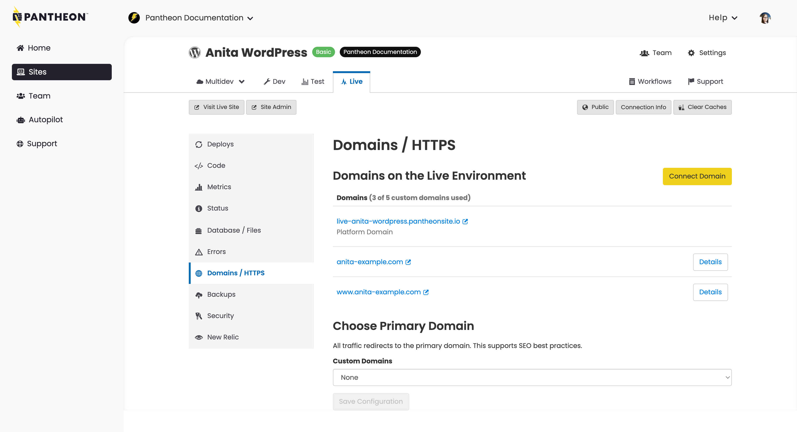

## Considerations 
Before you configure a primay domain consider the following: 
* WordPress Multisites should not use this configuration as it will conflict with subsite routing 
* Sites already managing redirects for secondary domains via PHP should not use this configuration 
  * For example, if you are redirecting `one-example.com` to `example.com/one` via [PHP redirects](/guides/redirect/advanced) 

## Choose Primary Domain

<Partial file="dns-primary.md" />

Choose a primary domain from the dropdown at the bottom of **Domains / HTTPS**:

<Alert title="Note" type="info">

Redirects cannot be managed via `.htaccess`, which is ignored on our platform. For details, refer to [Configure Redirects](/guides/redirect/#php-vs-htaccess).

</Alert>

<Partial file="primary-domain.md" />

<Partial file="remove-primary-domain.md" />

### Redirect to HTTPS

It's a best practice for SEO and security to standardize all traffic on HTTPS and choose a primary domain. Configure redirects to the primary domain with HTTPS in [pantheon.yml](/pantheon-yml#enforce-https--hsts)

### Redirect with PHP

If your site configuration prevents you from setting the primary domain from the platform level, you can use PHP redirects:

<Accordion title="PHP Redirection" >

<Partial file="_redirects.md" />

</Accordion>

## More Resources

- [Configure Redirects](/guides/redirect)

- [Redirect to HTTPS](/guides/redirect/https/)
