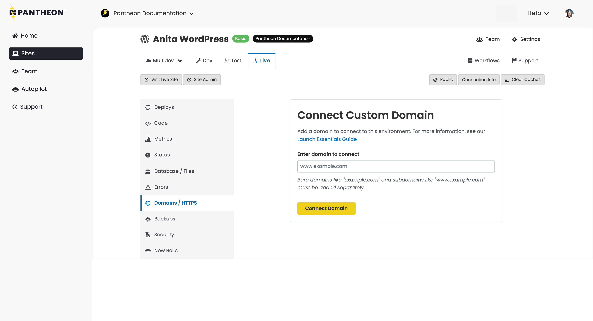

This section provides information on how to add a custom domain to the Pantheon platform.

## Custom Domains

<Partial file="dns-custom.md" />

<Alert title="Note" type="info">

Add all domains (`example.com` and `www.example.com` are different domains) you want to resolve to Pantheon within the Site Dashboard, for each respective environment, as described in [Launch Essentials](/guides/launch). Automatic resolution of domains and wildcards are not supported.

Note that each custom domain is counted regardless of the environment to which it's added.

</Alert>

### Add a Custom Domain

<Partial file="secure-only-tlds.md" />

1. Log in as an [Admin, Team Member, or Privileged User](/guides/account-mgmt/workspace-sites-teams/teams#roles-and-permissions).

1. [Go to the Site Dashboard](/guides/account-mgmt/workspace-sites-teams/sites#site-dashboard) for the environment you want the domain to point to (usually Live), and then click the <Icon icon="global" />**Domains / HTTPS** tab.

1. Enter a domain and click **Connect Domain**:

  

  If one (or more) domains have already been added, click **Connect Domain**:

  

1. Verify ownership by adding a new DNS TXT value or by uploading a file to a specific URL.

1. Select the method you prefer, and follow the instructions. Note that the values are randomized for security.

1. Click **Verify Ownership** to confirm:

   <Alert title="Note" type="info">

  Sites associated with Diamond or Platinum workspaces have the option to skip this step. For details, [see this FAQ below](#can-i-opt-out-of-domain-verification).

  </Alert>

  

  It might take 30 minutes or more for DNS records to propagate, depending on your DNS host and your domain's TTL values. If you encounter issues after 30 minutes, check some of the following:

    - Ensure that there's no "parking page" or redirect configured in your DNS.
    - The TXT record's Host value doesn't have a trailing `.`.
    - That the [DNS value has propagated](https://www.whatsmydns.net/#TXT/).

    You'll automatically be taken to the domain's **Details** page where you will see both the current DNS records detected (the **Detected Values**), as well as the values to be added at your DNS host (**Required Values**):

   

  If you instead see:

  > Waiting for HTTPS, DNS records will be provided when HTTPS provisioning completes.

  Wait a minute, then refresh the page.

1. Add the values to your DNS management service. Refer to [Introduction to Domain Name Services](/guides/domains/dns) for more details.

   - Note that if the Platform detects a CNAME record, the **Status** will show `Remove this detected record` on the line with the CNAME. Remove the CNAME from the DNS management service to avoid potential issues or interruptions.

## FAQ
### I have existing custom domains which were previously connected and launched prior to the enforcement of domain verification, will those be impacted?
No. Any custom domains previously added or launched will not require explicit domain verification. However, if any of those domains are deleted by the customer and then re-added, the process of re-addition (whether to the same environment or any other environment) will trigger domain verification.

### Is pre-provisioning HTTPS now a requirement to connect a custom domain?
Yes. Skipping HTTPS provisioning is no longer an option.

### Is Wild Card DNS routing supported by domain verification?
Pantheon does not allow wild card domains to be directly added as a custom domain. Customers may point wildcard domains (eg: *.example.com) in their own DNS to Pantheon, but are still required to have specific domains (eg: mysite.example.com) added and connected to specific environments on Pantheon.

### How can I know which domains are still pending ownership verification ?
For any domain that has been added that is pending verification, clicking on the "Details" button in the Domains list page for that domain will take you to another page where you can put in the information required to verify ownership for that domain. If the ownership of the domain has been already verified, the detail page will instead show the DNS records you need to update in your authoritative DNS to point to Pantheon, as well as the status of HTTPS provisioning. In other words, if your domain is not verified, we will require you to provide the necessary information to verify ownership first.

You can get a high-level status view for all custom domains connected to a given environment via Terminus using the [`https:info` command](/terminus/commands/https-info). Domains that are pending verification will have the "Verification Pending" status returned as part of the Terminus `https:info` command.

### Can I opt out of domain verification?
Sites associated with Diamond and Platinum workspaces are automatically exempt from domain verification enforcement. All other account tiers can request an exemption for a professional workspace by [contacting support](/guides/support/contact-support/).

Exemption enables the option to skip domain verification when connecting custom domains in the site dashboard, and is only available at the workspace level. For example, you cannot request exemption for just one site in your workspace, or an individual custom domain such as `example.com`.

## More Resources

- [DNS](/guides/domains/dns)

- [Redirect to HTTPS](/guides/redirect/https/)
