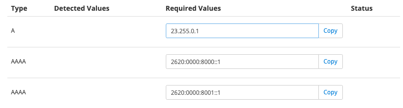

This section provides answers to frequently asked questions about domains and DNS on Pantheon.

### Where are my DNS records hosted?

DNS Records are hosted by an **authoritative name server**. This may or may not also be the **registrar** who you purchased the domain name from. You can use the command line tool **dig** to look up the `NS` record for a domain to find the name server:

```bash{outputLines:2-5}
dig +short ns pantheon.io
ns-1096.awsdns-09.org.
ns-148.awsdns-18.com.
ns-1857.awsdns-40.co.uk.
ns-924.awsdns-51.net.
```

The example above shows that the records for `pantheon.io` are hosted by AWS.

To find the registrar where your domain is registered, use the command line tool **whois**:

```bash{outputLines:2}
whois pantheon.io | grep Registrar:
Registrar: Gandi SAS
```

The example above uses `| grep Registrar:` to filter the results to what we're looking for specifically. Remove it to see the full output of the `whois` command. Our example shows that the domain `pantheon.io` is registered with Gandi.

<Alert title="Note" type="info">

Your registrar may appear to have DNS records for your domain and still not be the authoritative name server. Use `dig` as described above to confirm the name server in use.

</Alert>

### Can I buy my domain or manage DNS with Pantheon?

No, Pantheon is neither a domain registrar nor a DNS manager. Many platforms and hosting providers offer DNS servers and while it's convenient, it's often inflexible. Providers that offer nameservers usually build other features (like HTTPS) in a way that will only work for customers who use the provided nameservers. This approach is fine until it interferes with more advanced deployments.

<Accordion title="Learn More" id="nameservers-drop" icon="lightbulb">

Pantheon is built to support advanced website deployment needs, and that means allowing site owners to use the DNS provider of their choice. If Pantheon required specific nameservers, it would interfere with these major use cases (among others):

* **Large organizations and institutions with Information Technology departments that operate or configure DNS.** If Pantheon required use of particular DNS servers, it would interfere with the ability to use Pantheon for the organization's websites.
* **Digitally signing DNS records using a system like [DNSSec](https://en.wikipedia.org/wiki/Domain_Name_System_Security_Extensions).** While it would be technically possible for Pantheon to host records signed offline, it's much easier for interested organizations to operate their own DNS or choose a provider that supports the desired signing methods.
* **Uncommon record types.** If Pantheon required use of specific nameservers, it's unlikely that all of the desired record types would be available, particularly legacy ones.
* **Programmatic updates.** Such use cases include domain control validation for obtaining certificates and automated responses to security events. Different DNS services support different update APIs, and it's unlikely Pantheon would ever be able to support them all.

If your site doesn't have these advanced needs, there are free and inexpensive options outside of Pantheon. We recommend considering your domain registrar's DNS services, [Amazon Route 53](https://aws.amazon.com/route53/), [Google Cloud DNS](https://cloud.google.com/dns/), or [Cloudflare](https://woorkup.com/cloudflare-dns/).

</Accordion>

### Why does the `www` subdomain redirect to the bare domain?

Some DNS providers provide a default `CNAME` record for `www` pointing to `@` (the bare domain). Remove these records and replace them with the records suggested by the Pantheon Site Dashboard.

Note that if the Platform detects a CNAME record, the DNS **Status** will show `Remove this detected record` on the line with the CNAME. Remove the CNAME from the DNS management service to avoid potential issues or interruptions.

### What are `AAAA` records, and do I need them?

**AAAA** or "quad-A" records are used to assign [IPv6](https://en.wikipedia.org/wiki/IPv6) addresses to domain names. While most of the internet still uses IPv4, the address pool has been exhausted and IPv6 became the standard as of July 14th, 2017.

`AAAA` records are not required, but recommended as a best practice for performance, especially for mobile devices.

Pantheon provides IPv6 addresses for you to assign `AAAA` records to. If your DNS service does not support `AAAA` you can simply omit these records for now, but consider asking your provider to add functionality, as the need for IPv6 will only increase in the future.

Some DNS service providers require expanded `AAAA` records. You can retrieve the expanded version for each AAAA record by using the [IPv6 conversion tool](http://ipv6-literal.com/) and copying the "IPv6 longest" result.

### What about my `MX` records for email?

Pantheon does not provide email services. Make sure your DNS records include an `MX` record that points to a subdomain (like `mail`), which in turn has an `A` or `CNAME` record pointing it to your email provider.

### What is the difference between an `A` and `CNAME` record?

An `A` record points a domain name to an IPv4 address. A `CNAME` record points a domain name to *another* domain, but *does not* redirect to it.

Pantheon provides `A` and `AAAA` values:



<Accordion title="Learn More" id="example-panel" icon="education">

In the past, Pantheon used a mix of  `A`/`AAAA` and `CNAME` records. We've since standardized to only `A`/`AAAA`, which reduces complexity and confusion. `CNAME` records introduce an additional point of failure by requiring an additional lookup from `CNAME` to `A` before getting an IP address.

Additionally, the use of an `MX` or `TXT` record prevents the use of a `CNAME`, and vice versa.

</Accordion>

### Why does my domain say "Update Recommended?"

The **Status** in **Domains / HTTPS** will show as <span class="glyphicons glyphicons-alert text-warning"></span> **Update Recommended** when the Platform detects a CNAME record pointed to Pantheon, or when A/AAAA records are not detected.

Click **Details** to find the values required for A and AAAA records to add, or to find the CNAME detected on the line with `Remove this detected record` in the status.

Log in to your DNS provider to make the recommended changes. We have instructions for [many popular DNS providers](/dns-providers) to help make the required adjustment.

### Can I override DNS locally?

Yes! You can modify your local `hosts` file, which takes precedence over DNS:

<Partial file="_hosts-file.md" />

## More Resources

- [Troubleshoot Domains](/guides/domains/troubleshooting)

- [Modify the Local Hosts File](/guides/domains/hosts-file)

- [Relaunch Existing Pantheon Site](/relaunch)