[Pantheon Advanced Page Cache module](https://www.drupal.org/project/pantheon_advanced_page_cache) is a bridge between [Drupal cache metadata](https://www.drupal.org/docs/8/api/cache-api/cache-api) and the [Pantheon Global CDN](/global-cdn).

When you turn on this module your Drupal site will start emitting the HTTP headers necessary to make the Pantheon Global CDN aware of data underlying the response. Then, when the underlying data changes (nodes and taxonomy terms are updated, user permissions changed), this module will clear only the relevant pages from the edge cache.

This module has no configuration settings of its own, just enable it and it will pass along information already present in Drupal 8 to the Global CDN.

To take finer grain control of how Drupal handles its cache data on both the Global CDN and internal Drupal caches, you can set and clear your own custom tags. This guide will show you how to do this using a mix of custom code and [Views Custom Cache Tags](https://www.drupal.org/project/views_custom_cache_tag).

## Before You Begin

Before starting this guide, you should:

- Install and authenticate [Terminus](/terminus)
- Have an open sandbox slot on your Pantheon account. To follow along with this guide it is best to use the Dev environment of a newly created Drupal 8 site. You could use a pre-existing Drupal 8 site, but some of the details would change.
- So that you can easily copy and paste the example commands in this guide, define your site name with a local environment variable. Replace `cache-tags-demo` with a unique site name:

    ```bash{promptUser: user
    export TERMINUS_SITE=cache-tags-demo
    ```

## Set up a new Drupal site

First, set up a new Drupal 8 site and add the Pantheon Advanced Page Cache module.

1. Start by making a new Drupal 8 site from your local command line environment using Terminus:

  ```bash{promptUser: user
  terminus site:create $TERMINUS_SITE $TERMINUS_SITE "Drupal 8"
  ```

   You can replace the second instance of `$TERMINUS_SITE` with a site label.

2. Install Drupal:

  ```bash{promptUser: user
  terminus drush $TERMINUS_SITE.dev -- site-install -y
  ```

3. The command above modifies the `settings.php` file on the Dev environment. You could commit this change in the Pantheon Dashboard, but we’ll do it from the command line:

  ```bash{promptUser: user
  terminus env:commit $TERMINUS_SITE.dev --message="Installing Drupal"
  ```

4. Add and enable the Pantheon Advanced Page Cache module, which is responsible for sending cache metadata to the Pantheon Global CDN:

  ```bash{promptUser: user
  terminus drush $TERMINUS_SITE.dev -- dl pantheon_advanced_page_cache
  terminus drush $TERMINUS_SITE.dev -- en pantheon_advanced_page_cache -y
  ```

5. Commit the new code:

  ```bash{promptUser: user
  terminus env:commit $TERMINUS_SITE.dev --message="Adding Pantheon Advanced Page Cache."
  ```

6. Log in to your newly created site. This command will give you a one-time log-in link for the admin user:

  ```bashbash{promptUser: user
  terminus drush $TERMINUS_SITE.dev -- user-login
  ```

7. Turn on full page caching by setting the **Page cache maximum age** field to "10 min", then clear caches. We can do this from our Drupal site at `/admin/config/development/performance`:

  

  You can also make those same changes using Drush via Terminus:

  ```bash{promptUser: user
  terminus drush $TERMINUS_SITE.dev -- cset system.performance cache.page.max_age 600 -y
  terminus drush $TERMINUS_SITE.dev -- cr
  ```

## View HTTP Headers

Now we'll look at HTTP Headers.

1. Make a new article node complete with at least one taxonomy term in the **tags** field:

  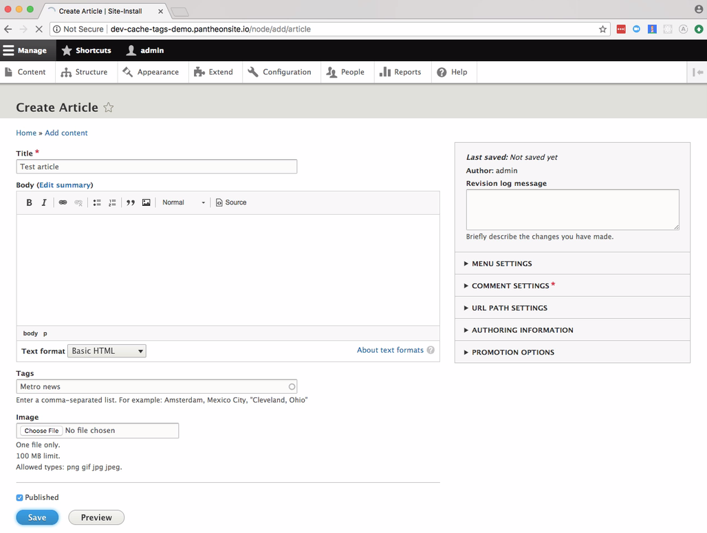

2. Use `curl -IH` to view the headers returned from that page:

    ```bash{promptUser: user
    curl -IH "Pantheon-Debug:1" http://dev-$TERMINUS_SITE.pantheonsite.io/node/1
    ```

    The first request you will see in the list is the initial HTML response. All of the subsequent requests for assets like CSS and images happen after this first HTML response kicks things off:

    ```http
    HTTP/2 200
    date: Thu, 11 Jan 2018 17:05:01 GMT
    cache-control: max-age=600, public
    content-language: en
    content-type: text/html; charset=UTF-8
    etag: W/"1515689631"
    expires: Sun, 19 Nov 1978 05:00:00 GMT
    last-modified: Thu, 11 Jan 2018 16:53:51 GMT
    link: </node/1>; rel="canonical"
    link: </node/1>; rel="shortlink"
    link: </node/1>; rel="revision"
    server: nginx
    surrogate-key-raw: block_view config:block.block.bartik_account_menu config:block.block.bartik_branding config:block.block.bartik_breadcrumbs config:block.block.bartik_content config:block.block.bartik_footer config:block.block.bartik_help config:block.block.bartik_local_actions config:block.block.bartik_local_tasks config:block.block.bartik_main_menu config:block.block.bartik_messages config:block.block.bartik_page_title config:block.block.bartik_powered config:block.block.bartik_search config:block.block.bartik_tools config:block_emit_list config:color.theme.bartik config:search.settings config:system.menu.account config:system.menu.footer config:system.menu.main config:system.menu.tools config:system.site config:user.role.anonymous http_response node:1 node_view rendered taxonomy_term:1 user:0 user:1 user_view
    x-content-type-options: nosniff
    x-drupal-cache: HIT
    x-drupal-dynamic-cache: MISS
    x-frame-options: SAMEORIGIN
    x-generator: Drupal 8 (https://www.drupal.org)
    x-pantheon-styx-hostname: styx-fe3-b-3174343232-r3qrq
    x-styx-req-id: styx-d1a4bdde194dbd2b07eeac64d3ac75bb
    x-ua-compatible: IE=edge
    accept-ranges: bytes
    via: 1.1 varnish
    age: 0
    x-served-by: cache-mdw17331-MDW
    x-cache: MISS
    x-cache-hits: 0
    x-timer: S1515690301.238914,VS0,VE48
    vary: Accept-Encoding, Cookie, Cookie
    x-robots-tag: noindex
    content-length: 10497
    ```

    You can also view headers in a web browser, if you have a browser extension to add the HTTP debugging request header, `Pantheon-Debug`, with a value of `1` (here are some extensions for [Chrome](https://chrome.google.com/webstore/search/modify%20header) and [Firefox](https://addons.mozilla.org/en-US/firefox/search/?q=modify+header)). In an another browser (or a [Chrome incognito window](https://support.google.com/chrome/answer/95464) or [Firefox Private Window](https://support.mozilla.org/en-US/kb/private-browsing-use-firefox-without-history#w_how-do-i-open-a-new-private-window)), open the article you just created. In your browser's page inspector, you can view the HTTP requests made by the page. You may need to refresh the page to see all the network requests.

    By clicking on the first request we can see more detailed information like the HTTP headers.

    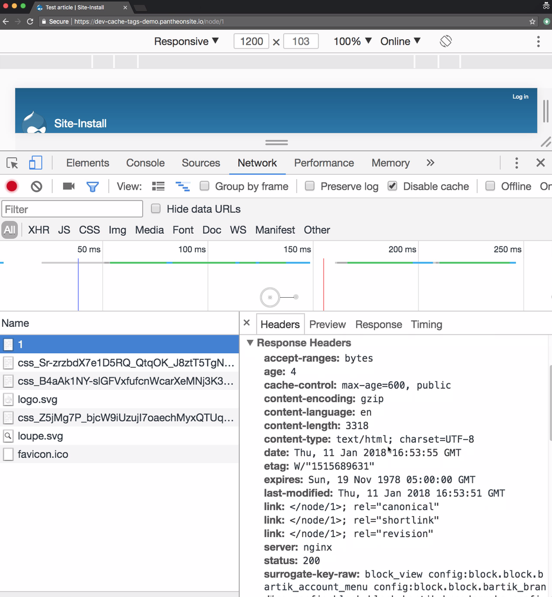

For the rest of the guide, as we make content changes and inspect the changing HTTP headers, we will just reference `curl -I` output because browser inspector tools have a lot of additional information that would distract from our purpose. But if you are more comfortable in the browser, you can continue using that incognito window.

For a walk through of how some of these different headers change caching behavior, see our [Frontend Performance Guide](https://pantheon.io/docs/guides/frontend-performance/). For this guide, we're going to focus on `Surrogate-Key-Raw` and `Age`.

### Review HTTP Headers

The `Surrogate-Key-Raw` header tell us all of the Drupal elements that comprise the page. Most critically, we see `node:1` and `taxonomy_term:1`. This tells us that this page contained renderings of those two entities.

The `Age` header tells us the number of seconds that the page has been cached. If you curl again you should see the age number go up.

```bash{outputLines:2-3}
curl -IH "Pantheon-Debug:1" http://dev-$TERMINUS_SITE.pantheonsite.io/node/1
surrogate-key-raw: block_view config:block.block.bartik_account_menu config:block.block.bartik_branding config:block.block.bartik_breadcrumbs config:block.block.bartik_content config:block.block.bartik_footer config:block.block.bartik_help config:block.block.bartik_local_actions config:block.block.bartik_local_tasks config:block.block.bartik_main_menu config:block.block.bartik_messages config:block.block.bartik_page_title config:block.block.bartik_powered config:block.block.bartik_search config:block.block.bartik_tools config:block_emit_list config:color.theme.bartik config:search.settings config:system.menu.account config:system.menu.footer config:system.menu.main config:system.menu.tools config:system.site config:user.role.anonymous http_response node:1 node_view rendered taxonomy_term:1 user:0 user:1 user_view
age: 40
```

From this point on, we'll trim the output of the `curl` commands to only show the relevant data.

1. Let's look at some of the headers on the listing page for the taxonomy term we made (`/taxonomy/term/1`):

   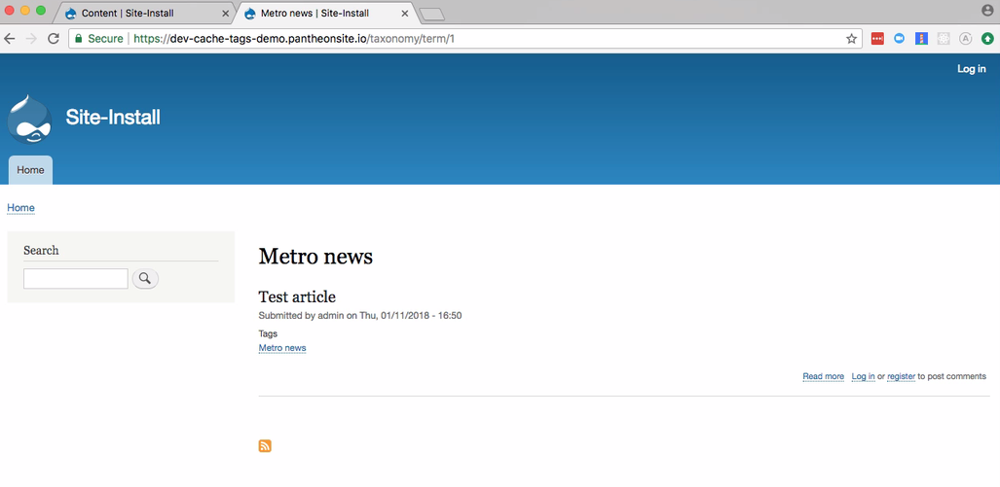

   ```bash{outputLines:2-3}
   curl -IH "Pantheon-Debug:1" http://dev-$TERMINUS_SITE.pantheonsite.io/taxonomy/term/1
   Surrogate-Key-Raw: block_view config:block.block.bartik_account_menu config:block.block.bartik_branding config:block.block.bartik_breadcrumbs config:block.block.bartik_content config:block.block.bartik_footer config:block.block.bartik_help config:block.block.bartik_local_actions config:block.block.bartik_local_tasks config:block.block.bartik_main_menu config:block.block.bartik_messages config:block.block.bartik_page_title config:block.block.bartik_powered config:block.block.bartik_search config:block.block.bartik_tools config:block_emit_list config:color.theme.bartik config:search.settings config:system.menu.account config:system.menu.footer config:system.menu.main config:system.menu.tools config:system.site config:user.role.anonymous config:views.view.taxonomy_term http_response node:1 node_emit_list node_view rendered taxonomy_term:1 taxonomy_term_view user:1 user_view
   Age: 0
   ```

  Again we see `node:1` and `taxonomy_term:1` and because this is the first time we have requested the listing page from curl, we see an age of 0, meaning the response wasn't cached.

2. Curl again and the age will go up:

  ```bash{outputLines:2}
  curl -IH "Pantheon-Debug:1" http://dev-$TERMINUS_SITE.pantheonsite.io/taxonomy/term/1
  age: 15
  ```

3. Let's now make a page node (`/node/add/page`).

   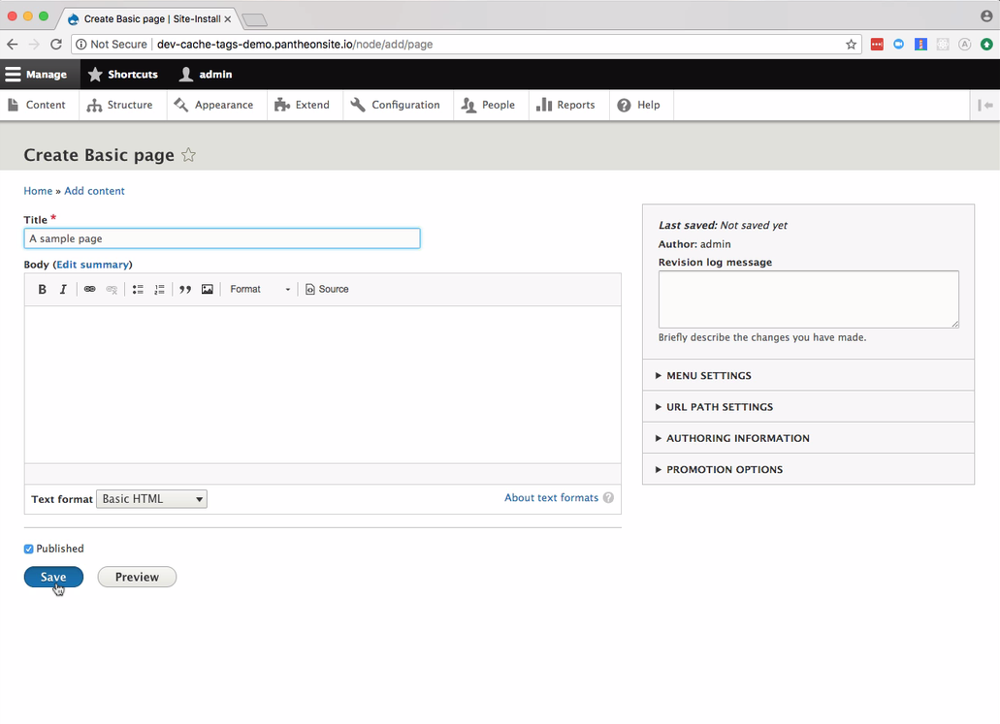

4. And look at its headers:

    ```bash{outputLines:2-3}
    curl -IH "Pantheon-Debug:1" http://dev-$TERMINUS_SITE.pantheonsite.io/node/2
    surrogate-key-raw: block_view config:block.block.bartik_account_menu config:block.block.bartik_branding config:block.block.bartik_breadcrumbs config:block.block.bartik_content config:block.block.bartik_footer config:block.block.bartik_help config:block.block.bartik_local_actions config:block.block.bartik_local_tasks config:block.block.bartik_main_menu config:block.block.bartik_messages config:block.block.bartik_page_title config:block.block.bartik_powered config:block.block.bartik_search config:block.block.bartik_tools config:block_emit_list config:color.theme.bartik config:search.settings config:system.menu.account config:system.menu.footer config:system.menu.main config:system.menu.tools config:system.site config:user.role.anonymous http_response node:2 node_view rendered user:0 user:1
    age: 0
    ```

5. The age will go up if you curl again.

    ```bash{outputLines:2}
    curl -IH "Pantheon-Debug:1" http://dev-$TERMINUS_SITE.pantheonsite.io/node/2
    age: 18
    ```

6. Now what if our article node, Node 1, were saved again? What caching behavior do we want across these three pages: `/node/1`, `/node/2`, and `/taxonomy/term/1`? Load up the edit screen but don't save yet (`node/1/edit`):

  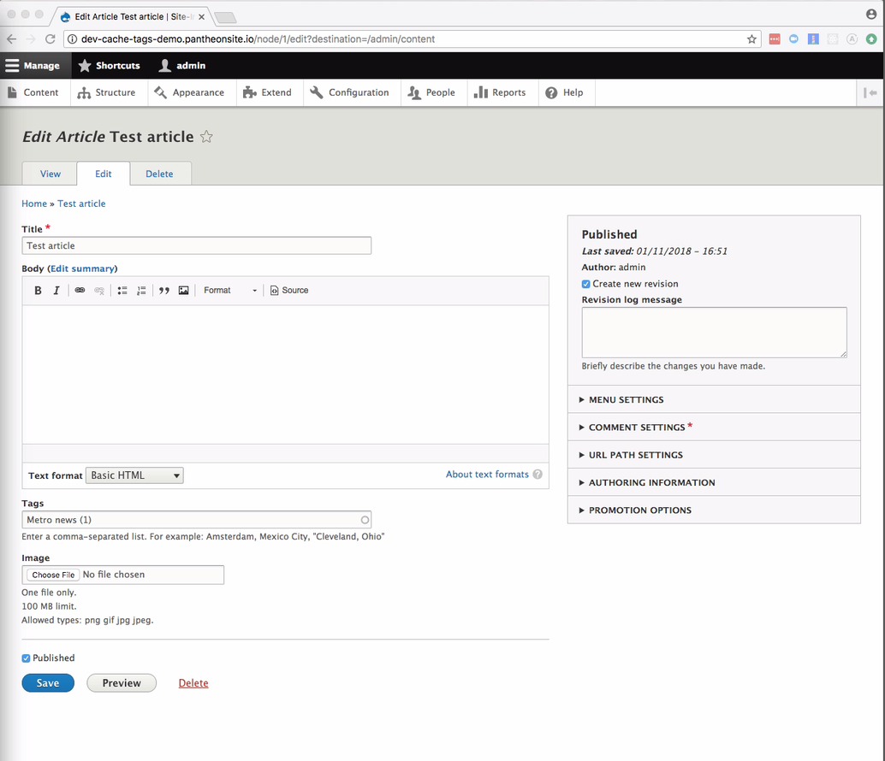

7. Check the age on our three pages:

  ```bash{outputLines:2}
  curl -IH "Pantheon-Debug:1" http://dev-$TERMINUS_SITE.pantheonsite.io/node/1
  age: 267
  ```

  ```bash{outputLines:2}
  curl -IH "Pantheon-Debug:1" http://dev-$TERMINUS_SITE.pantheonsite.io/taxonomy/term/1
  age: 256
  ```

  ```bash{outputLines:2}
  curl -IH "Pantheon-Debug:1" http://dev-$TERMINUS_SITE.pantheonsite.io/node/2
  age: 165
  ```

8. Now click the button to save node 1 in your browser. And then curl those three pages again:

  ```bash{outputLines:2}
  curl -IH "Pantheon-Debug:1" http://dev-$TERMINUS_SITE.pantheonsite.io/node/1
  age: 0
  ```

  ```bash{outputLines:2}
  curl -IH "Pantheon-Debug:1" http://dev-$TERMINUS_SITE.pantheonsite.io/taxonomy/term/1
  age: 0
  ```

  ```bash{outputLines:2}
  curl -IH "Pantheon-Debug:1" http://dev-$TERMINUS_SITE.pantheonsite.io/node/2
  age: 246
  ```

  The pages that contained a rendering of Node 1 were cleared. Node 2's page was not.

## Considerations

What if we added a new node that used taxonomy term 1? We would want the listing page for term 1 to be cleared. But is it?

1. Try adding a new article and use the same taxonomy term:

  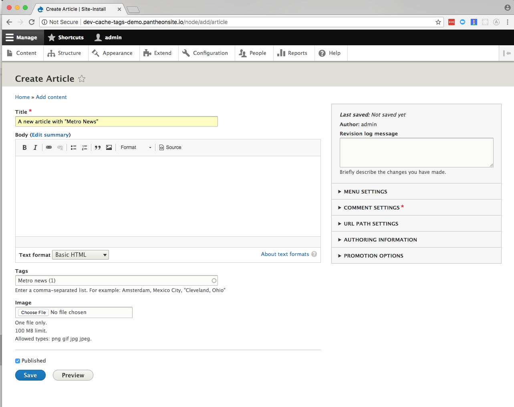

2. And curl the taxonomy listing page.

  ```bash{outputLines:2}
  curl -IH "Pantheon-Debug:1" http://dev-$TERMINUS_SITE.pantheonsite.io/taxonomy/term/1
  Age: 60
  ```

  Our taxonomy listing was not cleared. In order to clear the taxonomy term when a new node is added that uses that term, we need to write a little bit of custom code.

## Clear An Existing Cache Tag

Now we're going to add a custom module that uses a hook to clear the cache tag for all taxonomy terms.

1. To start, connect to your Dev environment via [SFTP](/sftp).

2. Open `code/modules` and create a new directory called `custom_cache_tags`. Open that folder:

  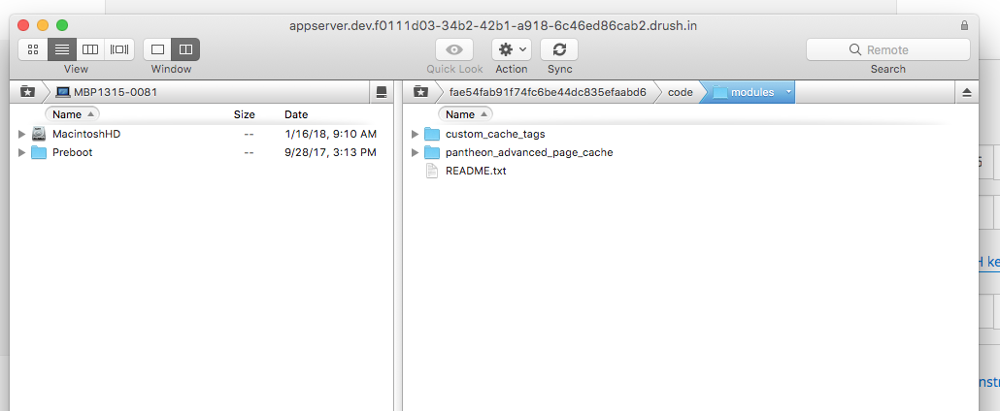

3. Create a new file named `custom_cache_tags.info.yml` and add the following:

  ```yml:title=custom_cache_tags.info.yml
  name: Custom Cache Tags
  type: module
  description: 'Customized cache tag clearing'
  core: 8.x
  ```

4. Create a new file named `custom_cache_tags.module` and add the following:

    ```php:title=custom_cache_tags.module
    <?php
    /**
    * @file
    * Contains custom_cache_tags.module.
    */

    use Drupal\Core\Cache\Cache;
    use Drupal\node\NodeInterface;

    /**
    * Implements hook_node_insert().
    */
    function custom_cache_tags_node_insert(NodeInterface $node) {
      custom_cache_tags_invalidate_all_terms_referenced_by_node($node);
    }

    /**
    * Invalidate the cache for all taxonomy terms referenced by a node.
    *
    *
    */
    function custom_cache_tags_invalidate_all_terms_referenced_by_node(NodeInterface $node) {

      // This code is copied and adapted from taxonomy_build_node_index().
      // Only act upon published nodes where this revision is the default
      // Because only such nodes would appear in the taxonomy listing.
      if ($node->isPublished() && $node->isDefaultRevision()) {
        // Collect a unique list of all the term IDs from all node fields.
        $tid_all = [];
        $entity_reference_class = 'Drupal\Core\Field\Plugin\Field\FieldType\EntityReferenceItem';
        foreach ($node->getFieldDefinitions() as $field) {
          $field_name = $field->getName();
          $class = $field->getItemDefinition()->getClass();
          $is_entity_reference_class = ($class === $entity_reference_class) || is_subclass_of($class, $entity_reference_class);
          if ($is_entity_reference_class && $field->getSetting('target_type') == 'taxonomy_term') {
            foreach ($node->getTranslationLanguages() as $language) {
              foreach ($node->getTranslation($language->getId())->$field_name as $item) {
                if (!$item->isEmpty()) {
                  $tid_all[$item->target_id] = $item->target_id;
                }
              }
            }
          }
        }
        // Insert index entries for all the node's terms.
        if (!empty($tid_all)) {
          foreach ($tid_all as $tid) {
            $cache_tag = 'taxonomy_term:' . $tid;
            Cache::invalidateTags(array($cache_tag));
          }
        }
      }
    }
    ```

  This code clears all references to every taxonomy term referenced by a new published node.

5. Enable the new custom module and commit your code:

    ```bash{promptUser: user}
    terminus drush $TERMINUS_SITE.dev -- en custom_cache_tags -y
    ```

    ```bash{promptUser: user}
    terminus env:commit $TERMINUS_SITE.dev --message="Add custom_cache_tags"
    ```

6. Clear all caches so that the new hook you added is detected by Drupal:

    ```bash{promptUser: user}
    terminus drush $TERMINUS_SITE.dev -- cr
    ```

7. Now whenever you add content, the referenced taxonomy term pages are automatically cleared. To test, check on the age of your taxonomy listing again by curling a few times.

  ```bash{outputLines: 2}
  curl -IH "Pantheon-Debug:1" http://dev-$TERMINUS_SITE.pantheonsite.io/taxonomy/term/1
  Age: 0
  ```

  ```bash{outputLines: 2}
  curl -IH "Pantheon-Debug:1" http://dev-$TERMINUS_SITE.pantheonsite.io/taxonomy/term/1
  Age: 5
  ```

8. Once you add another article that references term 1, that age should reset to zero. Make the new article node and use the same taxonomy term:

  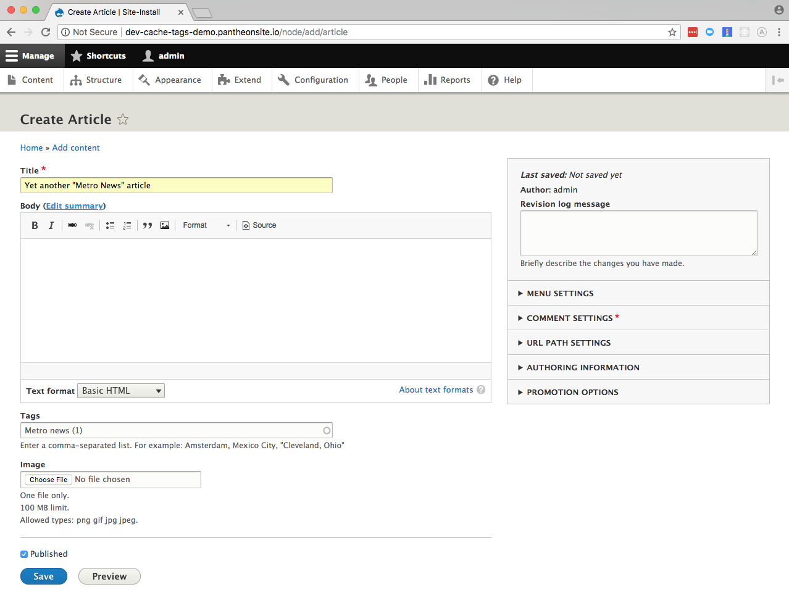

9. Now curl again:

  ```bash{outputLines: 2}
  curl -IH "Pantheon-Debug:1" http://dev-$TERMINUS_SITE.pantheonsite.io/taxonomy/term/1
  Age: 0
  ```

  The age of 0 tells us that adding the new node cleared the cache.

## Set a Custom Cache Tag

The code we added clears all references to each taxonomy term every time a node is added that references the term. Clearing caches that broadly might be too aggressive if we are just concerned about listings of our taxonomy term. We can be more targeted in our clearing by adding a module that will set a more specific tag.

1. Download and enable the [Views Custom Cache Tags](https://www.drupal.org/project/views_custom_cache_tag) module:

    ```bash{promptUser: user}
    terminus drush $TERMINUS_SITE.dev -- dl views_custom_cache_tag
    ```

    ```bash{promptUser: user}
    terminus drush $TERMINUS_SITE.dev -- en views_custom_cache_tag -y
    ```

2. Commit your code changes:

    ```bash{promptUser: user}
    terminus env:commit $TERMINUS_SITE.dev --message="adding views_custom_cache_tag"
    ```

3. Edit the View that controls taxonomy terms (`admin/structure/views/view/taxonomy_term`) and change the **caching** settings from "Tag based" to “Custom Tag based". You may have to expand the **Advanced** column:

  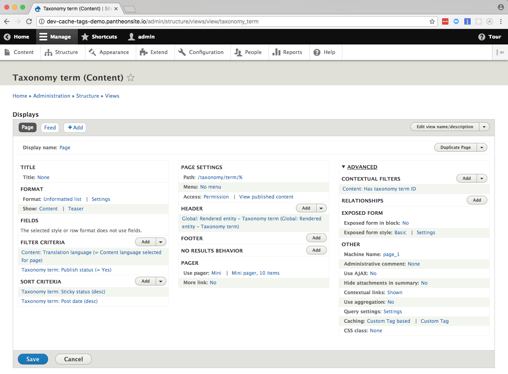

4. For the custom tag, use `taxonomy-listing:{{ raw_arguments.tid }}`. Save the View:

 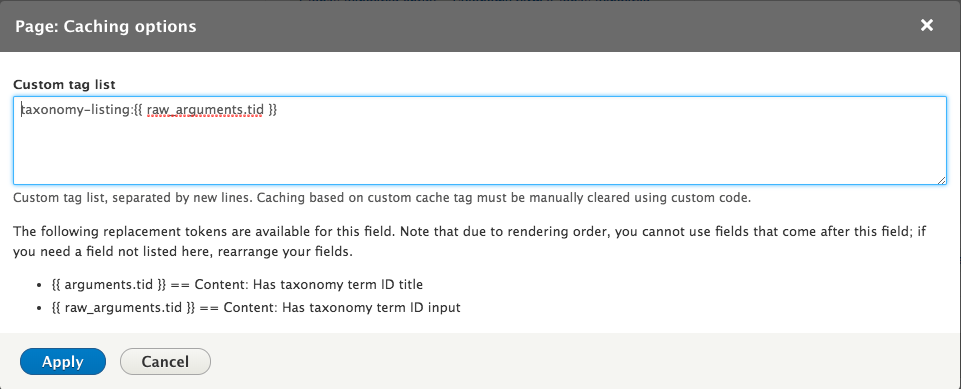

5. To see the change, you may need to clear all caches:

    ```bashbash{promptUser: user}
    terminus drush $TERMINUS_SITE.dev -- cr
    ```

6. Curl the listing page a few times again:

    ```bash{outputLines: 2-3}
    curl -IH "Pantheon-Debug:1" http://dev-$TERMINUS_SITE.pantheonsite.io/taxonomy/term/1
    Surrogate-Key-Raw: block_view config:block.block.bartik_account_menu config:block.block.bartik_branding config:block.block.bartik_breadcrumbs config:block.block.bartik_content config:block.block.bartik_footer config:block.block.bartik_help config:block.block.bartik_local_actions config:block.block.bartik_local_tasks config:block.block.bartik_main_menu config:block.block.bartik_messages config:block.block.bartik_page_title config:block.block.bartik_powered config:block.block.bartik_search config:block.block.bartik_tools config:block_emit_list config:color.theme.bartik config:search.settings config:system.menu.account config:system.menu.footer config:system.menu.main config:system.menu.tools config:system.site config:user.role.anonymous config:views.view.taxonomy_term http_response node:1 node:3 node:4 node:5 node:6 node_view rendered taxonomy-listing:1 taxonomy_term:1 taxonomy_term_view user:1 user_view
    Age: 8
    ```

7. Alter the custom module so that our new tag, `taxonomy-listing:1` gets cleared when a new node is added that references term 1. Change the code in `custom_cache_tags.module` from:

    ```php
    $cache_tag = 'taxonomy_term:' . $tid;
    ```

    To:

    ```php
    $cache_tag = 'taxonomy-listing:' . $tid;
    ```

8. Once again, check that adding a new article clears your taxonomy listing page:

    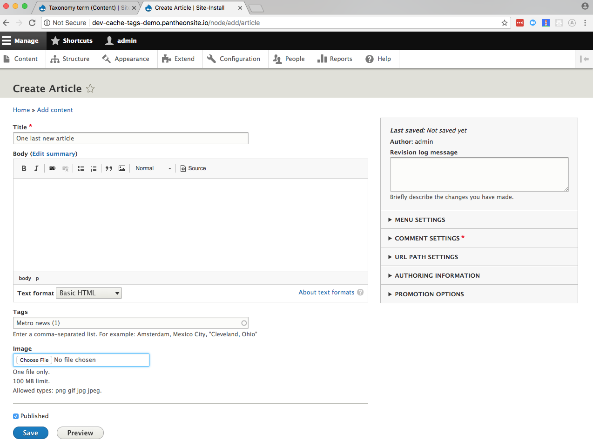

    ```bash{outputLines: 2}
    curl -IH "Pantheon-Debug:1" http://dev-$TERMINUS_SITE.pantheonsite.io/taxonomy/term/1
    Age: 0
    ```

## Additional Resources

- Where you set and clear tags will vary greatly based on the needs of your site. See the [Drupal.org documentation for how you can set cache metadata directly on render arrays](https://www.drupal.org/docs/8/api/render-api/cacheability-of-render-arrays).
- You can also read this blog post from Aaron Wolfe of Capellic on [Pantheon Advanced Page Cache in Drupal 7](https://capellic.com/2017/11/28/using-pantheon-advanced-page-cache-in-drupal-7/).
