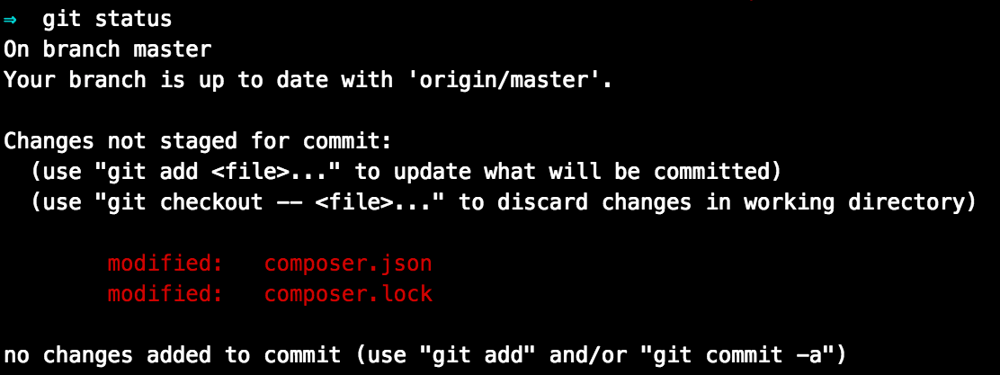
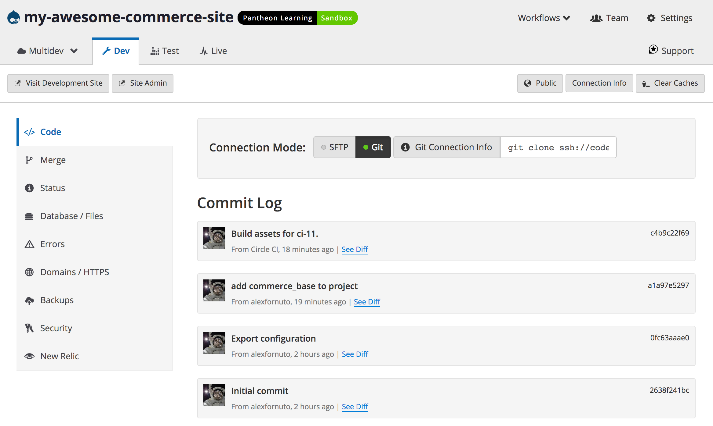
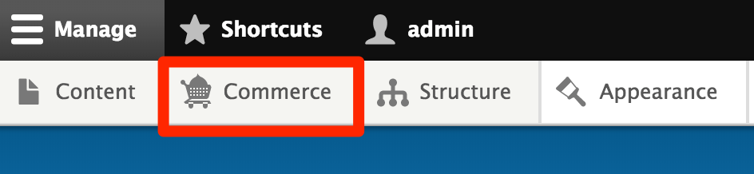

This guide covers installing [Drupal Commerce](https://drupalcommerce.org/), an e-commerce implementation designed specifically for Drupal. At the end of this guide you will have a Drupal Commerce site, GitHub repository, and Circle CI configuration for testing.


## Before You Begin
This process uses Composer to manage modules and dependencies. Before proceeding, you may wish to consult the following docs:

 - [Composer Fundamentals and Workflows](/composer)
 - [Build Tools](/guides/build-tools)

<Alert title="Note" type="info">

As packages pulled by Composer are updated (along with their dependencies), version compatibility issues can pop up. Sometimes you may need to manually alter the version constraints on a given package within the `require` or `require-dev` section of `composer.json` in order to update packages. See the [updating dependencies](https://getcomposer.org/doc/01-basic-usage.md#updating-dependencies-to-their-latest-versions) section of Composer's documentation for more information.

As a first troubleshooting step, try running `composer update` to bring `composer.lock` up to date with the latest available packages (as constrained by the version requirements in `composer.json`).

</Alert>

In addition to Pantheon, you will need accounts at:

 - [GitHub](https://github.com)
 - [CircleCI](https://circleci.com)


1.  Follow the [Before You Begin](/guides/build-tools/#before-you-begin) section of the Build Tools guide to install Composer, Terminus, and the Terminus Build Tools plugin on your local computer, and create machine tokens for [GitHub](https://help.github.com/articles/creating-an-access-token-for-command-line-use) and [CircleCI](https://circleci.com/account/api). Export the tokens to your current terminal session, as described below.

2.  This guide uses several variables in example [Terminus](/terminus) commands. This lets you copy and paste without needing to change the variable. For this to work, you must first export the variables in your local terminal session:

    ```bash
    export SITENAME=yoursitenamehere
    export GITHUB_TOKEN=yourgithubtokenhere
    export CIRCLE_TOKEN=yourcirclecitokenhere
    ```

    - `SITENAME` will be used as the machine names of the Pantheon site and the GitHub repo created in this process
    - `GITHUB_TOKEN` lets Terminus interact with your GitHub account to create the repository
    - `CIRCLE_TOKEN` is used to configure CircleCI to push to Pantheon any time a push is made to the GitHub repo

## Create a New Drupal 8 Site

1.  Using the Terminus Build Tools plugin, create a new Drupal 8 site from the Pantheon [Example Drops 8 Composer](https://github.com/pantheon-systems/example-drops-8-composer) repository on GitHub:

    ```bash
    terminus build:project:create pantheon-systems/example-drops-8-composer $SITENAME
    ```

    At this point *do not* go to the web interface to continue installation.

2.  You now have a repository on GitHub containing your new site. Clone a local copy to your `projects` folder:

    ```bash
    cd ~/projects
    git clone git@github.com:username/$SITENAME.git
    ```

    Remember to replace `username` with your GitHub username.

## Install Drupal Commerce

1. Move into the local repository for your site:

        cd $SITENAME

2. Use Composer to install the [Commerce Installation Profile](https://github.com/drupalcommerce/commerce_base):

   ```bash
   composer config repositories.commerce_base vcs https://github.com/drupalcommerce/commerce_base
   composer require "drupalcommerce/commerce_base dev-8.x-1.x"
   ```

3. Running `git status` should show that the `composer.json` and `composer.lock` files have changed:

   

4. Commit the new files and push them to GitHub:

   ```bash
   git commit -am "add commerce_base to project"
   git push origin master
   ```

5. From your [CircleCI Dashboard](https://circleci.com/dashboard) you can see that tests are already being run on your new commit. Once they pass, CircleCI will push the changes to your Site Dashboard.

6. Go to your newly created Site Dashboard. Under the <span class="glyphicons glyphicons-wrench"></span> **Dev** tab, click on <span class="glyphicons glyphicons-embed-close"></span> **Code**, then **install later**. You should now see your commit history. Once CircleCI completes the automated tests built into our repository, it will commit the build assets and push them to Dev:

    

## Reinstall Drupal

1. The Build Tools Plugin command we used earlier automatically installed Drupal's standard profile in the Dev environment for us. Now that we've installed the Commerce profile, we want that installed instead. Using Terminus, we can run the Drush command `site-install` which will first clear the database of the Standard profile before installing Commerce. This Drush command requires that the system be in writable (SFTP) mode:

   ```bash
   terminus connection:set $SITENAME.dev sftp
   terminus drush $SITENAME.dev -- site-install commerce
   ```

   Review the last two lines of output to identify the username and password created:

   ```bash
   Installation complete.  User name: admin  User password: jTHD8hd85U         [ok]
   Congratulations, you installed Drupal!                                  [status]
   ```


2. Log in to your Drupal site in the Dev environment. The presence of the **Commerce** button on the toolbar indicates a succefull install:

    

## Conclusion

What you do next is up to you and your needs. Remember that you're now using Composer to manage core, modules, and dependencies for your site. Consider reading our [Composer Fundamentals and Workflows](/composer) doc for more information.

## See Also

 - [Drupal Commerce](https://drupalcommerce.org/)
