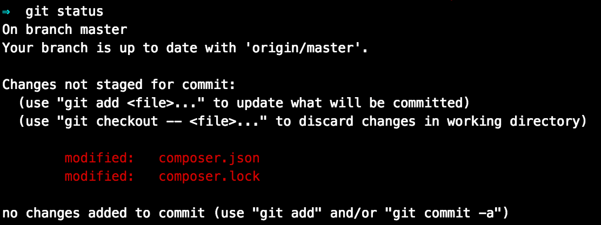

This guide covers installing [Drupal Commerce](https://drupalcommerce.org/), an e-commerce implementation designed specifically for Drupal. At the end of this guide you will have a:

- Drupal Commerce site
- GitHub repository
- Circle CI configuration for testing

## Before You Begin

1. Make sure you have updated to [Drupal 9](/drupal-9#about-drupal-9)

  <Alert title="Note"  type="info" >

  Drupal 8 reached end-of-life status in November 2021, and is no longer supported by Drupal. Read the [official announcement on Drupal.org](https://www.drupal.org/psa-2021-06-29).

  </Alert>

1. Follow the [Before You Begin](/guides/build-tools/create-project/#prerequisites) section of the Build Tools guide to install Terminus and the Terminus Build Tools plugin on your local computer, and create machine tokens for [GitHub](https://help.github.com/articles/creating-an-access-token-for-command-line-use) and [CircleCI](https://circleci.com/account/api). Export the tokens to your current terminal session, as described below.

1. Export the variables in your local terminal session copy and paste commands without needing to change the variable. 

  ```bash{promptUser: user}
  export SITENAME=yoursitenamehere
  export GITHUB_TOKEN=yourgithubtokenhere
  export CIRCLE_TOKEN=yourcirclecitokenhere
  ```

    - `SITENAME` will be used as the machine names of the Pantheon site and the GitHub repo created in this process
    - `GITHUB_TOKEN` lets Terminus interact with your GitHub account to create the repository
    - `CIRCLE_TOKEN` is used to configure CircleCI to push to Pantheon any time a push is made to the GitHub repo

## Create a New Drupal 9 Site

1. Use the Terminus Build Tools plugin to create a new Drupal 9 site from the Pantheon [Drupal Recommended](https://github.com/pantheon-systems/drupal-recommended) repository on GitHub:

 ```bash{promptUser: user}
 terminus build:project:create pantheon-systems/example-drupal-recommended $SITENAME
 ```

*Do not* go to the web interface to continue installation. You now have a repository on GitHub containing your new site.

1. Clone a local copy to your `projects` folder:

 ```bash{promptUser: user}
 cd ~/projects
 git clone git@github.com:username/$SITENAME.git
 ```

 Remember to replace `username` with your GitHub username.

## Install Drupal Commerce

1. Move into the local repository for your site:

  ```bash{promptUser: user}
  cd $SITENAME
  ```

1. Use Composer to install the [Commerce Installation Profile](https://github.com/drupalcommerce/commerce_base):

  ```bash{promptUser: user}
  composer config repositories.commerce_base vcs https://github.com/drupalcommerce/commerce_base
  composer require "drupalcommerce/commerce_base dev-9"
  ```

1. Run `git status` to see that the `composer.json` and `composer.lock` files have changed:

  

1. Commit the new files and then push them to GitHub:

  ```bash{promptUser: user}
  git commit -am "add commerce_base to project"
  git push origin master
  ```

1. Open your [CircleCI Dashboard](https://circleci.com/dashboard) to see that tests are running on your new commit. After they pass, CircleCI will push the changes to your Site Dashboard.

1. Go to your newly created Site Dashboard. Under the <span class="glyphicons glyphicons-wrench"></span> **Dev** tab, click on <span class="glyphicons glyphicons-embed-close"></span> **Code**, then **install later**. 

  You should now see your commit history. After CircleCI completes the automated tests built into our repository, it will commit the build assets and push them to Dev:

  

## Reinstall Drupal

The Build Tools Plugin command you used earlier automatically installed Drupal's standard profile in the Dev environment for us. Now that you've installed the Commerce profile, you need that installed instead.

1. Use Terminus to run the Drush command `site-install`.

  This will first clear the database of the Standard profile before installing Commerce. This Drush command requires that the system be in writable (SFTP) mode:

  ```bash{promptUser: user}
  terminus connection:set $SITENAME.dev sftp
  terminus drush $SITENAME.dev -- site-install commerce
  ```

1. Review the last two lines of output to identify the username and password created:

  ```bash
  Installation complete.  User name: admin  User password: jTHD8hd85U         [ok]
  Congratulations, you installed Drupal!                                  [status]
  ```

1. Log in to your Drupal site in the Dev environment. The presence of the **Commerce** button on the toolbar indicates a successful install:

    

## Conclusion

What you do next is up to you and your needs. Consider reading our [Composer Fundamentals and Workflows](/guides/composer) doc for more information.

## See Also

- [Drupal Commerce](https://drupalcommerce.org/)
