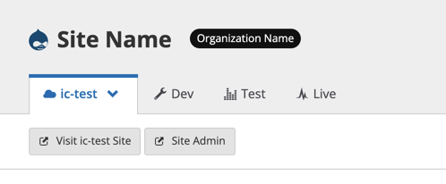

This doc demonstrates how to convert a non-Composer-managed Drupal 8 site to Integrated Composer while on Drupal 8.

The process is similar to the [Upgrade Pantheon Drupal 8 Sites to Drupal 9 With Integrated Composer](/guides/drupal-9-migration/upgrade-to-d9) guide, except that you stay on Drupal 8 with some special considerations for Custom Upstreams, and can defer the Drupal 9 upgrade to later.

From a local clone of the site, you will replace the entire site's file structure with the code from Pantheon's Integrated Composer upstream, then re-add your contrib and custom code to the new codebase. Then, you will create Multidev environments on individual sites for testing and apply any site-specific code customizations.

This doc uses [Terminus](/terminus).

## New Branch With Integrated Composer Code

1. Create a local clone of the Custom Upstream repository using the SSH URL, and `cd` into the cloned repository:

  ```bash{promptUser:user}
  git clone $SSH_URL
  cd $REPOSITORY_NAME
  ```

1. Add Integrated Composer upstream as a second remote and fetch:

  ```bash{promptUser:user}
  git remote add ic https://github.com/pantheon-upstreams/drupal-project.git && git fetch ic
  ```

1. Create a new `composerify` branch to work in:

   ```bash{promptUser:user}
   git checkout -b composerify
   ```

1. On the `composerify` branch, use Git to remove all the files in the directory and commit the change. This is because you're going to completely replace the file structure and re-add customizations:

   ```bash{promptUser:user}
    git rm -rf * && git commit -m "Removing all files"
    ```

1. Add and commit files from integrated-composer upstream:

   ```bash{promptUser:user}
   git checkout ic/master .
   git add $FILE_NAME
   git commit -m "Add and commit Integrated Composer files"
   ```

1. Navigate to `upstream-configuration/composer.json` in your text editor and change the `drupal/core-recommended` version to only Drupal 8:

  ```json:title=upstream-configuration/composer.json
  "drupal/core-recommended": "^8.8"
  ```

1. Commit the change:

  ```bash{promptUser:user}
  git commit -am "Setting Drupal core version to ^8.8"
  ```

## Add Contrib and Custom Code

This process the same as in the [Add in the Custom and Contrib Code Needed to Run Your Site](/guides/drupal-9-migration/upgrade-to-d9#contributed-code) section of the main Drupal 9 migration document.

<Accordion title="Optional Upstream Audit" id="optional-audit" icon="wrench">

If you would like to audit your upstream's customizations, compare it with the `drops-8` upstream.

Access the list of differences by adding the `drops-8` upstream as a second remote and use Git to compare the branches:

1. Change directories back to `master` branch:

   ```bash{promptUser:user}
   cd master
   ```

1. Add `drops-8` as a second remote:

   ```bash{promptUser:user}
   git remote add drops-8 https://github.com/pantheon-systems/drops-8.git && git fetch drops-8
   ```

1. Return a list of the differing files:

   ```bash{promptUser:user}
   git diff --stat drops-8/master
   ```

1. Run `git diff` for different lines within a specific file:

   ```bash{promptUser:user}
   git diff drops-8/master $FILENAME
   ```

Compare the differences and note the ones that you will need to reapply to the Integrated Composer codebase.

</Accordion>

### Modules

On the `composerify` branch, make a list of the modules that will need to be re-added:

- **If you know that all the sites have the same contrib and custom modules**, get the list of modules from a single representative site. You will need this list in next steps:

  ```bash{promptUser:user}
  terminus drush $SITE.dev  -- pm-list --type=module --no-core --status=enabled
  ```

- **If you do not know whether the sites have the same contrib and custom modules installed**, audit the modules across all sites and compile a unified list:

  <Accordion title="Audit Contrib and Custom Modules" id="audit-contrib-custom-modules" icon="wrench">

  1. To audit modules on all sites, create a new file called `audit_site_modules.sh` with the following content:

    ```bash:title=audit_site_modules.sh
    #!/usr/bin/env bash

    echo 'Updating site list now with site urls from the custom Drupal 8 Upstream.'
    SITES=$(terminus site:list --upstream=a2457b48-2c68-4d01-b471-7ae1337c9320 --field=Name)

    for site in $SITES
    do
      echo "---------- $site -----------"
      terminus drush $site.dev  -- pm-list --type=module --no-core --status=enabled
      echo "----------------------------"
      echo
    done | tee d8_upstream_sites_modules.txt

    for site in $SITES
    do
      echo "---------- $site -----------"
      terminus drush $site.dev  -- pm-list --type=theme --no-core --status=enabled
      echo "----------------------------"
      echo
    done | tee d8_upstream_sites_themes.txt
      ```
    
  1. Make the script executable:

      ```bash{promptUser:user}
      chmod +x audit_site_modules.sh
      ```
    
  1. Run the script:

      ```bash{promptUser:user}
      ./audit_site_modules.sh
      ```

      - This creates two new files in the same folder:

        - `d8_upstream_sites_modules.txt`: list of **modules** from each site
        - `d8_upstream_sites_themes.txt`: list of **themes** from each site

  1. Go through these files and build a list of modules and themes you'll need to add to the codebase.

  </Accordion>

### Contrib Modules and Themes

1. In your terminal, from the `composerify` branch, `cd` to `upstream-configuration`:

  ```bash{promptUser:user}
  cd upstream-configuration
  ```

1. For each contrib module and theme in the list you've gathered, go through the following steps:

    1. Add the package and version with Composer. If the version starts with `8.x-`, remove that and only include the version number after `8.x-`.

      For example, if the version is `8.x-3.2`, use the version number `3.2`:

      ```bash{promptUser:user}
      composer require drupal/MODULE_NAME:^VERSION --no-update
      ```

    1. Confirm that only `composer.json` has been modified:

      ```bash{promptUser:user}
      git status
      ```

      - If anything other than `composer.json` has been modified, add the modified file to `.gitignore`.

    1. Commit the change:

      ```bash{promptUser:user}
      git commit -am "Adding MODULE_NAME"
      ```

### Custom Modules and Themes

For custom modules and themes, the process is the same as in [Upgrade to Drupal 9](/guides/drupal-9-migration/upgrade-to-d9#modules-and-themes-1).

Modules:

```bash{promptUser:user}
git checkout master modules/custom
git mv modules/custom web/modules/
git commit -m "Copy custom modules"
```

Themes:

```bash{promptUser:user}
git checkout master themes/custom
git mv themes/custom web/themes/
git commit -m "Copy custom themes"
```

Do the same for any other custom code that needs to be carried over.

## Test Individual Sites and Apply Site-specific Customizations

Go through the following steps for each child site you wish to test, or that has site-specific code. Examples of site-specific code are: site-specific redirects and custom modules only present on a specific site.

1. Clone the child site's repository. You can get the command from the **Clone with Git** button on the Dashboard.

  The command will look like the following:

  ```bash{promptUser:user}
  git clone ssh://codeserver.dev.$SITE_ID@codeserver.dev.$SITE_ID.drush.in:2222/~/repository.git $SITE
  ```

1. Change directory into the newly created folder:

  ```bash{promptUser:user}
  cd $SITE
  ```

1. Add your custom upstream as a second remote called `upstream` and fetch. You can find the Custom Upstream's Git URL on the repository dashboard:

  ```bash{promptUser:user}
  git remote add upstream <UPSTREAM'S GIT URL> && git fetch upstream
  ```

1. Create a new branch called `ic-test` based on the upstream's `composerify` branch. If this site contains unique code customizations, merge this branch later:

  ```bash{promptUser:user}
  git checkout -b ic-test --no-track upstream/composerify
  ```

1. Push the new `ic-test` branch to your Pantheon site:

  ```bash{promptUser:user}
  git push --set-upstream origin ic-test
  ```

1. Create a new Multidev environment from the `ic-test` branch using Terminus:

  ```bash{promptUser:user}
  terminus multidev:create $SITE.dev ic-test
  ```

1. Re-add, commit, and push any code customizations that were specific or unique to this site.

   Compare the site's `master` branch to your Custom Upstream's `master` branch using the following commands:

   To assess files which have been changed:

    ```bash{promptUser:user}
    git diff --stat origin/master upstream/master
    ```

   To assess the line-by-line differences for a specific file:
  
    ```bash{promptUser:user}
    git diff origin/master upstream/master -- pantheon.yml
    ```

1. View & test the Multidev

  

## Final Deployment

Merge the code and files from the Multidev environment to the dev environment.

1. Merge the `composerify` branch on the Custom Upstream into the `master` branch and push:

    ```bash{promptUser:user}
    git checkout master
    git merge composerify && git push origin master
    ```

1. Apply the upstream updates to your individual sites. This will only apply them to the Dev environment.

1. If you applied any site-specific code to individual sites' `ic-test` Multidev, merge that Multidev into the Dev environment.

  <Alert title="Note"  type="info" >

  There is currently a platform bug which prevents Integrated Composer from being enabled until a change to pantheon.yml has been pushed to **each site**. Follow the steps below to complete final deployment.

  </Alert>

1. After you push to Dev, you must push another change to `pantheon.yml`. You can either:

    - Add a comment in `pantheon.yml` at the end of the file, and that will trigger Composer

      Or

    - Use `echo` to do it for you:

     ```bash{promptUser:user}
     echo "\n# comment to trigger Composer\n" >> pantheon.yml
     ```

1. Make sure to push your changes up again.

1. Confirm that the Dev environment is working as expected.

1. Deploy to live when ready.
