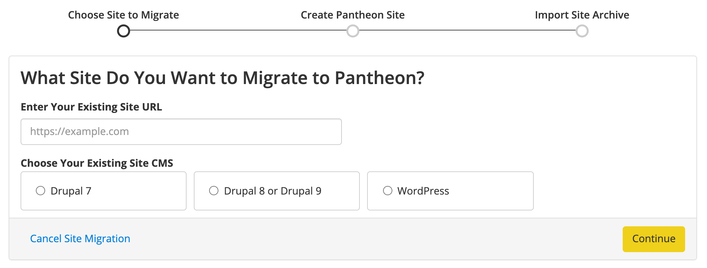

This is a placeholder, for the doc that will (soon!) provide steps to use the **Migrate Existing Site** button on your Pantheon Dashboard to migrate an existing Drupal 8 site to a Drupal 9 site with Integrated Composer on Pantheon.

<!-- steps here

1. Navigate to your User Dashboard and click the **Migrate Existing Site** button.

2. Enter your current website URL.

1. Select **Drupal 8 or Drupal 9**.

1. Click **Continue**.

5. Name your new Pantheon site.

1. Select an organization for the site (optional).

1. Click **Create Site**.

1. Follow the instructions to **Create an Archive of Your Existing Site With Drush**:

  

  The Dashboard instructs you to put the archive on your existing website, but you can put the site archive on Dropbox, S3, or any number of other places. The important thing is that you have a site archive that can be downloaded via a publicly accessible URL.

1. Paste a publicly accessible URL to a download of your site archive. Change the end of Dropbox URLs from `dl=0` to `dl=1` so we can import your site archive properly.

1. Click **Import Archive**. After the imported is complete, select **Visit the Site Dashboard** from the Site Dashboard on Pantheon:

 

(Additional Steps go here)

-->

## See Also

- [Drupal 9 with Integrated Composer](/drupal-9)
- [Composer Fundamentals and Workflows](/composer)
