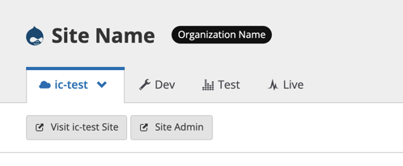

Go through the following steps for each child site you wish to test, or that has site-specific code. Examples of site-specific code are site-specific redirects and custom modules only present on a specific site.

1. Clone the child site's repository. You can get the command from clicking **Clone with Git** on the Dashboard.

  The command will look like the following:

  ```bash{promptUser:user}
  git clone ssh://codeserver.dev.$SITE_ID@codeserver.dev.$SITE_ID.drush.in:2222/~/repository.git $SITE
  ```

1. Change directory into the newly created folder:

  ```bash{promptUser:user}
  cd $SITE
  ```

1. Add your custom upstream as a second remote called `upstream` and fetch. You can find the Custom Upstream's Git URL on the repository dashboard:

  ```bash{promptUser:user}
  git remote add upstream <UPSTREAM'S GIT URL> && git fetch upstream
  ```

1. Create a new branch called `ic-test` based on the upstream's `composerify` branch. If this site contains unique code customizations, merge this branch later:

  ```bash{promptUser:user}
  git checkout -b ic-test --no-track upstream/composerify
  ```

1. Push the new `ic-test` branch to your Pantheon site:

  ```bash{promptUser:user}
  git push --set-upstream origin ic-test
  ```

1. Create a new Multidev environment from the `ic-test` branch using Terminus:

  ```bash{promptUser:user}
  terminus multidev:create $SITE.dev ic-test
  ```

1. Again, add, commit, and push any code customizations that were specific or unique to this site.

   Compare the site's `master` branch to your Custom Upstream's `master` branch using the following commands:

   To assess files which have been changed:

    ```bash{promptUser:user}
    git diff --stat origin/master upstream/master
    ```

   To assess the line-by-line differences for a specific file:
  
    ```bash{promptUser:user}
    git diff origin/master upstream/master -- pantheon.yml
    ```

1. View and test the Multidev environment.

  