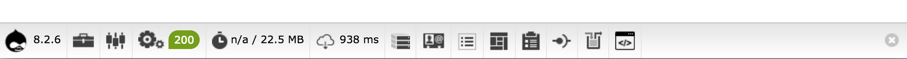

[Drush](https://github.com/drush-ops/drush) is a tool for working with Drupal from the command line. [Terminus](/terminus) allows you to use the command line to do everything you can do in Pantheon's browser-based dashboard. You can also run Drush commands directly from Terminus, making it a single solution for command line development on Pantheon.

This section walks you through using Drush and Terminus in the command line to create a new Drupal site and move configurations between Pantheon environments.

## Before You Begin

Be sure that you:

- Are familiar with your operating system's command line.
- Are using a Unix-based system (Linux or Mac OS X). Windows commands may vary slightly.
- Have created a [Pantheon account](https://dashboard.pantheon.io/register). Pantheon accounts are always free for development.
- Have an [SSH key](/ssh-keys) generated, added to your Pantheon dashboard, and loaded in to your local SSH agent.
- You have [Composer](https://getcomposer.org/download/), the package manager for PHP, installed on your machine.

## Install and Authenticate Terminus

Terminus provides advanced interaction with the platform and allows us to run Drush commands remotely. Terminus also opens the door to automating parts of your workflow by combining multiple operations. Refer to the [Terminus Manual](/terminus) for more information.

1. [Install Terminus](/terminus/install#install-terminus).

1. Navigate to the Pantheon dashboard, click **User Dashboard**, select **Account**, and then select **Machine Tokens** to [generate a Machine Token](https://dashboard.pantheon.io/login?destination=%2Fuser#account/tokens/create/terminus/).

1. Use the Machine Token to authenticate Terminus:

  ```bash{promptUser: user}
  terminus auth:login --machine-token=‹machine-token›
  ```

1. Verify your session after installation:

  ```bash{promptUser: user}
  terminus site:list
  ```

Your installation and authentication were successful if your Pantheon site is on the list.

## Create Your Site and Initialize Environments

<Alert title="Note" type="info">

The next few sections use the example variables `my-d9-site` and `"My D9 Site"` as the site name and label. Make sure you replace each instance, as well as other variables, with your desired values.

</Alert>

1. Create a new Drupal site on Pantheon:

  ```bash{promptUser: user}
  terminus site:create my-d9-site "My D9 Site" "drupal-composer-managed"
  ```

  - You can add the `--org` option to the command above and pass the Organization name, label, or ID if you want to associate this site with an Organization.
  
  - Use the `site:org:add` command to associate an existing site with an Organization.

1. Open your new Site Dashboard in a browser:

  ```bash{promptUser: user}
  terminus dashboard:view my-d9-site
  ```

  Keep this window open while you continue reading so you can see the changes you are making in Terminus appear almost immediately in your Site Dashboard.

1. Use the Drush [`site-install`](https://drushcommands.com/drush-8x/core/site-install/) command to install Drupal 9 on the Dev environment:

  ```bash{promptUser: user}
  terminus drush my-d9-site.dev -- site-install -y
  ```

  - You may need to [update your SSH configuration](/ssh-keys#control-path-error) if you get the error message `ControlPath too long`.

1. Use the password included in the output of that command to sign in to the site with your browser, or use this command to get a one-time login link:

   ```bash{promptUser: user}
   terminus drush  my-d9-site.dev  -- user-login
  ```

1. Create the Test environment:

  ```bash{promptUser: user}
  terminus env:deploy my-d9-site.test
  ```

1. Create the Live environment:

  ```bash{promptUser: user}
  terminus env:deploy my-d9-site.live
  ```

### Export the Site Name as a Variable

You can now replace `my-d9-site` in every command, so that you don't have to type it every time.

1. Set the site name to a variable so you can copy and paste the remainder of your commands instead of typing the site name:

  ```bash{promptUser: user}
  export TERMINUS_SITE=my-d9-site
  ```

  This sets an [**environment variable**](https://en.wikipedia.org/wiki/Environment_variable) named `$TERMINUS_SITE` to `steve-new-site`. The variable name is replaced in the executed command with the value whenever you use the variable name.

1. Test this by echoing your variable:

  ```bash{promptUser: user}
  echo $TERMINUS_SITE
  ```

  You can now copy and paste the remainder of these commands without replacing the site name because they use the `$TERMINUS_SITE` variable.

1. Run the command below to get the connection information for the Dev environment:

  ```bash{promptUser: user}
  terminus connection:info $TERMINUS_SITE.dev
  ```

## Install Terminus Composer plugin

Run the command below to install the Terminus Composer plugin.

  ```bash{promptUser: user}
  terminus plugin:install "pantheon-systems/terminus-composer-plugin"
  ```

## Install Drupal Modules

We recommend that you use [Integrated Composer](/guides/integrated-composer) to install and manage your modules. Integrated Composer is a Pantheon platform feature that extends Composer functionality to Drupal's core files, and treats them as a managed dependency. Integrated Composer lets you perform one-click updates from the Dashboard for upstream updates and Composer dependencies.

You can also manage all modules with [Composer](/guides/composer), or with Pantheon's [Terminus Composer plugin](https://github.com/pantheon-systems/terminus-composer-plugin), which runs Composer commands in your development environment.

We recommend that you download and enable modules from the `devel` package. These modules are helpful while a site is under construction. You can read more about [this package of modules on drupal.org](https://www.drupal.org/project/devel).

You may want to remove these modules after you launch your site, or use more advanced configuration management techniques to keep the module on in the Dev environment and off in Test and Live environments. You can have the modules installed in all three environments for this exercise on a Sandbox site.

1. Download and install the latest stable release of the `devel` package from [drupal.org](https://www.drupal.org/) via Composer:

  ```bash{promptUser: user}
  terminus composer $TERMINUS_SITE.dev -- require drupal/devel
  ```

1. Review the file changes:

  ```bash{promptUser: user}
  terminus env:diffstat $TERMINUS_SITE.dev
  ```

1. Commit your changes to the Dev environment:

  ```bash{promptUser: user}
  terminus env:commit  $TERMINUS_SITE.dev --message="Adding devel module"
  ```

1. Enable the modules:

  ```bash{promptUser: user}
  terminus drush $TERMINUS_SITE.dev -- pm-enable devel devel_generate webprofiler -y
  ```

  All of these modules are helpful during active development. Devel Generate is used in this walk-through to make nodes on the Live environment.

1. Sign in to your Dev environment if you haven't already done so. You will see a footer of helpful development information provided by the `webprofiler` module you just installed:

  ```bash{promptUser: user}
  terminus drush $TERMINUS_SITE.dev -- user-login
  ```

  

1. Export the configuration in the Dev environment:

  ```bash{promptUser: user}
  terminus drush $TERMINUS_SITE.dev -- config-export -y
  ```

1. Commit the changes:

  ```bash{promptUser: user}
  terminus env:commit  $TERMINUS_SITE.dev --message="export of config files"
  ```

1. Deploy the changes to the Test environment, and clear the site cache:

  ```bash{promptUser: user}
  terminus env:deploy $TERMINUS_SITE.test --sync-content --updatedb --note="Deploying exported config to enable modules"
  terminus env:clear-cache $TERMINUS_SITE.test
  ```

  <Alert title="Note" type="info">

  The `--sync-content` option pulls the database and files down from the Live environment. In a real-world scenario, your content editors most likely have added content and files in the Live environment. For thorough testing, you want those updates present on the Test environment with your deployed code. For more information on options for the this command, run `terminus env:deploy -h`.

  </Alert>

1. Import the `yml` configuration files now present on the Test environment into the database using the following command:

  ```bash{promptUser: user}
  terminus drush $TERMINUS_SITE.test -- config-import -y
  ```

1. Sign in to Drupal in the Test environment to see the enabled modules:

  ```bash{promptUser: user}
  terminus drush $TERMINUS_SITE.test -- user-login
  ```

1. Sign in to Drupal in the Live environment to see that the modules aren't there yet:

  ```bash{promptUser: user}
  terminus drush $TERMINUS_SITE.live -- user-login
  ```

  Now that you are signed in to all three environments you should see the development footer in Dev and Test, but not Live.

1. Push your code changes to the Live environment, and clear the site cache:

  ```bash{promptUser: user}
  terminus env:deploy $TERMINUS_SITE.live --updatedb --note="Deploying exported config to enable modules"
  terminus env:clear-cache $TERMINUS_SITE.live
  ```

1. Import the configuration on the Live environment:

  ```bash{promptUser: user}
  terminus drush $TERMINUS_SITE.live -- config-import -y
  ```

  You will be able to refresh the Live environment in your browser and see the development footer when this command completes.

## Managing Content, Configuration, and Code Across Environments

Drupal configuration information is stored in the database by default and can be exported to `yml` files. Configuration changes can be deployed to different environments (e.g. Test or Live) after you export to files and commit to Git. These changes can then be imported to the database.

In the lifecycle of managing a site, content editors will add new material to the Live environment. We recommend you move updated content into the Test and Dev environments from time to time to build and test features with fresh material from the Live environment.

Follow the steps below for a demonstration of the typical workflow on Pantheon.

1. Create content in Live using [the `generate-content` command](https://drushcommands.com/drush-8x/devel-generate/generate-content/):

  ```bash{promptUser: user}
  terminus drush $TERMINUS_SITE.live -- devel-generate-content 25
  ```

1. Copy the database and media files from the Live environment to the Dev environment:

  ```bash{promptUser: user}
  terminus env:clone-content $TERMINUS_SITE.live dev
  ```

1. Make a configuration change on the Dev environment, such as enabling the glossary that comes with Views module in Drupal core:

  ```bash{promptUser: user}
  terminus drush $TERMINUS_SITE.dev -- views-enable glossary
  ```

1. Export the configuration change so it can be managed in code:

  ```bash{promptUser: user}
  terminus drush $TERMINUS_SITE.dev -- config-export -y
  ```

1. Commit your code changes to the Dev environment:

  ```bash{promptUser: user}
  terminus env:commit $TERMINUS_SITE.dev --message="Enabling glossary View"
  ```

1. Check the Test environment before you deploy to get a deeper understanding of this workflow.

  Visit `/glossary` and `/admin/content` in your Test environment. You should see a 404 message for the glossary page and the administrative content list should not contain the articles and pages that were made on Live. You should see something different on both URLs after you deploy our code in the next step.

1. Deploy code, clear the site cache, and import configuration changes to Test:

  ```bash{outputLines: 2}
  terminus env:deploy $TERMINUS_SITE.test --sync-content --updatedb --note="Deploying glossary View"
  terminus env:clear-cache $TERMINUS_SITE.test
  terminus drush $TERMINUS_SITE.test -- config-import -y
  ```

1. Check the Test environment and visit `/glossary` and `/admin/content` again. You should see both the glossary view and a full list of content on the administrative page.

1. Deploy to the Live environment, clear the site cache, and import the changes:

  ```bash{outputLines: 2}
  terminus env:deploy $TERMINUS_SITE.live --updatedb --note="Deploying glossary View"
  terminus env:clear-cache $TERMINUS_SITE.live
  terminus drush $TERMINUS_SITE.live -- config-import -y
  ```

  You should be able to see the glossary page (`/glossary`) with the change to the glossary View deployed and imported on the environment.

## The Power of Terminus and Drush

Terminus provides the power to manage most aspects of your Pantheon sites, while tools like Drush (and WP-CLI for WordPress) give you the power to manage the inner workings of your Drupal-powered site. Now, you're ready to take the sandbox site you've setup and explore on your own to see what else is possible.

## More Resources

- [Use the Pantheon Workflow](/pantheon-workflow)
- [Configuration Workflow for Drupal 9 Sites](/drupal-9-configuration-management)
- [The Terminus Manual](/terminus)