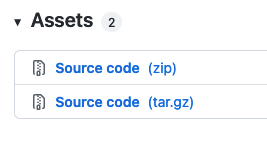

This doc will help you personalize, and provide custom experiences for visitors to your website, based on Geotargeting(geo) and Interest targeting.

## Before You Begin

As per the [Configuration Overview](https://pantheon.io/docs/guides/edge-integrations/configuration-overview/) your website must be connected to [Pantheon’s Advanced Global CDN](/guides/professional-services/advanced-global-cdn), and ensure that your site's vary headers have been provisioned by Professional Services.

### Install with Composer

You can use Edge Integrations with WordPress by installing it into a project with Composer, or by manually installing the plugin.

Adding Edge Integrations support to your Integrated Composer project is simple and is the recommended means of adding the Edge Integrations WordPress SDK.

#### Require the Composer Package

To get started, add the [Edge Integrations WordPress SDK repository](https://github.com/pantheon-systems/edge-integrations-wordpress-sdk) as a dependency:

```bash
composer require pantheon-systems/edge-integrations-wordpress-sdk
```

This command will add the repository to your `/vendor` directory, as well as all of the compiled assets and included dependencies, which include a global CMS-agnostic [PHP library](https://github.com/pantheon-systems/pantheon-edge-integrations), a [WordPress plugin](https://github.com/pantheon-systems/pantheon-wordpress-edge-integrations), and all of the documentation for the SDK.

Alternately, you can add `pantheon-systems/edge-integrations-wordpress-sdk` as a dependency to your project's existing `composer.json` file and run `composer install`.

### Install Manually

If you do not use Composer on your project, you can still get started with the WordPress Edge Integrations plugin. Instead of installing the SDK package, go to the [Pantheon WordPress Edge Integrations Releases page](https://github.com/pantheon-systems/pantheon-wordpress-edge-integrations/releases).

* Download the Source Code (zip) file associated with the most recent version.



* Extract the plugin in your `wp-content/plugins` directory and you will have all of the compiled assets and included dependencies, which inclue a global CMS-agnostic [PHP library](https://github.com/pantheon-systems/pantheon-edge-integrations), and a [WordPress plugin](https://github.com/pantheon-systems/pantheon-wordpress-edge-integrations).

### Activate the Plugin

Whether you install with Composer or manually, the last step is to activate the plugin from your WordPress dashboard Plugins page. There is no other admin interface for the WordPress plugin, all features and components are handled in the code itself, with hooks that developers can use to interact with the geolocation and interest tracking features.


## Configure Geolocation

Geotargeting is a method that delivers different content to visitors based on their geographic location. This includes country, continent, region, city, and other criteria (e.g. connection speed and connection type). The specific header data sent to your site depends on the settings you configure for your AGCDN instance. 

You can learn more about how to use or manage the geolocation data in the [Geolocation SDK documentation](https://github.com/pantheon-systems/edge-integrations-wordpress-sdk/blob/main/docs/geo.md).

### Test Geolocation

To validate that geolocation is working, open your browser inspector tools, click the Network tab (in Chrome and Firefox), and reload the page so that new data can be recorded and displayed. When you click on the page URL- usually listed first- and inspect the Response Headers, the relevant geolocation data will appear.


If the plugin is installed and configured correctly, the `Audience` or `Audience-Set` headers in the `vary` field, which indicates that those headers are being used to vary the cache on the CDN.

### Geolocation Code Samples


## Configure Interests

Interests are much easier to set up in the edge configuration. In this case, we're telling the CDN to vary cache for specific taxonomy terms. In Drupal, these are tags and configured in the admin. In WordPress, categories are used by default (but any taxonomy can be used). When a visitor clicks on multiple pages that are tagged with the same term, it will set that term as an "interest" for that visitor (by default, the threshold is 3 pages tagged with the same term). Like geolocation, this configuration needs to be enabled on your AGCDN instance.

You can read more about how to use or manipulate the interest data in the [Interest SDK documentation](https://github.com/pantheon-systems/edge-integrations-wordpress-sdk/blob/main/docs/interest.md).

### Test Interests

You can validate that the interest tracking is working by clicking on multiple pages tagged with the same term 3 (or more, depending on your configuration) times, then going to the same Network tab in your browser inspector tools. This time, you should see a value for `interest` that matches the pages you navigated to.


### Interests Code Samples


## Additional Resources

- [Pantheon Edge Integrations Global Library](https://github.com/pantheon-systems/pantheon-edge-integrations)
- [Pantheon Geolocation Shortcodes](https://github.com/pantheon-systems/pantheon-geolocation-shortcodes)
- [Geo: Function Reference](https://github.com/pantheon-systems/edge-integrations-wordpress-sdk/blob/main/docs/geo.md)
- [Interest: Function Reference](https://github.com/pantheon-systems/edge-integrations-wordpress-sdk/blob/main/docs/interest.md)
- [Integrate Cookie Consent](TBD- CR)
