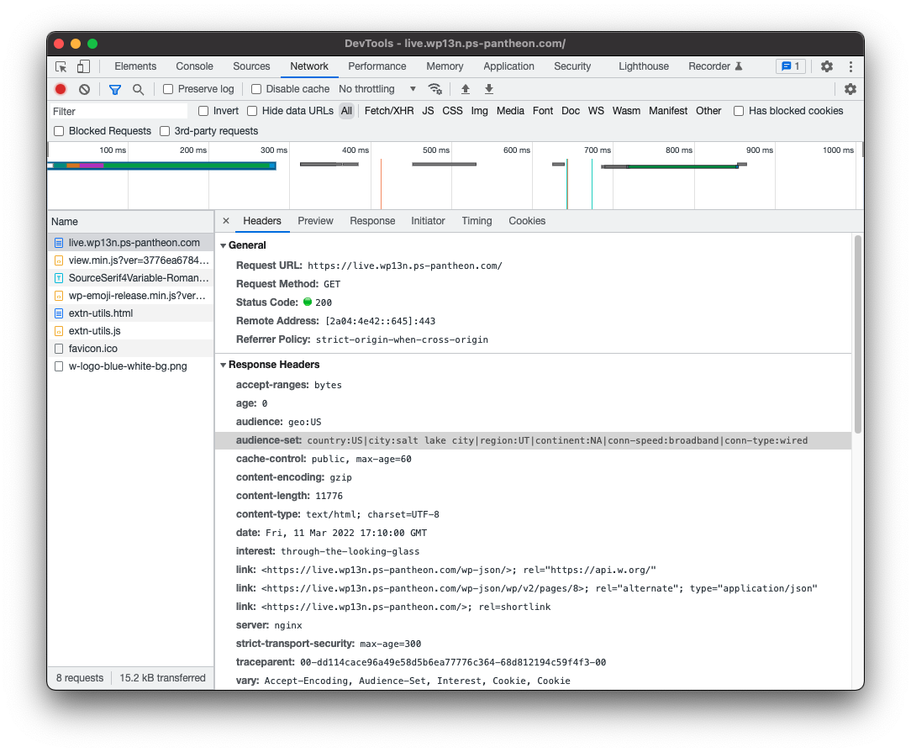
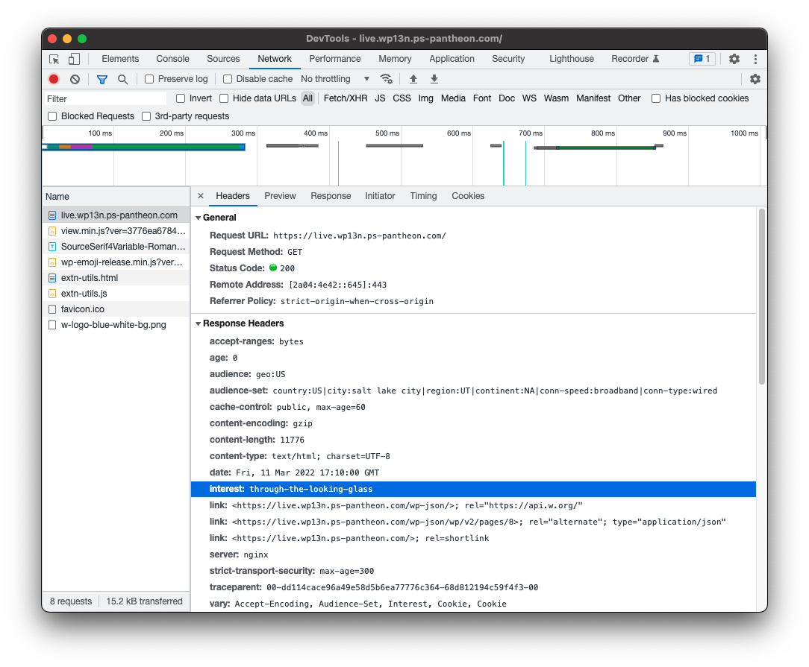

This doc will help you personalize, and provide custom experiences for visitors to your website, based on Geotargeting (geo) and Interest targeting.

## Before You Begin

You can use Edge Integrations with WordPress via installation into a project with Composer, or by manually installing the plugin.

### Install with Composer

Adding Edge Integrations support to your Composer-based project is simple and is the recommended means of adding the Edge Integrations WordPress SDK.

#### Requiring the Composer package
To get started, all you need to do is to add this repository as a dependency:

```bash
composer require pantheon-systems/edge-integrations-wordpress-sdk
```

That command will add the WordPress Edge Integrations SDK repository to your `/vendor` directory, as well as all of the dependencies, which include a global, CMS-agnostic [PHP library](https://github.com/pantheon-systems/pantheon-edge-integrations) and a [WordPress plugin](https://github.com/pantheon-systems/pantheon-wordpress-edge-integrations) as well as all of the documentation for the SDK.

Alternately, you can add `pantheon-systems/edge-integrations-wordpress-sdk` as a dependency to your project's existing `composer.json` file and run `composer install`.

### Install manually

If you do not use Composer on your project at all, you can still get started with the WordPress Edge Integrations plugin without any hassle. In this case, you won't be installing the SDK package, instead, go to the [Pantheon WordPress Edge Integrations Releases page](https://github.com/pantheon-systems/pantheon-wordpress-edge-integrations/releases).

* Download the Source Code (zip) file associated with the most recent version.


* Extract the plugin in your `wp-content/plugins` directory. You will get all of the compiled assets and included dependencies, including the CMS-agnostic, [global PHP library](https://github.com/pantheon-systems/pantheon-edge-integrations) in the package.

### Activate the plugin

In either case, the last step is activating the plugin from your WordPress dashboard Plugins page. There is no other admin interface for the WordPress plugin -- all the features and components are handled in the code itself, with hooks that developers can use to interact with the geolocation and interest tracking features.


## Configure Geolocation

Geotargeting is a method that delivers different content to visitors based on their geographic location. This includes country, continent, region, city, and other criteria (for example connection speed and connection type). The specific header data sent to your site will depend on the settings configured for your AGCDN instance.

## Test Geolocation

You can validate that geolocation is working by opening your browser inspector tools, clicking the Network tab (in Chrome and Firefox), and reloading the page so that new data can be recorded and populate that tab. When you click on the page url (usually the first thing on that page) and inspect the Response Headers, you should see that you are getting geolocated data relevant to your location.



If the plugin is installed and configured correctly, you should also see either `Audience` or `Audience-Set` headers in the `vary` field (last item in the screenshot above) which indicates that those headers are being used to vary the cache on the CDN.

## Geolocation Use Case


## Configure Interests

Interests are much easier to set up in the edge configuration. In this case, we're telling the CDN to vary cache for specific taxonomy terms. In Drupal, these are tags and configured in the admin. In WordPress, categories are used by default (but any taxonomy can be used). When a visitor clicks on multiple pages that are tagged with the same term, it will set that term as an "interest" for that visitor (by default, the threshold is 3 pages tagged with the same term). Like geolocation, this configuration needs to be enabled on your AGCDN instance.

## Test Interests

You can validate that the interest tracking is working by clicking on multiple pages tagged with the same term 3 (or more, depending on your configuration) times, then going to the same Network tab in your browser inspector tools. This time, you should see a value for `interest` that matches the pages you navigated to.



## Interests Use Case


## How to build a WordPress Widget that uses the Edge Integrations SDK

## Additional Resources

- [Pantheon Edge Integrations Global Library](https://github.com/pantheon-systems/pantheon-edge-integrations)
- [Pantheon Geolocation Shortcodes](https://github.com/pantheon-systems/pantheon-geolocation-shortcodes)
- [Geo: Function Reference](https://github.com/pantheon-systems/edge-integrations-wordpress-sdk/blob/main/docs/geo.md)
- [Interest: Function Reference](https://github.com/pantheon-systems/edge-integrations-wordpress-sdk/blob/main/docs/interest.md)
