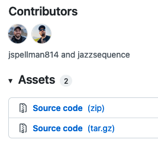
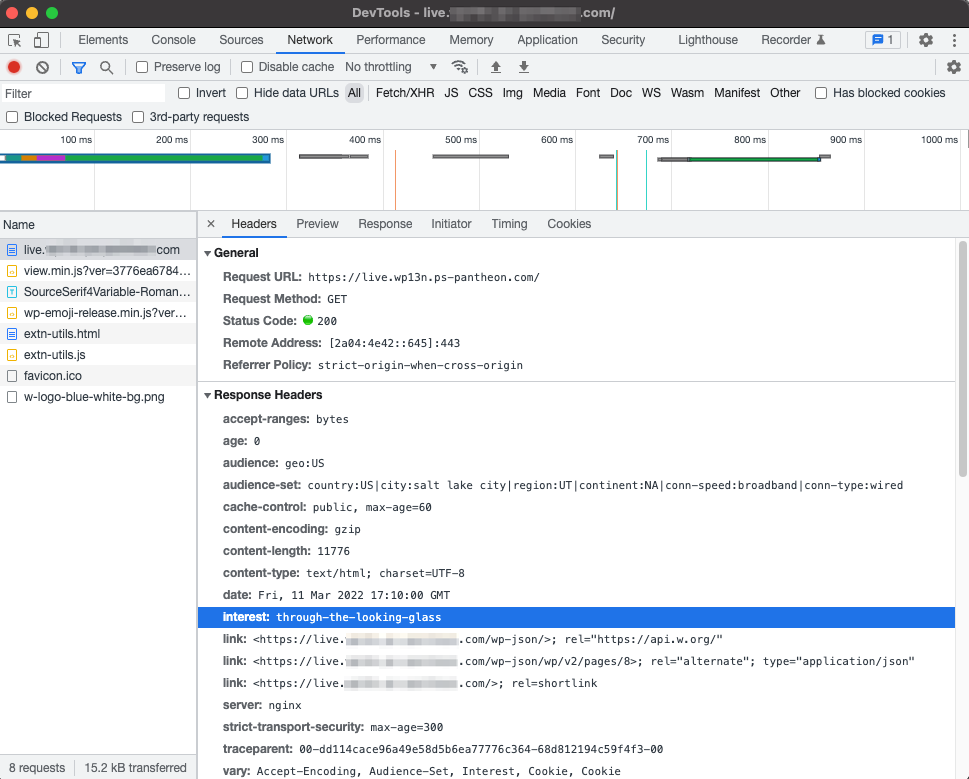

This doc will help you personalize and provide custom experiences for visitors to your website, based on Geotargeting and Interest targeting.

## Before You Begin

<Partial file="before-you-begin-config.md" />

To use Edge Integrations with WordPress, can either install it into a project with Composer, or manually install the plugin. 

The simplest and recommended means of adding Edge Integrations WordPress SDK is to add Edge Integrations support to your Integrated Composer project.

### Install with Composer

Adding Edge Integrations support to your Composer-based project is simple and is the recommended means of adding the Edge Integrations WordPress SDK.

#### Require the Composer Package

To get started, add the [Edge Integrations WordPress SDK repository](https://github.com/pantheon-systems/edge-integrations-wordpress-sdk) as a dependency:

```bash
composer require pantheon-systems/
-integrations-wordpress-sdk
```

This command will add the repository to your `/vendor` directory, as well as all of the compiled assets and included dependencies, which include a global CMS-agnostic [PHP library](https://github.com/pantheon-systems/pantheon-edge-integrations), a [WordPress plugin](https://github.com/pantheon-systems/pantheon-wordpress-edge-integrations), and all of the documentation for the SDK.

Alternately, you can add `pantheon-systems/edge-integrations-wordpress-sdk` as a dependency to your project's existing `composer.json` file and run `composer install`.

### Install Manually

If you do not use Composer on your project, you can still get started with the WordPress Edge Integrations plugin. Instead of installing the SDK package, go to the [Pantheon WordPress Edge Integrations Releases page](https://github.com/pantheon-systems/pantheon-wordpress-edge-integrations/releases).

* Download the most recent version of the Source Code (zip) file.



* Extract the plugin in your `wp-content/plugins` directory. You will get all of the compiled assets and included dependencies, including the CMS-agnostic, [global PHP library](https://github.com/pantheon-systems/pantheon-edge-integrations) in the package.

### Activate the Plugin

In either case, the last step is activating the plugin from your WordPress dashboard Plugins page. There is no other admin interface for the WordPress plugin -- all the features and components are handled in the code itself, with hooks that developers can use to interact with the geolocation and interest tracking features.


## Geolocation

### Configure Geolocation

Geotargeting is a method that delivers different content to visitors based on their geographic location. This includes country, continent, region, city, and other criteria (e.g. connection speed and connection type). The specific header data sent to your site depends on the settings you configure for your AGCDN instance. 

You can learn more about how to use or manage the geolocation data in the [Geolocation SDK documentation](https://github.com/pantheon-systems/edge-integrations-wordpress-sdk/blob/main/docs/geo.md).

### Test Geolocation

To validate that geolocation is working, open your browser inspector tools, click the Network tab (in Chrome and Firefox), and reload the page so that new data can be recorded and displayed. When you click on the page URL- usually listed first- and inspect the Response Headers, the relevant geolocation data will appear.


If the plugin is installed and configured correctly, the `Audience` or `Audience-Set` headers in the `vary` field, which indicates that those headers are being used to vary the cache on the CDN.

## Interests

### Configure Interests

Interests are much more straightforward to set up in the Edge configuration. In this case, we're telling the CDN to vary cache for specific taxonomy terms. In WordPress, categories are used to define user interests by default (but any taxonomy can be used). When a visitor clicks on multiple pages that are tagged with the same term, it will set that term as an "interest" for that visitor (by default, the threshold is 3 pages tagged with the same term). Like geolocation, this configuration needs to be enabled on your AGCDN instance.

You can read more about how to use or manipulate the interest data in the [Interest SDK documentation](https://github.com/pantheon-systems/edge-integrations-wordpress-sdk/blob/main/docs/interest.md).

### Test Interests

You can validate that the interest tracking is working by clicking on multiple pages tagged with the same term 3 (or more, depending on your configuration) times, then going to the same Network tab in your browser inspector tools. This time, you should see a value for `interest` that matches the pages you navigated to.



### Interests Code Samples

**Example**

A company using Edge Integrations might want to use query strings to define a visitor's interest in order to run targeted ads and create a sitewide personalized experience for the customer. With the custom wrapper function, `set_interest`, you can check for a set interest using a query string.

To implement this, refer to the [example](https://github.com/pantheon-systems/edge-integrations-wordpress-sdk/blob/main/docs/interest.md#set_interest) in our WordPress SDK repository.

## How to Integrate with Cookie Consent Management Plugins

Integrating cookie consent management plugins disallows user tracking if the user has not accepted cookies or other forms of local storage. This might be required based on the privacy laws of your region. In those cases, you cannot store any tracking information unless the user consents to it.

There is an [example plugin](https://github.com/pantheon-systems/pantheon-edge-integrations-consent-management) that will help you get started on with integrating with cookie consent management. The plugin uses the [WP Consent API](https://github.com/rlankhorst/wp-consent-level-api) proposed feature plugin to manage consent levels and cookie categories. This plugin adds a cookie consent banner and disables the functionality of the Pantheon WordPress Edge Integrations plugin when the user has not accepted cookies.

You can read more about it in the [plugin's README file](https://github.com/pantheon-systems/pantheon-edge-integrations-consent-management#description).

If you choose to use a third-party cookie consent management solution, the cookies and local storage information added by the Pantheon WordPress Edge Integrations plugin is listed below. This information can be used to help write and define your site's cookie or privacy policy.

| Name | Type | Purpose | Expiration | Category |
|------|------|---------|------------|----------|
| `interest` | Cookie | Interest-tracking | 14 days (default) | marketing/targeting |
| `pantheon_ei.interest` | Browser Local Storage | Interest-tracking | Never expires | marketing/targeting |

## Additional Resources

- [Pantheon Edge Integrations Global Library](https://github.com/pantheon-systems/pantheon-edge-integrations)
- [Pantheon Geolocation Shortcodes](https://github.com/pantheon-systems/pantheon-geolocation-shortcodes)
- [Geo: Function Reference](https://github.com/pantheon-systems/edge-integrations-wordpress-sdk/blob/main/docs/geo.md)
- [Edge Integrations Code Snippets](https://github.com/pantheon-systems/edge-integrations-snippets)
- [Interest: Function Reference](https://github.com/pantheon-systems/edge-integrations-wordpress-sdk/blob/main/docs/interest.md)
- [Pantheon Edge Integrations Consent Management](https://github.com/pantheon-systems/pantheon-edge-integrations-consent-management)
- [WordPress SDK API](https://github.com/pantheon-systems/edge-integrations-wordpress-sdk/blob/main/docs/api.md)

Pantheon has created example plugins to integrate with each of these third-party plugins, where the given solution is used to render content based on a visitor's location.

- [Geo ACF example plugin](https://github.com/pantheon-systems/edge-integrations-snippets/tree/main/wordpress/geo-acf)
- [Geo CMB2 example plugin](https://github.com/pantheon-systems/edge-integrations-snippets/tree/main/wordpress/geo-cmb2)

Edge Integrations can easily integrate with various WordPress plugins.

- [Advanced Custom Fields (ACF)](https://www.advancedcustomfields.com/) is a popular WordPress plugin that allows developers to turn sites into a fully-fledged content management system.
- [CMB2](https://github.com/CMB2/CMB2) is a developer's toolkit for building metaboxes, custom fields, and forms for WordPress.
