Pantheon’s Edge Integrations offers advanced and powerful features for content personalization. At this time, two key primary features are supported: Geo and Interest. These features allow us to serve different content to each user at given URLs. Google Analytics won’t differentiate between the personalized versions of a page unless you instruct it otherwise. This section aims to help you enhance your configuration to track personalization experiences via Google Tag Manager.

## Requirements

* Access to your site’s Google Analytics and Tag Manager accounts, and basic knowledge of these products. 
* You have the Smart CDN module enabled and a personalization use case active and working on your Pantheon-hosted, Advanced Global CDN-enabled website. 

Personalization strategy and implementation are outside the scope of this page. For more information on that, refer to the [Introduction](/guides/edge-integrations) part of the guide.

### Before You Begin

Consider the desired goals and objectives for your users. Define success for your organization and how you want to measure it. Do your personalization tactics aim to convert your users to sign up for your newsletter, download a whitepaper, or achieve some other goal? You may already have tracking in place to measure against these key performance indicators; you will be extending them here.

## Configure Your Website

### Add Google Tag Manager(GTM) Code

<Accordion title="WordPress" id="wp-analytics-config" icon="wrench">

The [Pantheon WordPress Edge Integrations plugin](https://github.com/pantheon-systems/pantheon-wordpress-edge-integrations) natively supports Google Analytics via Google Tag Manager. 

1. Navigate to the **General Settings** page in your WordPress admin and scroll to the **Google Tag Manager Code** field.

    

    Alternately, you can use the `pantheon.ei.gtm_code` filter. This filter can be used to either override the above setting in the admin, or to define a GTM code in your codebase.

    To override the GTM code option and prevent the built-in Google Analytics code from being displayed on your site, use the `__return_true` built-in callback on the filter:

    ```php
    add_filter( 'pantheon.ei.gtm_code', '__return_true' );
    ```

    This is helpful if you are using another plugin to add Google Analytics or GTM code snippets, or if you have hard-coded those code snippets into your site and do not need them to be added for you.

    Use the following example if you want to define the GTM code in the codebase and use the built-in integration. If the filter is set this way, the option in the admin setting will be suppressed and the GTM code added via the filter will be used:

    ```php
    function override_gtm_code( $gtm_code ) {
      return 'GTM-XXXXXXXX';
    }
    add_filter( 'pantheon.ei.gtm_code', 'override_gtm_code' );
    ```

1. Confirm which identifiers you will use to personalize a user’s experience. You can use:

    - Geography
    - Interest

You will need to push the data from WordPress to Tag Manager via a DataLayer. The SDK ships with a preconfigured custom WordPress Edge Integrations plugin that does this by implementing `wp_localize_script` to push the values from our header to the DataLayer object via the `eiGtm` JavaScript global. The relevant `gtm_headers.js` file can be found in the [Pantheon Wordpress Edge Integrations repository](https://github.com/pantheon-systems/pantheon-wordpress-edge-integrations/blob/main/assets/js/gtm-headers.js).


<Alert title="Note"  type="info">

Universal Analytics(UA-) or Google Analytics(G-) codes are not currently supported. The Edge Integrations plugin only supports Google Tag Manager (GTM-) codes.

</Alert>

</Accordion>

<Accordion title="Drupal" id="drupal-analytics-config" icon="wrench">

1. Install the Drupal [Google Tag](https://www.drupal.org/project/google_tag/) contributed module and configure it to reference your GTM (Google Tag Manager) container ID.

1. Confirm which identifiers you will use to personalize a user’s experience. You can use:

    - Geography
    - Interest

You will need to push the data from Drupal to Tag Manager via a DataLayer. The SDK ships with a preconfigured custom `smart_content_cdn` module that does this by implementing `hook_page_attachments()` to push the values from our header to the DataLayer object via `Drupal.behaviors`. The relevant `gtm_headers.js` file can be found in the [Smart Content CDN repository](https://github.com/pantheon-systems/smart_content_cdn/blob/main/js/gtm_headers.js).

</Accordion>

## Track Implementation

This section will cover the configuration of Google Tag Manager and Google Analytics. 

### Configure Google Analytics(GA)

Before you start, if you are setting up a brand new site/property, you must select "Create a Universal Analytics property" under **Advanced Options**. While you can choose either the "Create both a Google Analytics 4 and a Universal Analytics property" or the "Create a Universal Analytics property only" options, all of the additional settings described here refer to the Universal Analytics property, specifically. Google Analytics 4 is not currently supported.


#### Track Personalization Properties as Custom Dimensions in GA

1. Navigate to the **Admin > Property** area of Google Analytics. Expand Custom Definitions and select **Custom Dimensions**: 


1. Add **New Custom Dimensions** that correspond to the identifiers. Most dimensions will be set to “Hit,” as they change based on user behavior. For geotargeting, you have to set the scope to "Session" to allow the setting to persist.


Take note of the Index for each of your new Custom Dimensions, as you will need them to configure your Variables in Google Tag Manager. Your indexes will differ from this example if you have pre-existing configurations.

You now have the option to verify that the identifiers are accurately pushing data into the dataLayer. Refer to  the [Test and Debug](/guides/edge-integrations/analytics/#test-and-debug) section for more info. 

### Configure Google Tag Manager(GTM)

#### Create Variables in GTM

1. Navigate to **User -Defined Variables** and click **New** in the upper right-hand corner.

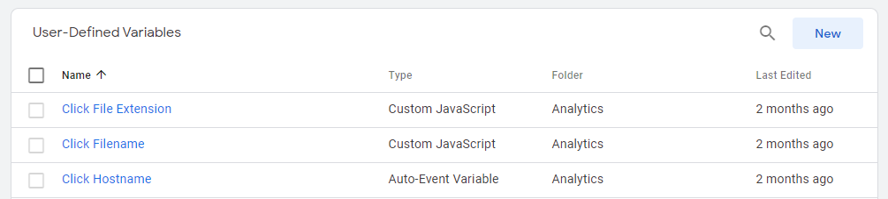

1. From the list, select **Data Layer Variable**.

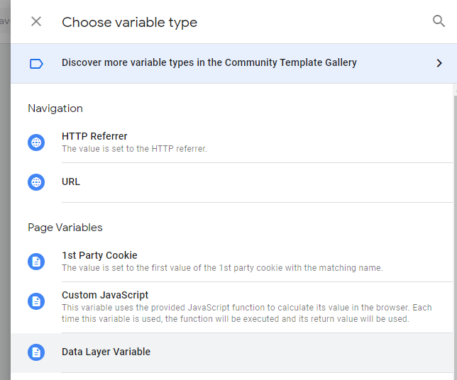

1. Create Variables following these best practices:

    - Use a common prefix for each of your variable names to help group and identify them. In the example below, we use `dlv` to signify “data layer variable.” Please make sure to note the actual name of the variable.
    - Include the Custom Dimension Index ID in your variable name, so that it's easy to reference.
    - When you create new variables that include text, we highly recommend that the **Format Value** is Lowercase.
    
    - Keep the **Data Layer Version** at Version 2.
    - Leave the **Set a Default Value** box unchecked.
    - The **Data Layer Variable Name** is the most important, so ensure you spell everything identically to what the DataLayer is pushing. In our case, these names are:
      - audience.geo
      - interest

<!-- 
 -->
#### Append Variables to Your Google Analytics Settings in Tag Manager

After your variables are created, you can attach them to your Google Analytics Settings Variable. 

* In your list of Custom Variables, be sure that the **Type** is the same. If you are using a “Constant” or have hardcoded the UA ID into each tag, change that in favor of GTM tags in order to ensure future usability.

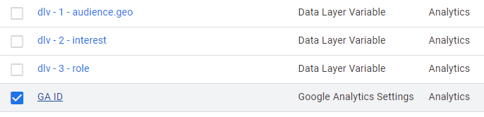

To append the variables:

1. Edit the **Google Analytics Variable** settings.

1. Expand the **More Settings** fieldset.

1. Expand **Custom Dimensions**.

1. Click **Add More Dimensions**.

1. Create an entry for each of your custom dimensions, and ensure that your Index and Dimension Values are correct


## Test and Debug

1. In Google Tag Manager, click **Preview** in your Workspace to debug. If you are new to using **Preview**, please refer to the [Preview and debug containers](https://support.google.com/tagmanager/answer/6107056?hl=en) support documentation on Google Tag Manager Support.

    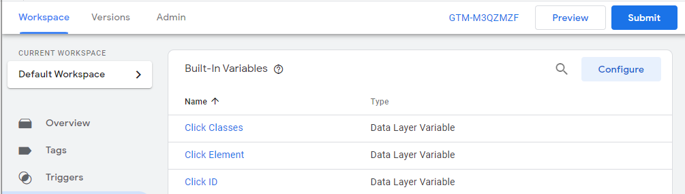

1. Use the [DataSlayer Chrome extension](https://chrome.google.com/webstore/detail/dataslayer/ikbablmmjldhamhcldjjigniffkkjgpo) to verify data is accurately being sent to Analytics. The Data Layer properties displayed should correspond directly to what is pushed to Google Analytics. Additionally, your personalization values with the Custom Dimension Index numbers you previously set up should also display. 

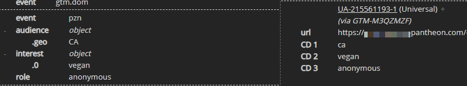

## Click Tracking and Goal Setup

This section will cover how to capture clicks on a particular link and set up a goal with Google Analytics. For this example, we will use Google Tag Manager to capture a “View recipe” button click as an event, and set it up as a goal in Google Analytics.

<!-- 
 -->
With dataSlayer, there is a dataLayer push that happens when you click on the “View recipe” button because it is a link click and has a unique Click Text – namely, “View recipe.” The values you will use in Google Tag Manager are:

- `event`
- `gtm.event`
- *Click Text*
- `gtm.elementClasses`
- `gtm.elementId`
- `gtm.elementTarget`
- `gtm.linkClick`
- *element*
- View recipe

### Create New Tag in GTM

1. In the workspace for your GTM account, visit the **Tags** menu and click the **New** button to create a Tag that will capture the information you are looking for. In this example, we want to know how often people click on the “View recipe” button. There are no best practices at this time, so feel free to make modifications as needed. 

    Our recommended Tag Configuration is as follows:

    - Track Type: Event
    - Category: Internal link click
    - Action: {{Page Hostname}}{{Page Path}}
    - Label: {{Click Text}}
    - Google Analytics Settings: {{GA ID}}

    

1. Scroll beyond the **Tag Configuration** section. In the **Triggering** section, click the gray circle to choose a trigger that will make the tag fire.

    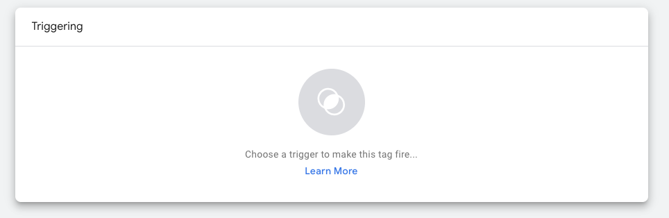

1. Click on the + in the upper right-hand corner to create a new trigger.

    

1. Click on the gray circle again and select the **Just Links** trigger type from the fly-out menu.

    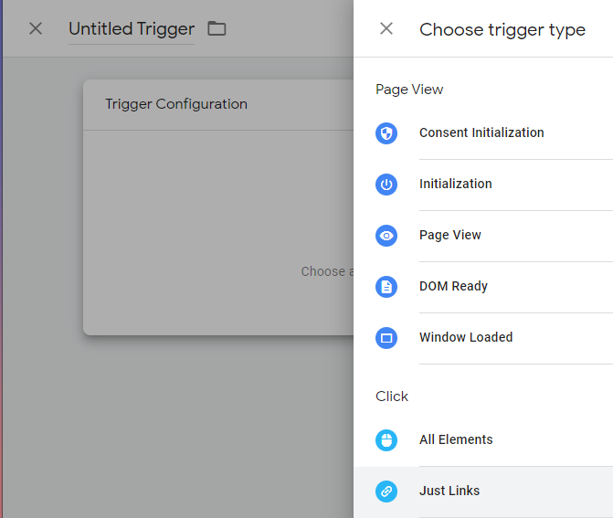

1. Fill out the form details for the trigger. Ensure you give it a name that is  easy to understand for anyone who refers to it in the future. In the example below, we've called it “Link Click - View Recipe.” To make the trigger specific to the “View recipe” button, select **Some Link Clicks**, instead of **All Link Clicks**. Be sure to specify that **Click Text** should be set to **matches RegEx** for “View recipe," which is the value we got from the dataSlayer extension. Save the trigger.

    

You now have a fully working Tag and corresponding Trigger.


To test that the Tag and Trigger function as expected, use Preview mode. In GTM, your tag will fire when you click on the link.

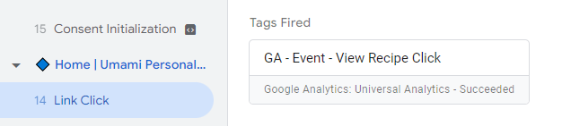

In dataSlayer your event will fire with the values that you previously set up in your tag. 

In this example case:

* category: internal link click
* action: (site URL)
* label: View recipe 

<!-- 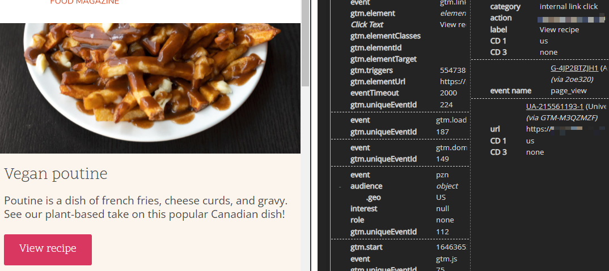
 -->
After you test your new event, make sure to publish your changes by pressing the **Submit** button in your Workspace.

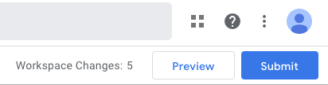

### Goal Setup in Google Analytics

1. Navigate to the **Goal** section and click **+ New Goal**.

    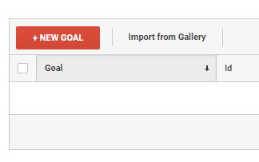

1. Name your goal and select **Event** as the type. Click **Continue**.

    

1. Input the condition of the goal. In this case, you need the label value that was generated in the previous section:
   - label: View recipe 

    Based on this information, enter the value of “label” into the Label field. Ensure that you change the default “Equals to” condition to “Regular expression,” which makes the matching more flexible.

    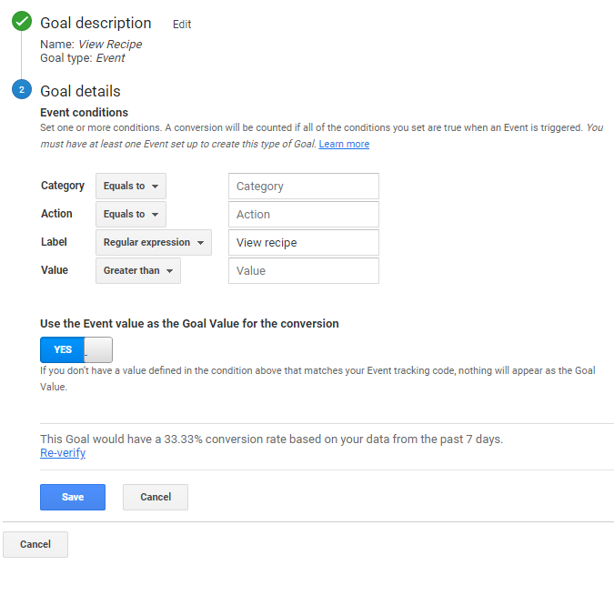

1. Save the goal.

## Reporting

1. To find your new data, log into Google Analytics. In the main navigation, go to Behavior > Events > Top Events.

    

1. Click on the **Secondary dimension** button, right below the **Event Category** label. This will display the custom dimensions you created earlier. 

    

1. Click on any label in the list to display the associated data.

    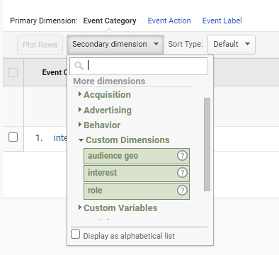

You can also toggle between the different custom dimensions by clicking in the list of events to switch views.

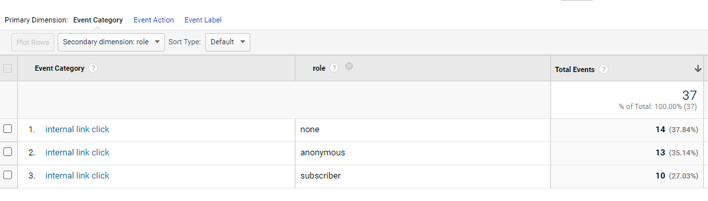

### Segmentation

1. You can create segments based on your custom dimensions in order to slice and dice your data. Most reports in Google Analytics allow you to  segment your data by clicking on the **+ Add Segment** button in the **Pages** section.

    

1. Create a new segment by clicking on the **+ New Segment** button. If you have any existing segments, they will be listed.

    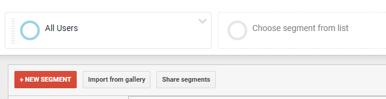

1. Under **Advanced** choose **Conditions** and select the kind of segment you want to create. For example, if you want to see how Canadian session behavior differs from all other visitors, go to the dimension field, find the appropriate dimension and click on it. In this case, it is **audience geo**.

    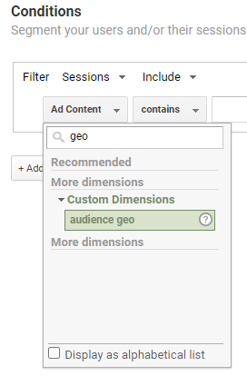

1. In this example, we want data for Canadian visitors, so the custom dimension should contain a value of `ca`. Name and save your segment, for example: `Audience Geo - Canada`.

    

1. Follow the same steps to create additional segments in your reports, like a US geo audience, to compare outcomes.  

    

It is useful to add audiences to your Goals. Tying this back to our previous Recipe Click goal, if we add US and Canadian audiences, we can compare outcomes. If we're more interested to see click-through rates based on audience interest, we can do that, too!


You can also observe how different audiences convert towards the same Goal.


