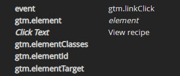

Pantheon’s Edge Integrations offers advanced and powerful features for content personalization. At this time, 3 key primary features are supported: Geo, Interest and Role. These features allow us to serve different content to each user at given URLs. Google Analytics won’t differentiate between the personalized versions of a page unless we instruct it otherwise. This documentation aims to help you enhance your configuration to track personalization experiences via Google Tag Manager.

## Requirements

* Access to your site’s Google Analytics and Tag Manager accounts, and basic knowledge of these products. 
* You have the Smart CDN module enabled and a personalization use case active and working on your Pantheon-hosted, Advanced Global CDN-enabled website. 

Personalization strategy and implementation are outside the scope of this documentation. Refer to our [Introduction](https://pantheon.io/docs/guides/edge-integrations/introduction/) guide for more information.

### Before  You Begin

Consider the desired goals and objectives for your users. Define success for your organization and how you want to measure it. Do your personalization tactics aim to convert your users to sign up for your newsletter, download a whitepaper, or achieve some other goal? You may already have tracking in place to measure against these key performance indicators; we will be extending them here. 

## Configure Your Website

<TabList>
<Tab title="WordPress" id="wp-analytics-config" active={true}>

</Tab>
<Tab title="Drupal" id="drupal-analytics-config">
Install the Drupal [Google Tag](https://www.drupal.org/project/google_tag/) contributed module and configure it to reference your GTM (Google Tag Manager) container ID.
Confirm which identifiers you will use to personalize a user’s experience. You can use:

1. Geography
2. Interest

We need to push the data from Drupal to Tag Manager via a DataLayer. The SDK ships with a preconfigured custom `smart_content_cdn` module that does this by implementing `hook_page_attachments()` to push the values from our header to the DataLayer object via` Drupal.behaviors`. Here’s the relevant gtm_headers.js file we’re attaching:

```javascript
/**
 * @file
 * Set content personalization headers for Google Tag Manager.
 */

 (function ($, Drupal,) {
  Drupal.behaviors.gtmBehavior = {
    attach: function (context, settings){
      if ('gtmHeaders' in settings && 'pObj' in settings.gtmHeaders) {
        // Get geo value.
        let geo = 'Audience' in settings.gtmHeaders.pObj && 'geo' in settings.gtmHeaders.pObj.Audience ?
          settings.gtmHeaders.pObj.Audience.geo : null;

        // Get interest value labels.
        let interest = 'InterestLabels' in settings.gtmHeaders.pObj ? settings.gtmHeaders.pObj.InterestLabels : null;

        // Get role value.
        let role = 'Role' in settings.gtmHeaders.pObj ? settings.gtmHeaders.pObj.Role : 'none';

        // Push header values in dataLayer object.
        window.dataLayer = window.dataLayer || [];
        window.dataLayer.push({
          'event': 'pzn',
          'audience': {
            'geo': geo,
          },
          'interest': interest,
          'role': role,
        });
      }
    }
  };

})(jQuery, Drupal);
```
</Tab>
</Tablist>

## Track Implementation

This section will cover the configuration of Google Tag Manager and Google Analytics. 
<!-- Video here? -->

### Configure Google Analytics

#### Track Personalization properties as Custom Dimensions in GA

Navigate to the Admin > Property area of Google Analytics. Expand Custom Definitions and select Custom Dimensions: 


Add new Custom Dimensions that correspond to the identifiers. Most dimensions will be set to “hit,” as they change based on user behavior. We will set the scope of our geotargeting to be session-based, assuming the user isn’t actively crossing borders while they visit our site. 


Take note of the Index for each of your new Custom Dimensions, as you will need them to configure your Variables in Google Tag Manager. Your indexes will differ from this example if you have pre-existing configurations.

At this time, you can verify that the identifiers are accurately pushing data into the dataLayer, if you like. Refer to  the [Test and Debug](#test-and-debug) section for more info. 

### Configure Google Tag Manager

#### Create Variables in GTM

WIthin Google Tag Manager, create User-Defined Variables to capture each of your personalization identifiers.


Select Data Layer Variable 


Create Variables following these best practices:


1. Use a common prefix for each of your variable names to help group and identify them. In this example, we use “dlv” to signify “data layer variable”.
2. Include the Custom Dimension Index ID in your variable name, so it's easy to reference.
3. Don't forget the actual name of the variable.
4. When you create new variables that include text, we highly recommend that you format the value and force it to be lowercase.

5. Keep the data Layer at Version 2.
6. Do not set a Default Value.
7. The Data Layer Variable Name is the most important, so ensure you spell everything identically to what the DataLayer is pushing. In our case, these names are:
  a. audience.geo
  b. interest
  c. role

#### Append Variables to Your Google Analytics Settings in Tag Manager

Now that you have your variables, you can attach them to your Google Analytics Settings Variable. Yours might be called something different but the “Type” will be the same. If you do not have this kind of variable and instead are using a “Constant” or have hardcoded the UA ID in each tag, you will need to clean up your implementation. Your Settings should appear in the list of Custom Variables.


1. Edit the Google Analytics Variable settings
2. Expand the “More Settings” fieldset
3. Expand Custom Dimensions.
4. Click “Add More Dimensions”
5. Create an entry for each of your custom dimensions, ensuring your Index and Dimension Values are correct


## Test and Debug

In your Google Tag Manager implementation, click “Preview” in your Workspace to debug. If you are new to using Preview, please refer to the [Preview and debug containers](https://support.google.com/tagmanager/answer/6107056?hl=en) support documentation on Google Tag Manager Support.


Use the [DataSlayer Chrome extension](https://chrome.google.com/webstore/detail/dataslayer/ikbablmmjldhamhcldjjigniffkkjgpo) to verify data is accurately being sent to Analytics. You should see Data Layer properties correspond directly to what is pushed to Google Analytics. And, you should see your personalization values with the Custom Dimension Index numbers you previously set up. 


## Click Tracking & Goal Setup

This section will cover how to capture clicks on a particular link and set up a goal with Google Analytics. For this example, we will use Google Tag Manager to capture the “View recipe” click as an event, and set it up as a goal in Google Analytics.


With dataSlayer, we can observe the dataLayer push that happens when we click on the “View recipe” button. It's a link click and has a unique Click Text – namely, “View recipe.” These are the values you will use in Google Tag Manager:



### Create New Tag in GTM

1. Create a tag that will capture the information you are looking for;  in this example, you want to know how often  people click on the “View recipe” button. Our recommended configuration is below. There are no best practices at this time, so feel free to make modifications as needed. 

Create a trigger that lets GTM know when it should fire. Access the ____ menu and, in the Triggering section, click on the gray circle.

2. Click on the + in the upper right hand corner to create a new trigger

3. Select “Just Links.”

4. Fill out the details for the trigger. Ensure you give it a name that is  easy to understand for anyone who refers to it in the future. Here, it is called “Link Click - View Recipe.” To make the trigger specific to the “View recipe” button, select Some Link Clicks, instead of All Link Clicks. Be sure to specify that Click Text needs to match RegEx of “View recipe, which is  the value we got from the dataSlayer extension. Save the trigger.


You now have a fully working Tag and corresponding Trigger.


To test that the Tag and Trigger are functioning as expected, you will use “Preview” mode. In GTM, you will see your tag firing when you click on the link.


In dataSlayer you will see your event firing with the expected values that you previously set up in your tag. 

In this case:

* category: internal link click
* action: (your URL)
* label: View recipe 


After you test your new event, make sure to **Publish** your changes.
