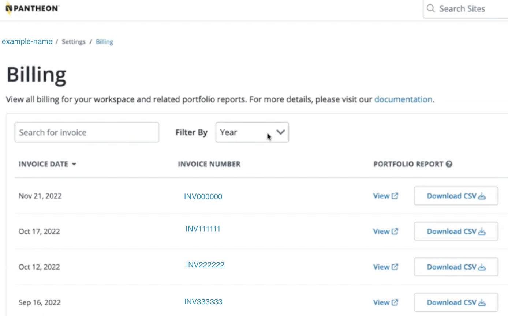

This section provides information on how you can access and interact with the invoices in the Enterprise Billing Center.

## Access Your Invoices in the Dashboard

You must have Admin privileges of the workspace to view invoices. Note that access may vary depending on how your organization has configured [roles and permissions](/guides/account-mgmt/workspace-sites-teams/teams#roles-and-permissions).

1. Navigate to the dashboard.

1. Click **Settings** and then click **Billing**.

1. Click the invoice number you want to review.

    

## Filter the Invoice

You can filter the filter the invoice by specific information.

Click the **Filter by** drop-down menus to sort by:

- Specific Owner

- All Owners

- Previous Site Plan

- Current Site Plan

You can also filter by several of the headings. Click the drop-down menu of the heading and select the option you want to filter by:

- Site Name

- Site Owner

- Previous Site Plan

- Current Site Plan

- Previous Invoice Date

- Current Invoice Date

## Search the Invoice

You can search the invoice by a specific name, key word, or ID.

Enter the specific information you want to search for in the **search box**.

## More Resources

- [Billing](/guides/account-mgmt/billing)
- [Site Plans](/guides/launch/plans/)