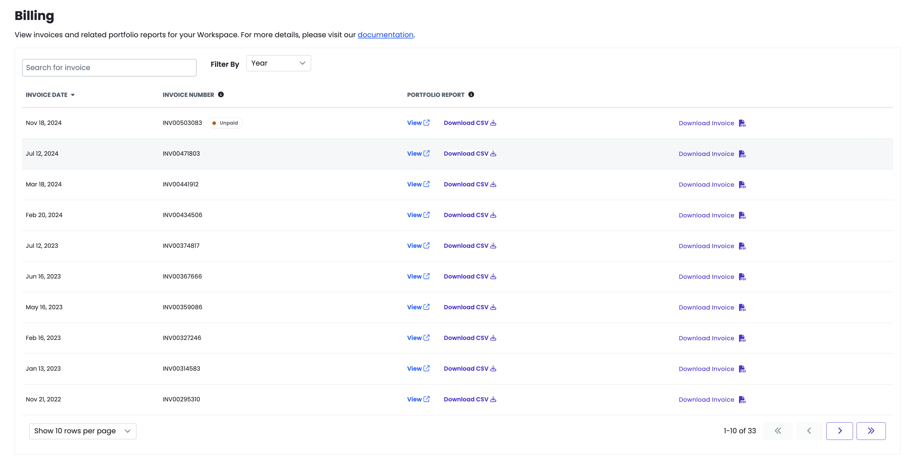

This section provides information on how you can access and interact with the invoices in the Enterprise Billing Center.

## Access Your Invoices in the Dashboard

You must have Admin privileges for the workspace to view invoices. Note that access may vary depending on how your organization has configured [roles and permissions](/guides/account-mgmt/workspace-sites-teams/teams#roles-and-permissions).

1. Navigate to the dashboard.

1. Click **Settings** and then click **Billing**.

1. Click the invoice number you want to review.

    

<Alert title="Note" type="info">

Only the latest invoice is labeled as paid or unpaid.

</Alert>

## Filter the Invoice

You can filter invoices by Year.

Click the **Filter by** drop-down menus to sort by Year.

## Search for Invoices

You can search for invoices by invoice number.

Enter the invoice number you want to search for in the **search box**.

## More Resources

- [Billing](/guides/account-mgmt/billing)
- [Site Plans](/guides/launch/plans/)