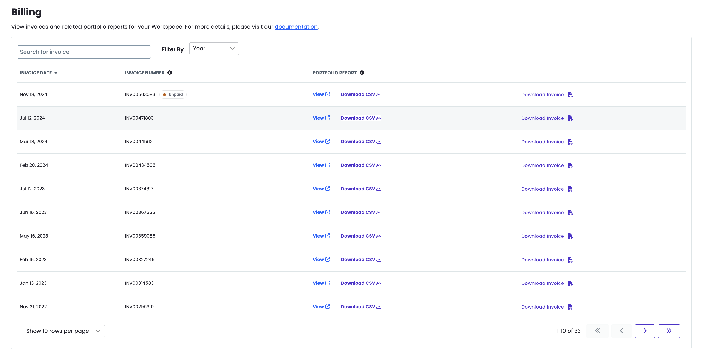

This section provides information on how you can access and interact with the Site Portfolio Report.

## Access the Site Portfolio Report in the Dashboard

You can access the Site Portfolio Report in the Enterprise Billing Center within the dashboard. You must have Admin privileges of the workspace to view the Site Portfolio Report. Note that access may vary depending on how your organization has configured [roles and permissions](/guides/account-mgmt/workspace-sites-teams/teams#roles-and-permissions).

1. [Go to the workspace](/guides/account-mgmt/workspace-sites-teams/workspaces#switch-between-workspaces), click **Settings**, then click **Billing**.

    - Click the **View** link next to desired invoice period to view the report in the dashboard or click **Download CSV** to download a CSV version of the report.

        

## View Additional Information in the Charts

You can view additional information for each of the charts.

Hover over the bars in the chart to see more information, including the number of sites by plan.

## Filter the Report

You can filter the Breakdown tables of all three categories in the report. 

Click the **Filter by** drop-down menus to sort by:

- Specific Owner

- All Owners

- Previous Site Plan

- Current Site Plan

You can also filter by several of the headings. Click the drop-down menu of the heading and select the option you want to filter by, which include:

- Site Name

- Site Owner

- Previous Site Plan

- Current Site Plan

- Previous Invoice Date

- Current Invoice Date

## Search the Report

You can search each of the Breakdown tables by site name.

Enter the site name you want to search for in the **Search by site name** box located above the breakdown headings.

## Increase the Number of Rows Shown in the Breakdown Tables

You can increase the number of rows shown in each of the three Breakdown tables.

Click the **Show rows per page** drop-down menu and select the number of rows you want to view.

## Collapse the Breakdown Tables

You can collapse and re-expand the each of the Breakdown tables.

Click the arrow located next to the site count of any of the Breakdown tables to collapse (or re-expand) the view.

## Download CSV 

You can click the Download CSV button under the All Active Sites in Portfolio breakdown table to download data. This allows you to view all data for active sites in Excel or a similar application.

## More Resources

- [Traffic Limits and Overages](/guides/account-mgmt/traffic)
- [Investigate and Remedy Traffic Events](/guides/account-mgmt/traffic/remedy)
- [Metrics in the Site Dashboard](/guides/account-mgmt/traffic)