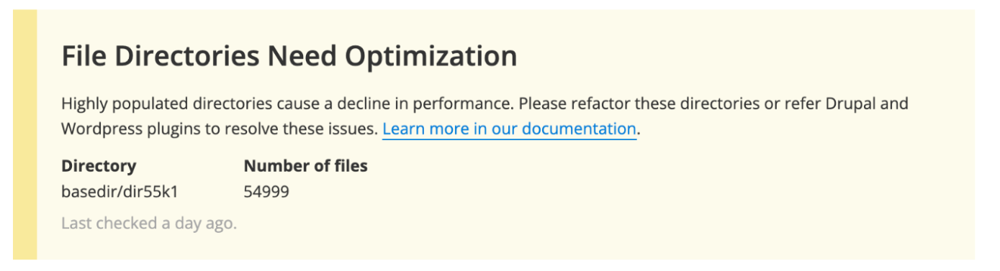
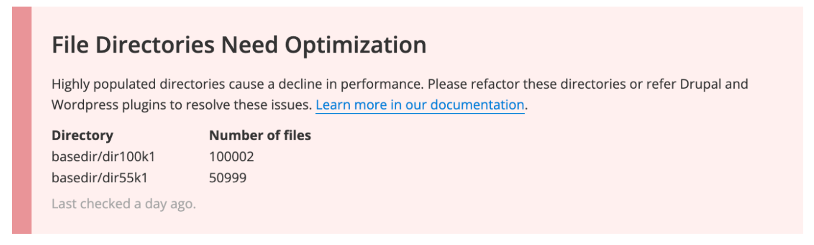

This section provides information on highly populated directories and large file management.

## Highly Populated Directories

Directories that house a large number of files can cause performance issues. Notably:

- Around 50,000 files in one directory may lead to performance degradation.
- Exceeding 100,000 files in one directory can result in very poor performance and eventually filesystem corruption, potentially causing extended site downtime and file loss.

### Alerts
Pantheon monitors for highly populated directories and alerts site administrators pro-actively via the Status page of the Pantheon Site Dashboard and email notifications.

When a directory is found to be approaching a concerning level, the Status Report will show warning when 50,000 files is reached and critical when 100,000 files is reached or exceeded.

### Optimize
To optimize performance:

- If possible, restructure directories that contain more than 50,000 files.
- Consider offloading files to dedicated external storage solutions, such as Amazon S3 or Google Cloud Storage.
- Use content management settings in both WordPress and Drupal to organize uploaded content into directories based on the YYYY/MM or YYYY/MM/DD format or specific user criteria. This approach is preferable over writing all uploads to a single directory. For sites already facing this issue, the solution typically involves reorganizing the files into multiple directories and then updating the respective file tables in Drupal or WordPress.

Useful tools for offloading are detailed below under CDNs.

## Large Code Repository

A code repository larger than 2GB increases the possibility of Git errors when committing code on Pantheon. Review the options below to improve performance:

- Keep multimedia assets out of the repository by moving files to a media file storage service, such as [Amazon S3](https://aws.amazon.com/s3/), and using version control to track URLs.
- [Reduce the size of your repository](/guides/git/troubleshooting#reduce-large-repositories) if it is over 2GB and is causing problems (such as errors when cloning).

## Large Files

The [Pantheon Filesystem](/guides/filesystem) and file serving infrastructure are not optimized to store and deliver large files.  The maximum size for any single file is 256 MiB.

### Large File Restrictions

- **Files over 50MiB** can be uploaded with WordPress, Drupal, or SFTP. You will experience noticeable degradation in performance.
- **Files over 100MiB** cannot be uploaded through WordPress or Drupal. You must add files of this size by [SFTP or rsync](/guides/sftp/rsync-and-sftp).
- **Files over 256MiB** are not supported and cannot be stored on the Pantheon Filesystem.

| File Size       | Platform Compatibility               | Notes                               |
|:----------------|--------------------------------------|-------------------------------------|
| ≤ 100MiB        | ✔  | Can be uploaded via any means       |
| 100MiB - 256MiB | ✔ | Must be uploaded over SFTP or rsync |
| > 256MiB        | ❌    | Must be offloaded to an external filesystem

### CDNs

For hosting either large files or a very large number of media files, we recommend external file systems like Amazon S3 or Google Cloud Storage. These offer a cost-effective solution and can allow direct uploads without utilizing the Pantheon Filesystem.

- Drupal sites can use a module such as [S3 File System](https://www.drupal.org/project/s3fs).
- WordPress sites can use plugins such as [S3 Uploads](https://github.com/humanmade/S3-Uploads) or [WP Offload Media](https://deliciousbrains.com/wp-offload-media/).

You cannot upload files over 100MiB through the CMS even when using an external CDN to host files. You can upload these files directly to the CDN. Refer to Amazon's documentation for [uploading to an S3 bucket](https://docs.aws.amazon.com/AmazonS3/latest/user-guide/upload-objects.html) for more information.

You can also refer to our documentation for [Drupal](/drupal-s3) and [WordPress](/guides/wordpress-developer/wordpress-s3) for more information about integrating S3 with your Pantheon site.

### Upload Speed

If you're transferring large files over a slow internet connection, the upload might exceed our 59-second [Connection Timeout](/timeouts/#timeouts-that-are-not-configurable). Use an [upload time calculator](https://downloadtimecalculator.com/Upload-Time-Calculator.html) to ascertain if your connection speed might prevent uploads from completing in time.

### Media and Email

Refer to the [Media and Email](/guides/platform-considerations/media-email-support) section of the [Platform Considerations](/guides/platform-considerations) guide for more information on support for large media and email files.

## Large (>100GiB) File Backups

Large backups take longer, use more resources, and have a higher likelihood of failing.
Filesystems exceeding 200 GiB or containing over two million files cannot be backed up (though code and databases are backed up as normal).
Even without filesystem backups, file content is protected by redundant storage.

## More Resources

- [All About Application Containers](/application-containers)
- [Integrate Your Fastly Account on Pantheon with Amazon S3](/guides/fastly-pantheon/fastly-amazon-s3)
- [Platform Considerations](/guides/platform-considerations)
