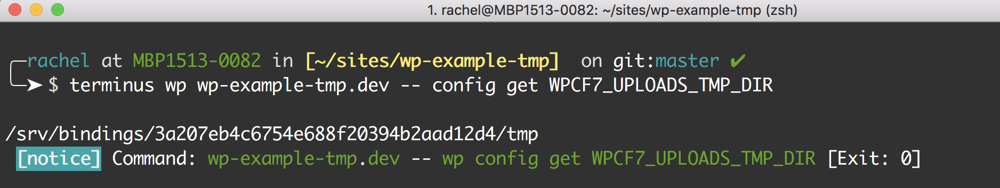

This section provides information on how to use and debug the default temporary path, `.tmp`.

<Alert title="Exports" type="export">

This doc uses [Terminus](/terminus) commands. Before you begin, set the variables `$site` and `$env` in your terminal session to match your site name and the correct environment:

```bash
export env=dev
```

</Alert>

## Default Temporary Path

### WordPress

You can get the Pantheon-configured temporary path for WordPress on the [Pantheon Systems WordPress Github](https://github.com/pantheon-systems/WordPress/blob/default/wp-config-pantheon.php#L67).

### Drupal

We don't recommend changing the temporary settings path for Drupal 7. Changing the configuration allows temporary files to be shared across application containers, but causes a heavy performance penalty.

Add the code below to your `settings.php` file to get the appropriate configuration for Drupal 7 sites.

```php
/**
 * Drupal 7
 * Define appropriate location for tmp directory
 */
if (isset($_ENV['PANTHEON_ENVIRONMENT'])) {
  if (isset($_SERVER['PRESSFLOW_SETTINGS'])) { 
    // It's necessary to unset the injected PRESSFLOW_SETTINGS to override the values.
    $pressflow_settings = json_decode($_SERVER['PRESSFLOW_SETTINGS'], TRUE); 
    unset($pressflow_settings['conf']['file_temporary_path']); 
    unset($pressflow_settings['conf']['file_directory_temp']); 
    $_SERVER['PRESSFLOW_SETTINGS'] = json_encode($pressflow_settings); 
  } 
  $conf['file_temporary_path'] = $_SERVER['HOME'] .'/tmp';
  $conf['file_directory_temp'] = $_SERVER['HOME'] .'/tmp';
}
```

## Fix Unsupported Temporary Path

Errors caused by an unsupported temporary path typically surface as permission errors for `.tmp` files and can be replicated on any environment.

<TabList>

<Tab title="WordPress" id="wptmppath" active={true}>

You must correct an unsupported temporary path set by a plugin or theme in `wp-config.php`.

1. Replace `SOME_TMP_SETTING` with the conflicting plugin or theme option. For example:

  ```php
  if (isset($_ENV['PANTHEON_ENVIRONMENT'])) {
    define('SOME_TMP_SETTING', $_SERVER['HOME'] . '/tmp');
  }
  ```

1. Run `wp config get`in [Terminus](/terminus) to verify the setting:

  ```bash{promptUser: user}
  terminus wp $site.$env -- config get SOME_TMP_SETTING
  ```

Output of this command should look something like the following Contact Form 7 example:



</Tab>

<Tab title="Drupal 7" id="d7tmppath">

You must correct an unsupported temporary path set by a module or theme using `$conf` override in the `settings.php` file.

1. Replace `some_tmp_setting` with the conflicting module or theme setting. For example:

  ```php
  if (isset($_ENV['PANTHEON_ENVIRONMENT'])) {
    $conf['some_tmp_setting'] = $_SERVER['HOME'] . '/tmp';
  }
  ```

1. Run `drush variable-get` in [Terminus](/terminus) to verify the setting:

  ```bash
  terminus drush $site.$env -- variable-get some_tmp_setting
  ```

Output of this command should look something like the following Plupload example:


</Tab>

<Tab title="Drupal 9" id="d9tmppath">

You must correct an unsupported temporary path set by a module or theme using `$settings` override in the `settings.php` file.

1. Replace `file_temp_path` with the conflicting module or theme setting:

  ```php
  if (isset($_ENV['PANTHEON_ENVIRONMENT'])) {
    $settings['file_temp_path'] = $_SERVER['HOME'] . '/tmp';
  }
  ```

1. Run `drush config:get` in [Terminus](/terminus) to verify the setting:

  ```bash
  terminus drush $site.$env -- config:get some_tmp_setting
  ```

</Tab>

</TabList>

## Multiple Application Containers

Errors caused by this scenario occur on production environments (Test or Live) and typically reference some `.tmp` file as not found and could not be copied. These errors cannot be replicated on development environments (Dev or Multidev) because those environments use a single application container.

Sites on the Performance Medium plan and above have multiple [application containers](/application-containers). The platform routes requests across available application containers based on their load to help sites perform at scale.

The default temporary path (`$_SERVER['HOME'] . '/tmp'`) is not synchronized across application containers which causes operations that expect this path to persist will fail.

### Considerations

It's not common for a plugin, module, or theme to use the temporary path in a way that results in such errors. We suggest reporting the issue to the author and replacing the conflicting plugin, module, or theme whenever possible until a fix is released.

Be aware that temporary files are not cleaned up automatically in the following configuration, which can result in [highly populated directories](/guides/filesystem/large-files).

### Persistent Temporary Path Workaround

<Alert title="Warning" type="danger">

There's generally no need for temporary files to persist across application containers. You can use a different plugin or module to avoid a performance hit that accompanies the workaround below.

</Alert>

<TabList>

<Tab title="WordPress" id="wpworkaround" active={true}>

You must configure a temporary path that uses a private subdirectory of Pantheon's networked filesystem in the `wp-config.php` file.

1. Verify that you have the `private` and `tmp` directories. These directories do not exist by default. You must create the folders via SFTP if you have not done so already. We do not recommend using a public path because core treats the temporary path as non-web-accessible by default.

1. Replace `SOME_TMP_SETTING` with the conflicting plugin or theme option:

    ```php
    if (isset($_ENV['PANTHEON_ENVIRONMENT'])) {
      define('SOME_TMP_SETTING', '/wp-content/uploads/private/tmp');
    }
    ```

1. Run `wp config get` in [Terminus](/terminus) to verify the setting:

    ```bash
    terminus wp $site.$env -- config get SOME_TMP_SETTING
    ```

Output of this command should look something like the following Contact Form 7 example:


</Tab>

<Tab title="Drupal 7" id="d7workaround">

You must configure a temporary path that uses a private subdirectory of Pantheon's networked filesystem using the `$conf` override in the `settings.php` file.

1. Verify that you have the `private` and `tmp` directories. These directories do not exist by default. You must create the folders via SFTP if you have not done so already. We do not recommend using a public path because core treats the temporary path as non-web-accessible by default.

1. Replace `some_tmp_setting` with the conflicting module or theme setting:

    ```php
    if (isset($_ENV['PANTHEON_ENVIRONMENT'])) {
      $conf['some_tmp_setting'] = 'sites/default/files/private/tmp';
    }
    ```

1. Run `drush variable-get`in [Terminus](/terminus) to verify the setting:

    ```bash{promptUser: user}
    terminus drush $site.$env -- variable-get some_tmp_setting
    ```

Output of this command should look something like the following Plupload example:


</Tab>

<Tab title="Drupal 9" id="d9workaround">

You must configure a temporary path that uses a private subdirectory of Pantheon's networked filesystem using the `$settings` override in the `settings.php` file.

1. Verify that you have the `private` and `tmp` directories. These directories do not exist by default. You must create the folders via SFTP if you have not done so already. We do not recommend using a public path because core treats the temporary path as non-web-accessible by default.

1. Replace `file_temp_path` with the conflicting module or theme setting:

    ```php
    if (isset($_ENV['PANTHEON_ENVIRONMENT'])) {
      $settings['file_temp_path'] = 'sites/default/files/private/tmp';
    }
    ```

</Tab>

</TabList>

## More Resources

- [Configure Your wp-config.php File](/guides/php/wp-config-php)
- [Configure Your Drupal Settings.php File](/guides/php/settings-php)
- [SFTP Guide](/guides/sftp)