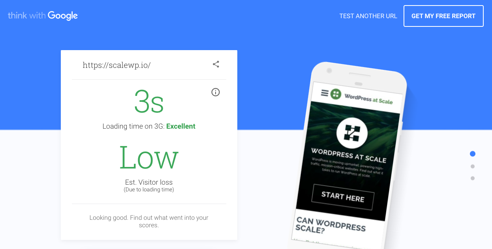
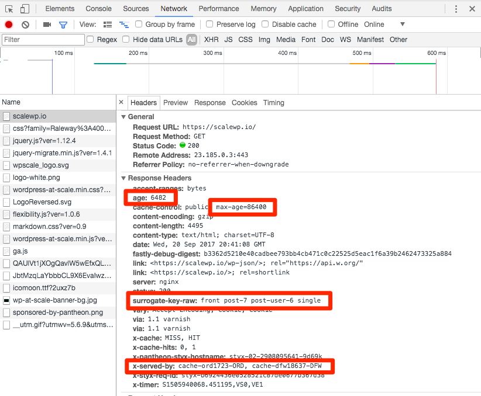
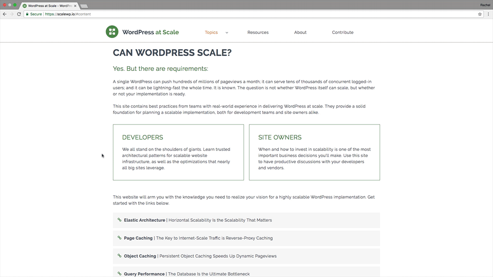
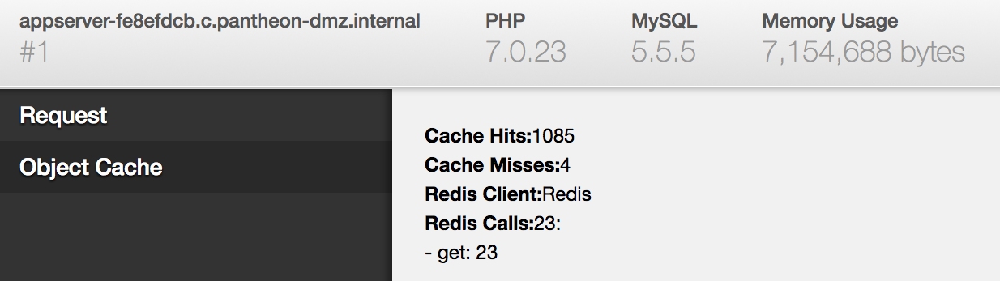

Slow websites are **bad**. Many studies have looked at this and the facts are in. Among other metrics, [a one second delay can reduce conversions by 7%, and 40% of users abandon a website that takes over three seconds to load](https://blog.kissmetrics.com/loading-time/). In this guide we’ll show you how to speed up frontend performance to ensure that visitors to your site stay engaged and have the best experience.

<Enablement title="Agency WebOps Training" link="https://pantheon.io/agencies/learn-pantheon?docs">

Learn industry best practices for caching, how to take advantage of them on the platform, and troubleshooting common issues with help from the experts at Pantheon.

</Enablement>


There are many different ways to measure page speed and performance. This guide will be tuning for the metrics set forth by [Google's mobile speed test](https://testmysite.thinkwithgoogle.com/):

- Reduce Server Response Time
- Compress Images
- Deliver Efficient CSS and JavaScript
- Avoid Redirects



## Reduce Server Response Time
The amount of time it takes for a site to respond, **Time To First Byte** (TTFB), along with the time it takes a page to render meaningful content above the fold, **Time To First Paint** (TTFP), are both proven factors for Google's page rankings. All other qualifiers being equal, search rankings can drop by 5 or 10 if TTFB goes up a few hundred milliseconds.

Of course, there's much more to Google's ranking than just these two aspects but if a page falls down even one or two ranks you start to see drastic hits to CTR and conversion rates. People leave your site, and most aren't likely to come back.

### Pantheon's Global CDN
Reduce page rendering speeds from seconds to sub-seconds by caching content _and_ resources alike across 40+ points of presence (POPs) on Pantheon's Global CDN.

<TabList>

<Tab title="Global" id="globaltab1" active={true}>


</Tab>

<Tab title="N. America" id="natab1">


<p class="pop-desc">Ashburn (x2), Atlanta (x2), Boston, Chicago (x2), Dallas, Denver, Los Angeles (x2), Miami, Minneapolis, Montreal, New York (x2), San Jose (x2), Seattle, Toronto</p>

</Tab>

<Tab title="S. America" id="satab1">


<p class="pop-desc">São Paulo, Rio de Janeiro</p>

</Tab>

<Tab title="Africa" id="aftab1">


<p class="pop-desc">Cape Town, Johannesburg</p>

</Tab>

<Tab title="Europe" id="eutab1">


<p class="pop-desc">Amsterdam, Frankfurt (x2), London (x2), Madrid, Paris, Stockholm</p>

</Tab>

<Tab title="Asia" id="asiatab1">


<p class="pop-desc">Dubai, Hong Kong, Osaka, Singapore, Tokyo (x2)</p>

</Tab>

<Tab title="Australia & New Zealand" id="austab1">


<p class="pop-desc">Auckland, Brisbane, Melbourne, Perth, Sydney, Wellington</p>

</Tab>

</TabList>

Each POP caches all the resources (e.g., CSS and JavaScript) needed to render the page, including the HTML output. Using the closest physical POP to serve a request means the visitor doesn't have to wait as long to see the first meaningful paint (TTFP).

### Full Page Caching

Pantheon is designed to store cached copies of the full HTML pages coming out of Drupal and WordPress core by default. If non-logged in visitors to your site are not getting a near-instant delivery of HTML from the cache in our Global CDN, something is wrong. Full page cache depends on the HTTP Headers coming out of your site.

### Review Response Caching
The following describes the expected cache behavior for sites running the Pantheon Advanced Page Cache [WordPress plugin](https://wordpress.org/plugins/pantheon-advanced-page-cache/) or [Drupal module](https://www.drupal.org/project/pantheon_advanced_page_cache). If you find that your page is not served from cache with similar headers and values, examine the response using Google's Developer tools and consult the next section for common cache busters and potential culprits.

<dt>age</dt>
<dd >The number of seconds cache has been available to serve the request. Any number greater than zero indicates that this response was served to the browser from cache.</dd>
<br />
<dt>cache-control</dt>
<dd >This header should include a `max-age` that is the maximum number of seconds that the cache can be kept.</dd>
<br />
<dt>surrogate-key-raw</dt>
<dd>Metadata including the the content IDs for what was displayed on this page. This metadata instructs this page to be cleared from cache when any of those posts are saved again. This header is only present when you specifically add a debugging header (`Pantheon-Debug:1`) to your request. You can use a browser extension to add the debugging header (here are some extensions for [Chrome](https://chrome.google.com/webstore/search/modify%20header) and [Firefox](https://addons.mozilla.org/en-US/firefox/search/?q=modify+header)).</dd>
<br />
<dt>x-served-by</dt>
<dd>This header indicates which POP your response came from. Our primary infrastructure is in the Midwest of the United States so the first item you will probably see on this list will include "ORD" for the O'Hare airport in Chicago. If you're physically located in Austin you will also see DFW, indicating the response went from the primary datacenter to a cached copy in Chicago to a cached copy in Dallas.</dd>



<Accordion title="Google's Developer Tools" id="dev-tools" icon="lightbulb">

Examine the HTTP headers for the response using Chrome's Developer tools:



1. Right click somewhere on the page.
2. Select **Inspect**.
3. Open the **Network** tab, then refresh the page. This allows you to review all of the HTTP requests necessary to display your page.
4. Select the first row, which is a request for the initial HTML file.
5. Look for the **Age** header. Any number greater than zero indicates that this response was served to the browser from cache.

</Accordion>

### Debug Common Cache Busters

#### Cookies

Cookies are included in the response headers we examined previously. They can include sessions for authenticated traffic to logged in users, which can invalidate cache. For WordPress, it's common for plugins to add their own cookies in such a way that breaks full-page caching.

For reference, here are all the cookie patterns configured to bust cache across Pantheon's Global CDN:

```http
NO_CACHE
S+ESS[a-z0-9]+
fbs[a-z0-9_]+
SimpleSAML[A-Za-z]+
PHPSESSID
wordpress[A-Za-z0-9_]*
wp-[A-Za-z0-9_]+
comment_author_[a-z0-9_]+
duo_wordpress_auth_cookie
duo_secure_wordpress_auth_cookie
bp_completed_create_steps # BuddyPress cookie used when creating groups
bp_new_group_id # BuddyPress cookie used when creating groups
wp-resetpass-[A-Za-z0-9_]+
(wp_)?woocommerce[A-Za-z0-9_-]+
```

You can see the cookies used on your site under the **Application** tab in Chrome's Developer Tools.

#### Unintentional Cache Invalidation

Try to walk yourself through the content rendering tree, considering any custom or contrib code that may be affecting the directives set in the HTTP headers of a response.

<TabList>

<Tab title="WordPress" id="wordpress-max-age" active={true}>

There could be an existing snippet assumed to disable caching for a single entity when in reality it's disabling caching for the entire page:

```php
/**
* This is an example of accidentally bypassing cache when rendering a response.
* Don't use this without proper conditionals wrapped around the header function.
**/
add_action( 'send_headers', 'add_header_maxage' );
function add_header_maxage() {
  // some logic that accidentally invalidates full-page cache
    header('Cache Control: max-age=0');
}
```

See the [WordPress documentation](https://codex.wordpress.org/Plugin_API/Action_Reference/send_headers) for more details.

</Tab>

<Tab title="Drupal" id="drupal-max-age">

There could be an existing snippet assumed to disable caching for a single block when in reality it's disabling caching for the entire page:

```php
/**
* This is an example of accidentally bypassing cache when rendering a response.
* Don't use this without proper conditionals wrapped around it.
**/
// some logic that accidentally invalidates full-page cache
$form['#cache'] = ['max-age' => 0];
```

See the [Drupal documentation](https://www.drupal.org/docs/8/api/render-api/cacheability-of-render-arrays) for more details. You can search your custom code for `#cache` to find places where you've interacted with the Cache API.

</Tab>

</TabList>

#### Incorrect Configuration

Working across many environments presents opportunities for configuration changes to get lost or for configurations to never be set correctly in the first place. Using tools like [WP-CFM](https://wordpress.org/plugins/wp-cfm/) and Drupal 8's [Configuration Management System](https://www.drupal.org/docs/8/configuration-management/managing-your-sites-configuration) to track configuration alongside code will mitigate these issues, but mistakes do happen. Double-check your site's default caching configurations:

<TabList>

<Tab title="WordPress" id="wp-config-get" active={true}>

The Pantheon Page Cache plugin is already included by our upstream as a Must-Use plugin. Check the plugin settings to make sure you're setting the desired TTL:

1. From the WordPress dashboard, click **Settings** > **Pantheon Page Cache**.
2. Review the Time to Live, which translates to `max-age`.
3. We recommend setting **Default Time to Live (TTL)** to a higher value, like 86400 seconds (one day):


</Tab>

<Tab title="Drupal" id="drupal-config-get">

In Drupal it is very easy to turn off page caching and forget to turn it back on.

1. Navigate to **Configuration** > **Development** > **Performance** within Drupal's Admin Interface.
2. Review **Page cache maximum age**:


The Drupal 8 default setting is 10 minutes. You can set much higher cache max ages when using the Pantheon Advanced Page Cache Module to clear specific pages when your underlying data is updated.

</Tab>

</TabList>

### Optimize Non-Cached Responses

Improve performance on longer trips to and from the browser for instances you _want_ to bypass cache and go straight to the application:

#### Upgrade to PHP7

If you haven't done so already, [make the switch to PHP7](/php-versions). Upgrading your site's PHP version will improve the security, performance, and supportability of your site.

See our blog post for an example of [62% performance gains after upgrading](https://pantheon.io/blog/php-7-now-available-all-sites-pantheon).

#### Enable Redis Object Caching

Sites loading a lot of content can benefit from an object cache like Redis. For details, see [Installing Redis on Drupal or WordPress](/redis).

#### Monitor Performance with New Relic

If your site doesn't seem to be able to send uncached content fast enough, enable monitoring services for free with [New Relic](/new-relic) for help identifying bottlenecks.

#### Helper Tools

There are toolbars for both Drupal and WordPress that provide stats like the number of queries, amount of memory, and response time. These can be helpful for real time debugging.

<TabList>
<Tab title="WordPress" id="wordpress-helpers" active={true}>

The [Debug Bar](https://wordpress.org/plugins/debug-bar/) plugin can be useful identifying advanced cache behaviors. This plugin requires that you enable debugging via `wp-config.php`:

```php
/**
 * For developers: WordPress debugging mode.
 *
 * Sets WP_DEBUG to true on if on a non-production environment.
 *
 */
    if ( in_array( $_ENV['PANTHEON_ENVIRONMENT'], array( 'test', 'live' ) ) && ! defined( 'WP_DEBUG', false ) ) {
      define('WP_DEBUG', false);
    }
    else
      define( 'WP_DEBUG', true );
```

1. Navigate to a development environment's site URL that has the plugin installed and enabled, with the above configuration in place.
2. From the WordPress dashboard, click **Debug** towards the top right.
3. Review the request and object cache data for potential red flags.



</Tab>

<Tab title="Drupal" id="drupal-helpers">

The `webprofiler` module is provided by [Devel](https://www.drupal.org/project/devel) and generates a helpful toolbar at the bottom which can dig into performance and caching behaviors.


</Tab>

</TabList>

For debugging deep and complex server-side performance problems you might need to run your site locally with profiler like [Blackfire](https://blackfire.io/).

## Compress Images

While images are not render blocking, they do need to be loaded as soon as they are visible. However, they will block the `onload` DOM event resulting in longer waits and more spinners. Use the following techniques for handling images.

### Send Text Instead

Many design elements on a page are best loaded as SVGs (Scalable Vector Graphics) rather than JPGs or GIFs. SVGs have the benefit of often looking better than JPGs or GIFs (because they scale to any screen-size). Also, because they are simply text, you have the option of including them inline with HTML. Inlining an SVG, like your website's logo, reduces the number of total requests needed to serve the page.

Ask the designers on your team if any of the elements intended to be loaded as images were created in Adobe Illustrator, Sketch, or any another application that can easily export SVGs.

Social sharing links are often good candidates here and are freely available in packs, such as Ridiculously Responsive Social Sharing Buttons for [WordPress](https://wordpress.org/plugins/rrssb/) or [Drupal](https://www.drupal.org/project/rrssb).

### Lazy Load Images

Lazy loading images is a JavaScript technique that saves bandwidth and lowers load times by delaying the loading of images until they appear in the viewport.

Try the [BJ Lazy Load](https://wordpress.org/plugins/bj-lazy-load/) plugin for WordPress and the [Image Lazyloader](https://www.drupal.org/project/lazyloader) module for Drupal.

### Send Only as Many Pixels as Needed

Images might be expected to grow and shrink by large amounts according to device and browser size, but it's overkill to use a 4000x4000 pixel image within an element that will never render larger than 200x200 pixels.

One of the newer HTML5 tags, `<picture>`, addresses this scenario in ways that the older `` tag did not. Drupal 8 and WordPress core support this tag by default. Drupal 7 support has been backported to the [Picture](https://www.drupal.org/project/picture) module.

Use this new [HTML Tag](https://www.w3schools.com/tags/tag_picture.asp) to define a size attribute appropriate for the given layout at a particular screen-size.

```php
  <picture>
      <source srcset="small.jpg" media="(max-width: 768px)">
      <source srcset="normal.jpg">
      
  </picture>
```

### Send Only as Many Bytes as Needed

Resizing an image so that you only send 200x200 pixels instead of 4000x4000 is a good start. The next step is ensuring that the file containing those 200 pixels is as small as it could possibly be without reducing the image quality. This task is commonly called "smushing" and unfortunately there is not a great native PHP option to do so.

The Pantheon Global CDN does not offer image optimization as a feature, but sites that rely on a third-party CDN service provider might have the option of smushing at the CDN level.

For images that are a part of your theme or module/plugin, you can smush them before committing them to Git with an application like [ImageOptim](https://imageoptim.com/mac).

## Deliver Efficient CSS and JavaScript

Drupal and WordPress Core both allow for themes and modules/plugins to add individual CSS and JavaScript files to any given page (or every single page). To handle this norm in a way that ensures stable functionality, both systems default to serving each one of those `.css` and `.js` files separately, usually  in HTML `<head>` tag.

Loading everything separately and early in the page rendering process ensures that the effect of each file is taken on the first page rendering. It also nearly guarantees a slower than necessary page load because both types of resources block rendering.

Fully optimizing all of the JavaScript and CSS on an already-built site is usually more work than can be done in one sitting. Though there are some easy wins that you should make sure you are getting.

### Load Only What is Needed

Many sites load CSS and JavaScript files not used on the given page and not used on any page. Look at your theme and remove unused scripts or styles.

To load custom scripts and styles only on relevant pages, use the appropriate APIs of Drupal and WordPress:

<TabList>

<Tab title="WordPress" id="wp-css" active={true}>

WordPress has twin functions `wp_enqueue_style()` and `wp_enqueue_script()` for adding CSS and JavaScript. You can call them from within your theme or custom plugins to add styles and scripts to page.

If the file you are adding is not relevant for all pages on your site, be sure to wrap the function in some kind of logic so that it is only loaded when needed. See the WordPress [developer documentation](https://developer.wordpress.org/themes/basics/including-css-javascript/) for more details.

</Tab>

<Tab title="Drupal" id="drupal-css">

In Drupal 7 it was possible to use the functions `drupal_add_css()` and `drupal_add_js()` to add assets. Often these functions were misused to add assets to every single page on the site. Those functions were removed from Drupal 8. Now the `#attached` property on Render arrays (which is also available in Drupal 7) is the technique to use:

```php
// From core/modules/contextual/contextual.module.
function contextual_page_attachments(array &$page) {
  if (!\Drupal::currentUser()->hasPermission('access contextual links')) {
    return;
  }

  $page['#attached']['library'][] = 'contextual/drupal.contextual-links';
}
```

[See the Drupal core documentation where this example was taken from for more details.](https://www.drupal.org/docs/8/creating-custom-modules/adding-stylesheets-css-and-javascript-js-to-a-drupal-8-module)

</Tab>

</TabList>

### Use as Few Requests as Possible

Once you have eliminated code that is not needed, make sure the code being loaded comes in as few requests as possible.

<TabList>

<Tab title="WordPress" id="wp-requests" active={true}>

Use the [Autoptimize](https://wordpress.org/plugins/autoptimize/) plugin and the following configuration in your site's `wp-config.php` file:

```php
// Configure directory & filename of cached autoptimize files
define('AUTOPTIMIZE_CACHE_CHILD_DIR','/uploads/autoptimize/');
define('AUTOPTIMIZE_CACHEFILE_PREFIX','aggregated_');
```

The following blog post walks through how to use results from the [Critical Path CSS Generator](https://jonassebastianohlsson.com/criticalpathcssgenerator/) with the Autoptimize plugin so that you have inline critical styles with a deferred stylesheet: [How to Use the Autoptimize “Inline and Defer CSS” Option](https://www.wpfaster.org/blog/how-to-use-autoptimize-inline-and-defer-css-option)

</Tab>
<Tab title="Drupal" id="drupal-requests">

Drupal Core has the ability to "aggregate" CSS and JavaScript. When turned on, Drupal will combine individual CSS and Javascript files in a smaller number of bigger files. This easy optimization can be done at `admin/config/development/performance`:


Checking these boxes will take a normal Drupal site from having dozens (or hundreds) of small CSS/JS files to just a few. As you browse around the site the aggregated files loaded will be different as different modules add different source files to the page. [For more details, see the Drupal.org documentation on CSS organization.](https://www.drupal.org/docs/develop/standards/css/css-file-organization-for-drupal-8)

If you want to make the number of files as low as possible, try [Advanced Aggregation](https://www.drupal.org/project/advagg) module. [It can help take fine grain control over how files are combined](http://www.mediacurrent.com/blog/better-css-js-aggregation-advanced-aggregation). In the past there have been bugs when using Advanced Aggregation on Pantheon. To our knowledge, those are all resolved.

</Tab>

</TabList>

<Alert title="Note" type="info">

The Pantheon Global CDN includes HTTP/2. One of the benefits of HTTP/2 is that it allows multiple files to be downloaded simultaneously.<br/><br/>
The web community has long speculated whether HTTP/2 will make CSS and JavaScript aggregation irrelevant. (In theory, lots of little files, each individually cacheable, and downloaded en masse over one HTTP/2 connection would be more performant than one big inline CSS statement that's been aggregated.)<br/><br/>
In our testing, HTTP/2 makes disaggregated files much faster than they were before, but still not as fast as aggregated files. As HTTP/2 and related technologies mature, we will revisit this recommendation.<br/><br/>

</Alert>

### Make Assets as Small as Possible

In addition to making as few requests as possible to load styling and scripts, the loaded files should be as small as possible. Both Drupal's [Advanced Aggregation](https://www.drupal.org/project/advagg) and WordPress' [Autoptimize](https://wordpress.org/plugins/autoptimize/) have options for further minifying or "uglifying" your CSS and Javascript.

#### Local Minification

Many of us have a build step, for tasks like compiling Sass, as part of our development workflow. Adding a minification step when generating resources is easy. For CSS use [CSSNano](https://github.com/ben-eb/cssnano) and for JavaScript use [UglifyJS](https://github.com/mishoo/UglifyJS2) or [Closure Compiler](https://developers.google.com/closure/compiler/).

These can be used with common build tools, such as [Grunt](https://gruntjs.com/) or [gulp](https://gulpjs.com/), or a GUI tool like [CodeKit](https://codekitapp.com/). No matter how you do it you should be minifying your resources (HTML, CSS and JavaScript) for every site.

### Load Assets after the Browser Renders the Page

Performance graders will call out CSS and Javascript that blocks the rendering of the page. Usually these styles and scripts are in the `<head>` tag of your webpage. Many can be moved from the top of the HTML to the bottom so that the browser is able to first render the page without processing them.

WordPress and Drupal option have core API's for declaring whether an asset should be in the header or footer. For instance, WordPress' [wp_enqueue_script()](https://developer.wordpress.org/reference/functions/wp_enqueue_script/) function can be given an argument to say that a script should go in the footer.

Similarly Drupal has the concept of `scope` for header and footer. For a detailed look at how Drupal works under the hood, take a look at this [blog post from Lullabot](https://www.lullabot.com/articles/javascript-aggregation-in-drupal-7).

While you can use those core APIs directly to move load files as late as possible, Drupal's [Advanced Aggregation](https://www.drupal.org/project/advagg) and WordPress' [Autoptimize](https://wordpress.org/plugins/autoptimize/) make it easy to do this task without custom code.

#### Defer and Async Script Attributes

For JavaScript, we suggest deferring as much as possible until after the `onload` DOM event has completed so rendering isn't blocked. Whatever script cannot be deferred should be loaded asynchronously so the page rendering continues without interruption.

For more details on the `<script async>` and `<script defer>` attributes, see [this article by Daniel Imms](http://www.growingwiththeweb.com/2014/02/async-vs-defer-attributes.html).

### Load the Critical Pieces as Early as Possible

For some CSS styles it is not sensible to load them after the first HTML rendering. Without some styling your site may look bad. Inlining critical CSS means finding the CSS rules that will be used by the top of your webpage and including those rules in the same HTML response that first comes back from the server (rather than in a separate style sheet). This means the browser doesn't have to wait for an additional request to start applying styles.

You can identify critical styles for your above-the-fold content using a tool like [Critical Path CSS Generator](https://jonassebastianohlsson.com/criticalpathcssgenerator/) and then again use Drupal's [Advanced Aggregation](https://www.drupal.org/project/advagg) module and WordPress' [Autoptimize](https://wordpress.org/plugins/autoptimize/) plugin to load the critical styles within the HTML.

Be careful with this technique because you are making a tradeoff. By making every single HTML response include inline styles you make that initial response be a larger amount of data to load. This slight slowdown in initial loading is acceptable as long as it is slight. Having the bulk of your CSS in separate files means those files can be cached by the browser. If all of the CSS rules moved from separate files to inline then none of the CSS would be cached by the browser and performance would suffer.

### Load Resources Once

While a CDN can bring resources closer to the browser, there's no faster cache than the one in the browser itself. However unlike a CDN, it's not possible to directly invalidate browser caches. We recommend the following techniques to achieve maximum browser caching:

#### Common Libraries and Fonts

Use externally hosted Javascript libraries and fonts. While some speed tests will show this as taking extra time, a real-world browser is likely to have major libraries and fonts already cached.

#### Set Long Cache Lifetimes

Deliver static files with long cache lifetimes (via `Cache-Control` headers). Pantheon automatically uses a one-year lifetime for static files.

#### Bust Cache with Query Parameter

Include static files with [cache-busting query strings](https://stackoverflow.com/a/9692722). This prevents the long `Cache-Control` lifetime for static files from breaking pages when the CSS and Javascript change.

Drupal automatically does this for CSS and Javascript, for details see [Drupal.org docs](https://www.drupal.org/docs/8/creating-custom-modules/adding-stylesheets-css-and-javascript-js-to-a-drupal-8-module). WordPress provides the `wp_enqueue_style` parameter for a version when enqueuing CSS and Javascript, for details see Themetry's article, [Cache-Busting Enqueued Scripts and Styles in WordPress](https://themetry.com/cache-busting-wordpress/).

#### Upload Entirely New Files

For files included in pages without cache-busting query strings (like images), it's better to upload a new file (and delete the old one) instead of replacing the existing file.

The new filename will cause clients to get the new file, even if they have a cached version of the older one (which is likely given the one-year cache lifetimes for static files on Pantheon).

## Avoid Redirects

A redirect will add at least one extra HTTP request-response cycle. As a result, eliminating extraneous redirects can make your website more snappy. Despite your best efforts it still may be necessary to include the occasional [redirect to a primary domain](/guides/launch/redirects) using HTTPS with or without the WWW.

Other considerations:

- Avoid mobile-specific subdomains and use responsive web design techniques.
- A DNS service provider such as [Cloudflare](https://support.cloudflare.com/hc/en-us/articles/200170536-How-do-I-redirect-all-visitors-to-HTTPS-SSL-) may allow speedier redirects in some circumstances, but it’s still faster not to redirect at all.
- Avoid several chained redirects that make small changes such as redirecting to HTTPS, adding or removing WWW, or adding a trailing slash. Instead, [redirect to a primary domain](/guides/launch/redirects) that has all of these standardized.
- Pantheon doesn’t read changes to the `.htaccess` file or support NGINX customization, so redirections via those methods will not work. For details, see [Configure Redirects](/redirects/#php-vs-htaccess).

## GZIP Compression

By default, gzip compression is already enabled server-side. The response headers include `content-encoding: gzip` which will serve the site's HTML, stylesheets and JavaScipt files in a reduced size before sending it to the browser, resulting to a faster Time To First Byte (**TTFB**). Users don't need to modify any Nginx/.htaccess configuration, nor install any 3rd party plugins/modules for gzip compression.

If there are any assets that are not being gzipped, most likely they are assets loaded from outside Pantheon.
