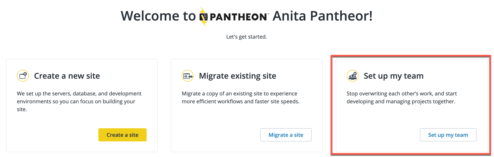

First, let's get you signed up!

To create an account:

1. Go to the Pantheon <a href="https://pantheon.io/register?docs" target="_blank" rel="nofollow noopener external">Registration Page</a>.

1. Enter your name, email, company name, password, country and state.

1. Read and accept the terms of service.

1. Click **Sign Up**.  Your account will be created (it may take a few moments), and a login page will appear.

   

   <Alert title="Note" type="info">

   Are you an agency? Do you build sites for others? If so, check **Are you an agency?** on the [signup form](https://pantheon.io/register) to get more free features and really make the most of this guide. You can sign up if you're an agency of one or one thousand.

   </Alert>

1. Log in to your account.  A Welcome page will appear.

1. Select [**Set up your team**](/guides/account-mgmt/workspace-sites-teams/teams) for the purposes of completing the activities in this guide.

Congratulations! You are now the proud owner of a free Pantheon account.  Now let's get it set up.