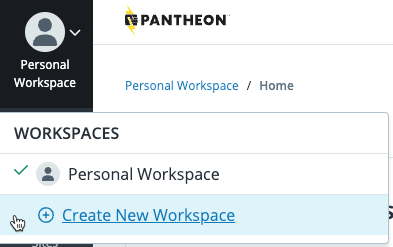

<Alert title="Note" type="info" >

If you are a one-person shop, and will only ever be a one-person shop, you could skip this section.  However, you may want to consider planning for growth, and perform all the steps on this page.

</Alert>

## Create A Workspace

Professional workspaces bring together users, sites, tools, and support to allow administrators to effectively manage a large number of sites. You may be a part of no workspaces, or many workspaces, depending on your company setup.  You can learn more about Workspaces in [Workspaces, Sites and Teams](/guides/account-mgmt/workspace-sites-teams).

To create a workspace:

You can create as many workspaces as necessary. The following process will create a Silver Tier Professional workspace.

1. Select your gravatar in the upper left corner, then select **Create New Workspace**.

   <Alert title="Note" type="info" >
   
   Your gravatar is an image you can upload in your [personal settings](https://dashboard.pantheon.io/personal-settings/profile).  If you have not personalized your gravatar, it will appear as it does in the image below.
   
   </Alert>

   

1. Enter the information, upload a logo (optional), and click **Continue**.
   
   

1. If you have a team member that needs access to this Workspace, enter their email address and select a role for them.  To learn about roles, select **View Role Permission Levels**.

  

Your Workspace is created, and you are taken to the Workspace Dashboard.

## Add Additional Team Members

If you have additional people you'd like to add to the team:

1. Select the <Icon icon={"fa fa-users"} text={"Teams"}/>**Team** tab, and click **Add User**. 

1. Click **Invite Team Member**.

1. Enter the email address of the new user, select a role, then click **Send Invite**.

