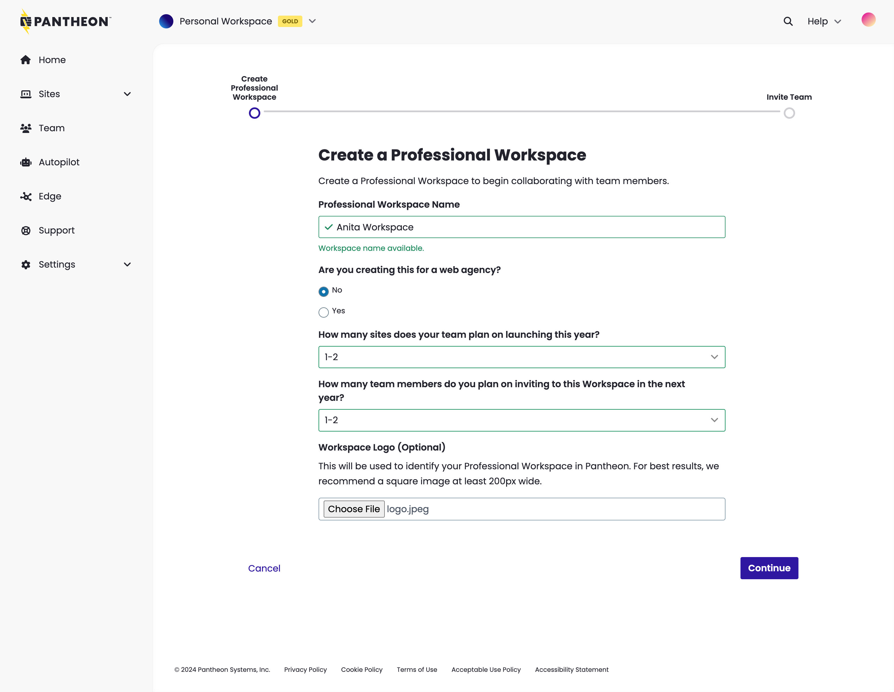
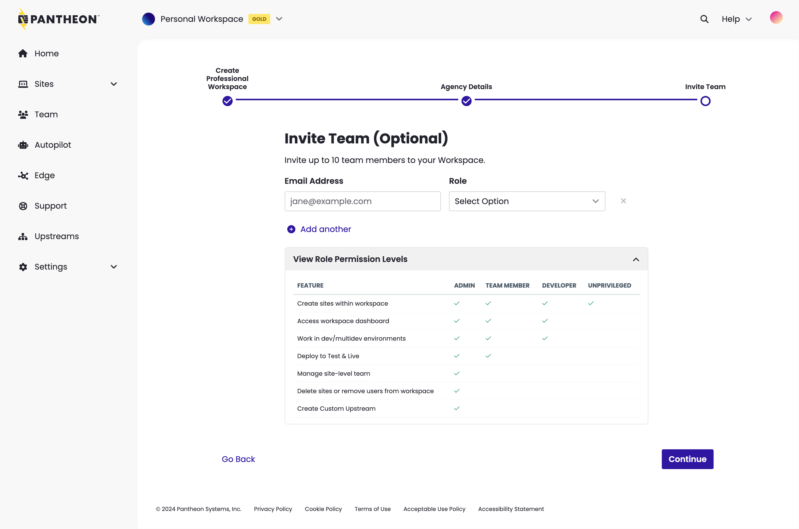
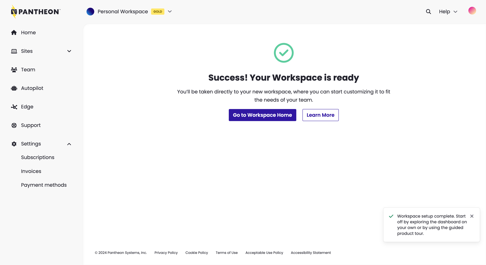
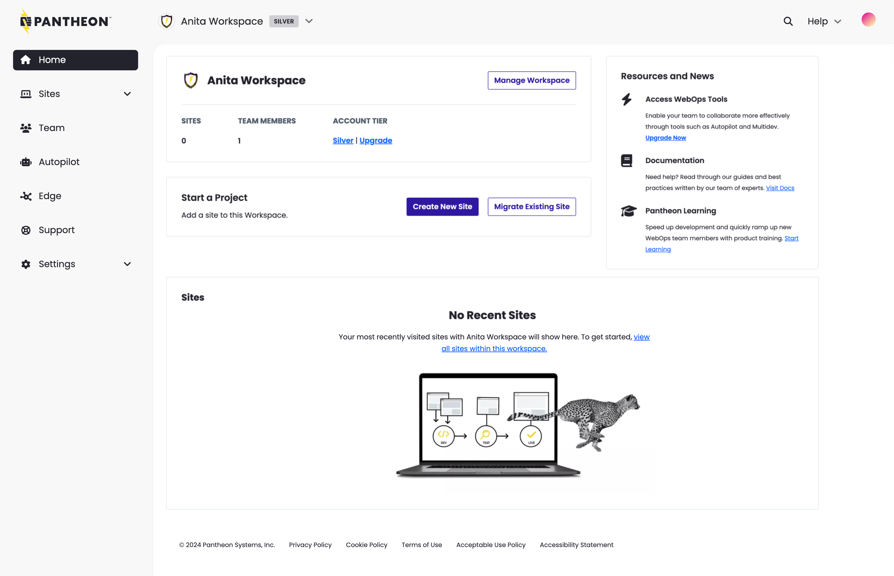

<Wistia src="jdhn2naeu2" />

<Alert title="Note" type="info" >

If you are a one-person shop, and will only ever be a one-person shop, you could skip this section.  However, you may want to consider planning for growth, and perform all the steps on this page.

</Alert>

To set up your team:

1. If you are a Self-Serve Customer (paying via Credit Card), click the [Workspace Switcher](/guides/account-mgmt/workspace-sites-teams/workspaces#switch-between-workspaces), then select **Create New Workspace**.  If you are an Enterprise Customer (paying via a contract), either select the Professional Workspace created when you created your account, or click **Create a New Workspace**.

1. Enter the information, upload a logo (optional), and click **Continue**.

   

1. Enter the email addresses and select roles for team members that need access to this Workspace. To learn about roles, select **View Role Permission Levels**.

   Repeat this step for each team member you want to add, then click **Continue**.

  

1. Once your workspace is created, click **Go to Workspace Home**.

   

  You have created your first workspace, and added your team members:

  

If you'd like to learn more about workspaces and teams, refer to [Workspaces, Sites, and Teams](/guides/account-mgmt/workspace-sites-teams).

Now, let's add a site.
