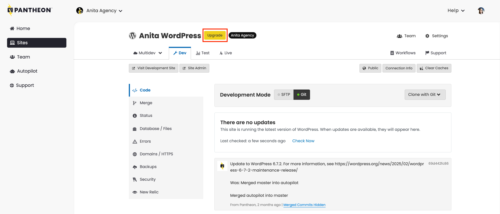
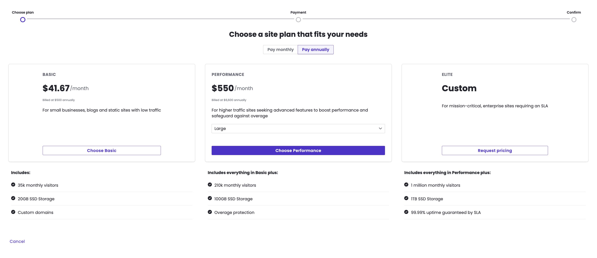
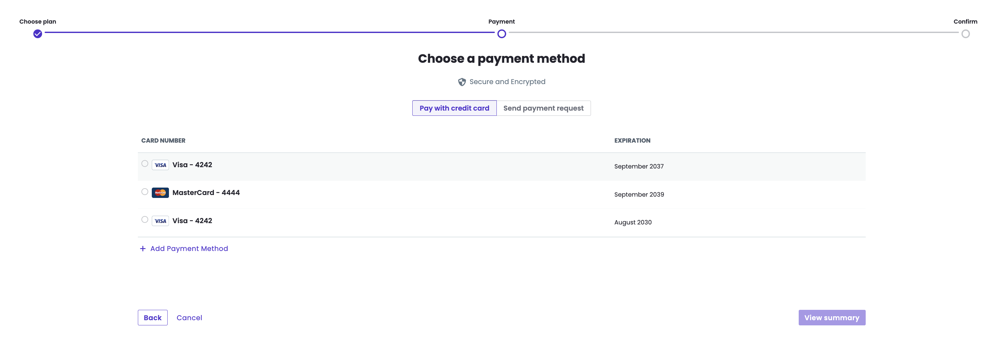
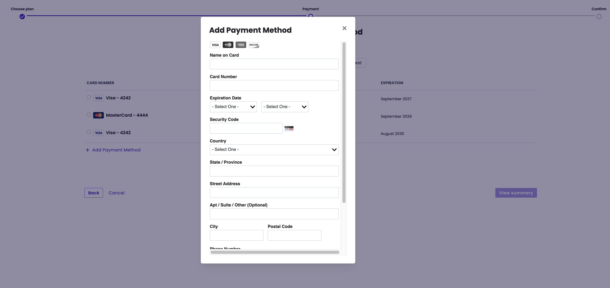
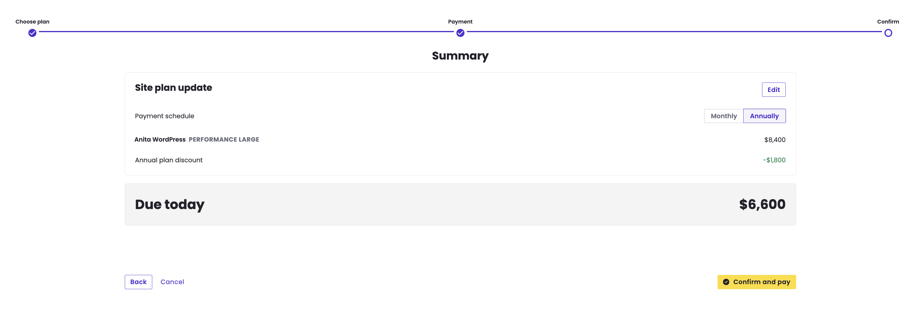

The free account you created allows you to create sandbox (non-production) sites.  In order to take your site live, you'll need to select and purchase a plan.

## Select a Plan

<Partial file="plans.md" />

## Purchase a Plan

1. [Go to the Site Dashboard](/guides/account-mgmt/workspace-sites-teams/sites#site-dashboard) and click **Upgrade** next to the site's name.

   

1. Choose the plan you want to purchase.

   

1. Select an existing card or add a new payment method.

   

1. If adding a new payment method, enter your billing information and click **Add Card**.

   

1. Make sure the details are correct, and click the **Confirm and pay** button.

   

You have purchased your plan, and can now go live!