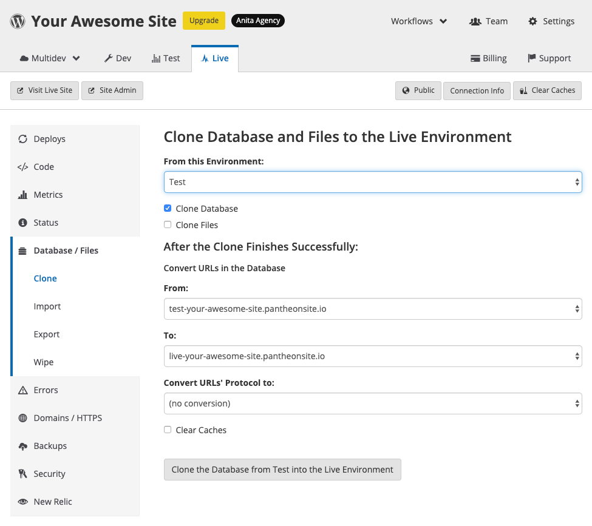

And now it's time to finally make your site available to the public! This section provides the minimum requirements to launch your site. Refer to our [Launch Guide](/guides/launch/) for more detailed information.

## Test Your Site

To create your Test environment:

 1. Go to your Site Dashboard, click the <Icon icon="equalizer" text="Test"/> tab, and then click **Initialize Test Environment** to create your Test environment.

 

  This takes a few moments.

1. Click **Site Admin**. A new browser tab will open, and you will be presented with your CMS setup screen.

1. Enter the information on the screen, and when done, return to the browser tab with your Site Dashboard.

  <Alert title="Note" type="info">

  Be sure to record your new username and password.

  </Alert>

1. Select the <Icon icon="server" text="Database / Files"/> tab. Keep the default selections and select **Clone the Database & the Files from Development into the Test Environment**.

   

Your Test environment is now set up. Test your site thoroughly before proceeding to the next step.

## Deploy Your Site to Live

After you've tested your site, it's time for it to go live.

<Alert title="Note" type="info" >

When you complete this step, your site will be live for anyone to see, at the Pantheon URL. We will change this URL in the next section.

</Alert>

 1. Go to your Site Dashboard, click the <Icon icon="equalizer" text="Live"/> tab, and then click **Initialize Live Environment** to create your Live environment.

   

1. Click **Site Admin**.  A new browser tab will open, and you will be presented with your CMS setup screen. Enter the information on the screen, and when done, return to the browser tab with your Site Dashboard.

  <Alert title="Note" type="info">

  Be sure to record your new username and password.

  </Alert>

1. Select the <Icon icon="server" text="Database / Files"/> tab. Keep the default selections *except* select "Test" from **From this Environment**, then select **Clone the Database & the Files from Test into the Live Environment**.

   

1. You will be prompted to confirm you want to go live.  Type "CLONE", then click **Overwrite This Environment**.

   

   Your site is now live at the Pantheon URL.

1. Click **Visit Live Site** to view it.

## Domain Configuration

At this point, you have a live site with a Pantheon URL, like `http://my-site.pantheonsite.io/`. To change that to a more friendly URL, you'll need to purchase a domain from a DNS provider.

After you've done that, connect your DNS:

1. Go to the ** Live** environment in your Pantheon Site Dashboard.

1. Select the ** Domains / HTTPS** tab.

1. Enter the `www` domain (for example, `www.example.com`), then click **Connect Domain**.

1. Verify ownership by adding a new DNS TXT value or by uploading a file to a specific URL. Select the method you prefer, and follow the instructions. Note that the values are randomized for security.

1. Click **Verify Ownership** to confirm, or to skip HTTPS provisioning for now, click **Skip without HTTPS**. It can take 30 minutes or more for DNS records to propagate, depending on your DNS host and your domain's TTL values.

1. Open a new tab or browser window, and copy the **Required Values** to your [DNS](/guides/domains/dns) provider. If you see a message like "Waiting for HTTPS, DNS records will be provided when HTTPS provisioning completes.", wait one minute, then refresh the page.

1. Click ** Back to Domains/HTTPS**.

1. Select **Connect Domain** and enter the bare domain (for example, `example.com`, and then click **Connect Domain**.

Then, configure your DNS:

1. Select **Details** next to the `www` domain.

1. Log in to the DNS host for the domain in a separate window.

1. Copy the value provided in the Pantheon Site Dashboard for the required **A** record, then use it to create an **A** record wherever you manage DNS. Repeat this step for <i>both</i> of the AAAA records.

1. Return to the ** Domains / HTTPS** page in the Pantheon Site Dashboard.

1. Click **Details** next to the bare domain.

1. Copy the value provided in the Pantheon Site Dashboard for the required **A** record, then use it to create an A record wherever you manage DNS. Repeat this step for <i>both</i> of the AAAA records.

Click below for detailed instructions for your specific DNS host.

<Accordion title=" DNS Host-Specific Instructions" id="host-specific2" icon="info-sign">

<DNSProviderDocs />

You can run diagnostics at [Let's Debug](https://letsdebug.net/) if you are having difficulties issuing a [Let's Encrypt](https://letsencrypt.org/) certificate. This tool can identify an array of issues specifically for [Let's Encrypt](https://letsencrypt.org/) certificates, including problems with DNS, nameservers, networking issues, common website misconfigurations, and CA policy issues.

</Accordion>

Your site is now live at the domain you have purchased!