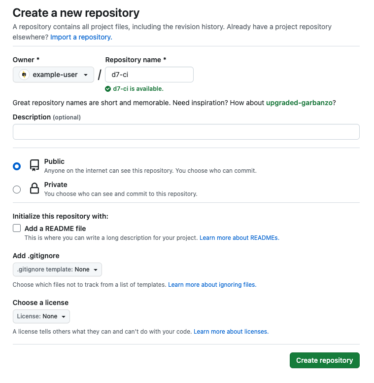

Pantheon provides Git repositories for all sites on the platform. However, some teams might need an external repository hosted by a provider, like GitHub or Bitbucket, to function as the canonical version of the site's codebase. This section shows you how to use Pantheon with an external repository. The example below uses a GitHub account. However, the steps should be similar for any provider.

## Git Repositories on Pantheon

The codebase for your site is stored in a Git repository. This includes your versions of Drupal or WordPress core, and all of the custom and contributed modules, plugins, and themes that work together to power your site. It doesn’t include the `/sites/default/files/` or `/wp-content/uploads/` directories, or your database.

This repository will be a clone of one of the **upstreams** running on the platform, usually [Drupal 7](https://github.com/pantheon-systems/drops-7/ "Pantheon's Drupal 7 repository at GitHub") or [WordPress](https://github.com/pantheon-systems/WordPress/ "Pantheon's WordPress repository at GitHub"),
or one of their forks that our users manage as [Custom Upstreams](/guides/custom-upstream). Your site’s repository on the Pantheon platform will track one of these upstream repositories as a Git remote. 

These repositories control the common codebase for several sites. The most common change to an upstream is the release of a new core version. These changes to the upstream repository become available to the sites running them within a day. For individual sites, using GitHub to collaborate on custom code is often a requirement for teams. In order to do so, you’ll need a quick and efficient way to keep your Pantheon repository in sync with GitHub.

The sections below will show you the basics for collaborating with others if your site:

- Is only on Pantheon and you’re moving development to GitHub
- Exists on GitHub and you want to deploy to Pantheon
- Isn’t using Git
- Doesn’t yet exist

## Synchronizing Existing Pantheon Sites to GitHub

1. Log in to Pantheon and load the Site Dashboard for the site you want to work on.

  

1. Click the **<span class="glyphicons glyphicons-wrench"></span> Dev** tab > set the **Development Mode** to **Git** > click **Clone with Git**:

    Your local copy will now track the Pantheon repository as the origin.

    ```bash{outputLines: 2-8}
    git clone <ssh://codeserver.dev.UUID@codeserver.dev.UUID.drush.in:2222/~/repository.git d7-ci>
    Cloning into 'd7-ci'...
    remote: Counting objects: 298630, done.
    remote: Compressing objects: 100% (59210/59210), done.
    remote: Total 298630 (delta 208616), reused 298143 (delta 208186)
    Receiving objects: 100% (298630/298630), 67.23 MiB | 479.00 KiB/s, done.
    Resolving deltas: 100% (208616/208616), done.
    Checking connectivity... done.
    ```

1. Change directory into the site repository > verify your connection to the Pantheon server:

    ```bash{outputLines: 2-4}
    cd d7-ci
    git remote -v
    origin  ssh://codeserver.dev.UUID@codeserver.dev.UUID.drush.in:2222/~/repository.git (fetch)
    origin  ssh://codeserver.dev.UUID@codeserver.dev.UUID.drush.in:2222/~/repository.git (push)
    ```

   The output lists "origin" as the remote with Pantheon SSH Git clone connection information as it's address.

### Create a Repository on GitHub

Follow the steps below to configure your GitHub repository.

1. Set the **Owner** drop-down to **pantheon-systems**.

1. Enter the **Repository name** (the examples on this page use d7-ci).

1. Select the **Public** radio button.

1. Keep **Initialize this repository with a README** unchecked if you want the option to add code to your repository. 

1. Select the **Add .gitignore** checkbox > set the **.gitignore template** drop-down to **none**.

1. Select the **Choose a license** checkbox > set the **License** drop-down to **none**.

1. Click **Create Repository**.

 

### Add the GitHub Repository as a Remote

Replace the word `origin` with the name you want for your remote to add the GithHub repository as a remote.

  - The remote, in this case, cannot be named `origin` because your local clone is already tracking the Pantheon site repository as `origin`.

  

In the example below, the remote is named `github`.

  ```bash{outputLines: 3-6}
  git remote add github git@github.com:pantheon-learning/d7-ci.git
  git remote -v
  github  git@github.com:pantheon-learning/d7-ci.git (fetch)
  github  git@github.com:pantheon-learning/d7-ci.git (push)
  origin  ssh://codeserver.dev.UUID@codeserver.dev.UUID.drush.in:2222/~/repository.git (fetch)
  origin  ssh://codeserver.dev.UUID@codeserver.dev.UUID.drush.in:2222/~/repository.git (push)
  ```

#### Configure Origin as a Multi-Remote Destination (Optional)

You can also add another push URL for origin by adding a push URL within `.git/config`:

  ```none:title=.git/config
  [remote "origin"]
    url = ssh://codeserver.dev.<SITE_UUID>@codeserver.dev.<SITE_UUID>.drush.in:2222/~/repository.git
    url = git@github.com:systemseed/example.git
  ```

  Commits will be pushed to both remote destinations automatically on `git push origin`. Enforce this configuration with all team members when working collaboratively. Props to [Tom Kirkpatrick](/contributors/mrfelton) for contributing this tip in the [Pantheon Community](/pantheon-community).

### Push the Pantheon Site's Codebase to GitHub

Run the command below in your terminal:

  ```bash{outputLines: 2-6}
  git push -u github master
  Writing objects: 100% (120046/120046), 31.88 MiB | 3.26 MiB/s, done.
  Total 120046 (delta 89679), reused 120039 (delta 89679)
  To git@github.com:pantheon-learning/d7-ci.git
  ```

 The repository on GitHub now has all of the same code as the existing site.

 

## Migrate Existing Site Repositories to Pantheon

 The Pantheon Dashboard provides a guided path for migrating existing sites to the platform. Follow the steps in the [Migrate Existing Sites](https://pantheon.io/docs/migrate#migrate-existing-sites) document.

## Developing in Sync

You must create the `settings.php` file to develop in sync.

1. `cd` into `sites/default` and create the file:

  ```bash{promptUser: user}
  cd sites/default
  touch settings.php
  ```

1. Add the file to version control and push to both remotes:

  ```bash{outputLines: 2-9, 12-18, 20-22}
  git status
  On branch master
  Your branch is up-to-date with 'github/master'.
  Untracked files:
    (use "git add <file>..." to include in what will be committed)

    settings.php

    nothing added to commit but untracked files present (use "git add" to track)
    git add .
    git status
    On branch master
    Your branch is up-to-date with 'github/master'.
    Changes to be committed:
    (use "git reset HEAD <file>..." to unstage)

    new file:   settings.php

    git commit -m “Create settings.php”
    master b802550] Create settings.php
    1 file changed, 577 insertions(+)
    create mode 100644 sites/default/settings.php
    ```

1. Push the change to GitHub and Pantheon:

    ```bash{outputLines: 2-8}
    git push github master
    Counting objects: 4, done.
    Delta compression using up to 4 threads.
    Compressing objects: 100% (4/4), done.
    Writing objects: 100% (4/4), 384 bytes | 0 bytes/s, done.
    Total 4 (delta 2), reused 0 (delta 0)
    To git@github.com:pantheon-learning/d7-ci.git
      fe267cb..b802550  master -> master
    ```

    ```bash{outputLines: 2-17}
    git push origin master
    Counting objects: 4, done.
    Delta compression using up to 4 threads.
    Compressing objects: 100% (4/4), done.
    Writing objects: 100% (4/4), 384 bytes | 0 bytes/s, done.
    Total 4 (delta 2), reused 0 (delta 0)
    remote:
    remote: PANTHEON NOTICE:
    remote:
    remote: Environment 'dev' (branch: master) is currently in SFTP mode.
    remote: It cannot receive git pushes until you disable this via the Pantheon dashboard.
    remote: If you are trying to push changes to a different branch or environment, try:
    remote:     git push origin [branch-name]
    remote:
    To ssh://codeserver.dev.59b2dd69-2305-4ca2-a745-4f00e4100c88@codeserver.dev.59b2dd69-2305-4ca2-a745-4f00e4100c88.drush.in:2222/~/repository.git
    ! [remote rejected] master -> master (pre-receive hook declined)
    error: failed to push some refs to 'ssh://codeserver.dev.59b2dd69-2305-4ca2-a745-4f00e4100c88@codeserver.dev.59b2dd69-2305-4ca2-a745-4f00e4100c88.drush.in:2222/~/repository.git'
    ```

    This push to Pantheon failed, because the Development environment was in SFTP mode.

    

1. Set the **Development Mode** to **Git** by clicking on the toggle, or enter the code below in the command line:

    ```bash{promptUser: user}
    terminus connection:set <site>.<env> git
    ```

    

1. Push to Pantheon:

    ```bash{outputLines: 2-8}
    git push origin master
    Counting objects: 4, done.
    Delta compression using up to 4 threads.
    Compressing objects: 100% (4/4), done.
    Writing objects: 100% (4/4), 384 bytes | 0 bytes/s, done.
    Total 4 (delta 2), reused 0 (delta 0)
    To ssh://codeserver.dev.59b2dd69-2305-4ca2-a745-4f00e4100c88@codeserver.dev.59b2dd69-2305-4ca2-a745-4f00e4100c88.drush.in:2222/~/repository.git
      fe267cb..b802550  master -> master
    ```

    

    The GitHub repository and Pantheon site both now have a `settings.php` file. This will allow for environment-specific configuration to enable modules through remote Drush calls and other essential functionality.

    We recommend renaming the remote repository to something more specific than `origin`, such as `pantheon`. 

1. Rename the remote repository:

    ```bash{outputLines: 3-8}
    git remote rename origin pantheon
    git remote -v
    github  git@github.com:pantheon-learning/d7-ci.git (fetch)
    github  git@github.com:pantheon-learning/d7-ci.git (push)
    pantheon  ssh://codeserver.dev.59b2dd69-2305-4ca2-a745-4f00e4100c88@codeserver.dev.59b2dd69-2305-4ca2-a745-4f00e4100c88.drush.in:2222/~/repository.git (fetch)
    pantheon  ssh://codeserver.dev.59b2dd69-2305-4ca2-a745-4f00e4100c88@codeserver.dev.59b2dd69-2305-4ca2-a745-4f00e4100c88.drush.in:2222/~/repository.git (push)
    ```

## Feature Branching

 Working with teams on GitHub requires a branching strategy. You must add your colleagues to the site you're developing, both on [GitHub](https://help.github.com/enterprise/2.0/admin/guides/user-management/organizations-and-teams/) and on [Pantheon](/team-management).

 Locally, your codebase is in sync with both repositories. 

1. Checkout a branch to start working on a new feature:

    Since the site is associated with a supporting organization that has a Multidev environment, you can test out any feature. These environments have an 11-character limit for branch names, so you should use short branch names for your feature branches.  

    ```bash{outputLines: 2}
    git checkout -b configs
    Switched to a new branch 'configs']
    ```

1. Download the module and its dependencies in your local environment.

    ```bash{promptUser: user}
    drush dl configuration-7.x-2.x-dev xautoload
    ```

1. Enable the module > test and verify that the module is working. 

1. Add, commit, and push to branches on Pantheon and GitHub:

    ```bash{outputLines: 2-13}
    git status
    On branch configs
    Untracked files:
      (use "git add <file>..." to include in what will be committed)

      sites/all/modules/configuration/
      sites/all/modules/xautoload/

    nothing added to commit but untracked files present (use "git add" to track)
    Brians-Pantheon-Mac-2:d7-ci brian$ git add .
    Brians-Pantheon-Mac-2:d7-ci brian$ git commit -m "install configuration and xautoload"
    [configs 0f85fbd] install configuration and xautoload
    284 files changed, 25781 insertions(+)
    ```

    ```bash{outputLines: 2-13}
    git push pantheon configs
    Counting objects: 365, done.
    Delta compression using up to 4 threads.
    Compressing objects: 100% (325/325), done.
    Writing objects: 100% (365/365), 199.00 KiB | 0 bytes/s, done.
    Total 365 (delta 70), reused 0 (delta 0)
    remote:
    remote: PANTHEON NOTICE:
    remote:
    remote: Skipping code sync, no multidev environments were found for branch "configs".
    remote:
    To ssh://codeserver.dev.59b2dd69-2305-4ca2-a745-4f00e4100c88@codeserver.dev.59b2dd69-2305-4ca2-a745-4f00e4100c88.drush.in:2222/~/repository.git
    ```

    The platform found no Multidev environments associated with the Git branch. 
  
    Continue with the steps below to create a Multidev environment.

1. Create a Multidev environment in Terminus:

    ```bash{promptUser: user}
    terminus multidev:create <site>.dev <to_env>
    ```

    

    The module will now be available to activate and test on Pantheon for your colleagues to experience. 

1. Add a link to the module's configuration page on the Multidev environment in your GitHub pull request.

    

### Create Pull Request

 You are now ready to create a pull request on GitHub. The pull request can include: 

 - Links to the Multidev environment where the team can view the effects of the commits

 - @-mentions of team members

 - A list of tasks for team members to perform before merging

 

 Timani completed the tasks, we discussed a bit in person, and he merged the PR.

 

## Deploy to Pantheon

1. Checkout the master branch on your local.

1. Pull from github master > push to pantheon master:

  ```bash{promptUser: user}
  git checkout master
  git pull github master
  git push pantheon master
  ```

 

## Optional Tools to Optimize Workflows

There are other options to further optimize workflows now that you have the basic setup. 

 - A continuous integration server like Jenkins, Travis CI, Bamboo, or CircleCI

 - A suite of automated acceptance tests using Behat or PHPUnit

These tools allow your team to fully implement continuous delivery with automated testing and continuous integration.

## More Resources

- [Install and Configure Git](/guides/git/git-config)

- [Git FAQs](/guides/git/faq-git)

- [Multidev](/multidev)
