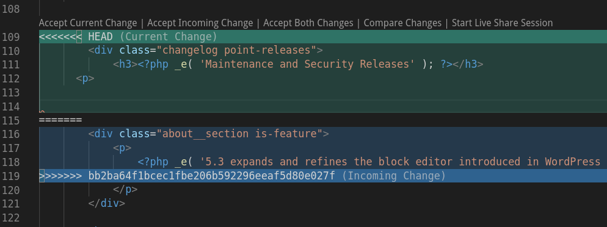

Conflicts can occur when modified file(s) within your site's codebase do not align with changes made to the same file(s) in the site's upstream.

> When a merge isn’t resolved automatically, Git leaves the index and the working tree in a special state that gives you all the information you need to help resolve the merge.
>
> \- [Git Manual](https://www.kernel.org/pub/software/scm/git/docs/)

## Resolve Conflicts When Updating Core

The fastest resolution for conflicts when updating is often to use the `-Xtheirs` flag. This will attempt to automatically resolve the conflicts with a preference for upstream changes.

This is safe to run if you don't have your own changes in any of the conflicting files (for example problems with `.gitignore`).

<TabList>

<Tab title="Drupal 7" id="d7" active={true}>

  ```bash{promptUser: user}
  git pull -Xtheirs https://github.com/pantheon-systems/drops-7.git master
  # resolve conflicts
  git push origin master
  ```

</Tab>

<Tab title="WordPress" id="wp">

  ```bash{promptUser: user}
  git pull -Xtheirs https://github.com/pantheon-systems/WordPress.git master
  # resolve conflicts
  git push origin master
  ```

</Tab>

<Tab title="WordPress Site Network" id="wp-network">

  ```bash{promptUser: user}
  git pull -Xtheirs https://github.com/pantheon-systems/wordpress-network.git master
  # resolve conflicts
  git push origin master
  ```

</Tab>

</TabList>

1. Double-check the files before going forward to make sure no bugs were introduced.

    - The `-Xtheirs` flag will drop your changes if you modify core CMS files.
    You should [manually resolve conflicts](#manually-resolve-conflicts) in this scenario. 
  
1. Review [WordPress and Drupal Core Updates](/core-updates) for more details on core updates.

### Find a Site's Upstream URL

Run the following command in [Terminus](/terminus) to retrieve your Upstream URL:

```bash{promptUser: user}
terminus site:info <site> --field=upstream
```

## Manually Resolve Conflicts

Steps to resolve merge conflicts vary by the type of conflict. Refer to the sections below for more information on resolving delete/modify conflicts, content conflicts, and Multidev conflicts.

### Resolve Delete/Modify Conflicts

A delete/modify conflict occurs when one commit deletes a file and another modifies it. Follow the steps below to resolve such a conflict.


1. Identify the file that is generating a delete error.

    For example, the Git log may contain an entry similar to the following:

    ```git
    CONFLICT (delete/modify): scripts/run-tests.sh deleted in HEAD and modified in 72faeeff1c9356221694d1351cdb2000ab3c5d1c. Version 72faeeff1c9356221694d1351cdb2000ab3c5d1c of scripts/run-tests.sh left in tree.
    ```

1. Navigate to your local repository > run the following Git command to get a copy of the file in conflict:

    ```bash{promptUser: user}
    git checkout <commit ID> -- <file>
    ```

    <Alert title="Note" type="info">

    When looking for a commit ID, you can find the last instance where the missing file was in the repository.

    </Alert>

1. Run `git status` and verify that there is a new file to add to the repository:

 ```bash{outputLines:2-5}
  git status
  On branch master
  Changes to be committed:
  (use "git reset HEAD ..." to unstage)
  new file: README.txt
  ```

1. Stage and commit:

 ```bash{promptUser: user}
 git commit -am "verifying missing README.txt"
 ```

  You will receive confirmation from Git that the file has been committed.

1. Run the Git push command:

 ```bash{promptUser: user}
 git push origin master
 ```

### Resolve Content Conflicts

A content conflict occurs when two commits modify the same line(s) of a file non-sequentially (without one having the other in its history). For example:

```git
CONFLICT (content): Merge conflict in wp-admin/about.php
Automatic merge failed; fix conflicts and then commit the result.
```

Follow the steps below to resolve this scenario.

1. Open the conflicting file in your text editor or IDE. Note that the conflicting lines are enclosed with `< HEAD` at the top, and `> <commit-id>` at the bottom, with `=======` delineating the two versions. Some IDEs, like Visual Studio Code for example, will highlight the conflicting section:

  

1. Edit the conflict by choosing one of the two versions of the conflicting line(s), or by editing a version containing both updates. 

1. Remove all the delineator notes from the file.

1. Commit and push your changes:

  ```bash{promptUser: user}
  git add wp-admin/about.php
  git commit -m "Merge conflict resolution"
  git push origin master
  ```

### Resolve Conflicts from Multidevs

Follow the steps below to resolve a merge conflict that is preventing you from merging a Multidev environment.

1. Navigate to your **Dev** environment > set the **Development Mode** to **Git**:

    

1. Click **Clone with Git** to Clone the repository to your local computer:

    

1. Navigate to the repository directory, change to the `master` branch and pull the Multidev branch to `master`.

    - In the example below, replace `multidev` with the Multidev environment name:

      ```bash{promptUser: user}
      git checkout master
      git pull origin multidev
      ```

1. [Resolve the conflicts](#manually-resolve-conflicts) using the steps above when you receive the Git notification listing the files that are in conflict.

## More Resources

- [Git FAQs](/guides/git/faq-git)

- [Undo Git Commits](/guides/git/undo-commits)

- [Multidev](/guides/multidev)

- [WordPress and Drupal Core Updates](/core-updates)
