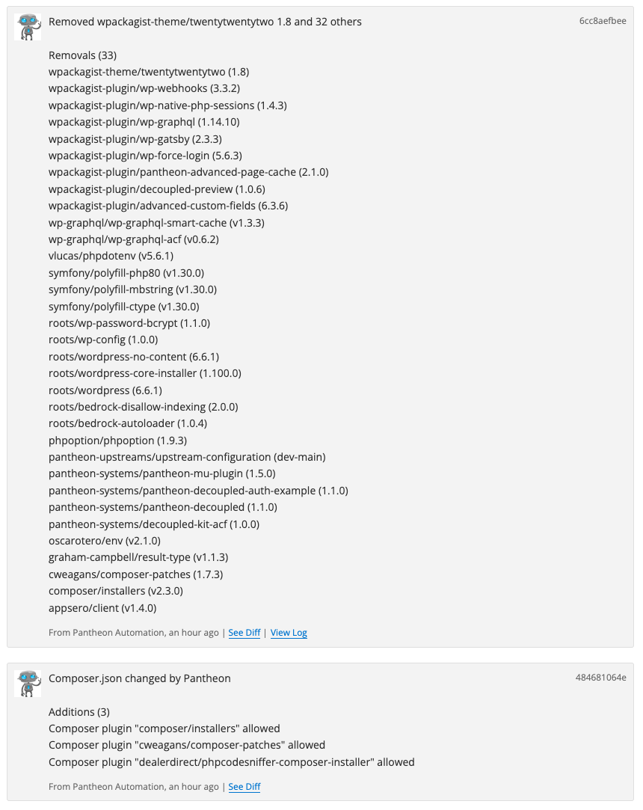

This section provides information on how to use Bedrock with Integrated Composer on a WordPress site.

WordPress does not natively support [Composer](https://getcomposer.org/), however, [Bedrock](https://roots.io/bedrock/) is a WordPress-specific framework for using Composer on WordPress sites.

## Requirements

- [PHP version](/guides/php/php-versions#verify-current-php-versions) 8.0 or greater
- [Composer](https://getcomposer.org/)

## Create Your Site

There are two ways you can spin up a site using WordPress Composer Managed:

- Running the following terminus command:

    ```bash{promptUser: user}
    terminus site:create --org ORG --region REGION -- <site_name> <label> "WordPress (Composer Managed)"
    ```

- Using this [site create link](https://dashboard.pantheon.io/sites/create?upstream_id=90a683cd-4e03-4832-9b49-be97ab2a0be4).

The site you create will be based on the Pantheon-maintained [WordPress Composer Managed](https://github.com/pantheon-upstreams/wordpress-composer-managed) upstream. Once this install completes, visit the Dev environment and follow the prompts to complete the CMS installation.

Review the sections below for important information about your site, including an explanation of the directory structure and essential configuration actions.

## Use Roots Bedrock

### Environment Variables

Bedrock makes use of an `.env` file to store environment variables. Pantheon takes care of many of these variables in `.env.pantheon`. You may set your own environment variables in a new `.env` or environment variables that are local-only in `.env.local` using the `.env.example` as a guide. Wrap values that may contain non-alphanumeric characters with quotes, or they may be incorrectly parsed.

### WordPress Config

The `wp-config.php` file is located in the `web` directory. As with other WordPress sites on Pantheon, much of this is taken care of for you in `wp-config-pantheon.php`. Application-level configuration takes place in `config/application.php` while platform-specific updates are made in `config/application.pantheon.php`. This means that `config/application.php` can be modified for your WordPress configuration settings without fear of conflicts with the upstream. Any configuration changes should be made to your `config/appliction.php` **not** your `wp-config.php` file directly.

You can learn more about WordPress configuration with Bedrock in the [Bedrock Configuration docs](https://docs.roots.io/bedrock/master/configuration/).

### Understand the WordPress Codebase

Bedrock installs WordPress as a required package so updates can be managed by Composer. As such, the contents of the `wp-content` directory have been moved outside the WordPress codebase so changes can be made safely to files within those directories without conflicts. Learn more about [Bedrock's folder structure here](https://docs.roots.io/bedrock/master/folder-structure/).

* Themes are installed into `web/app/themes/`
* Plugins are installed into `web/app/plugins`
* Must-use plugins are installed into `web/app/mu-plugins`
* WordPress core is installed into `web/wp`
* The WordPress admin dashboard is available at `https://example.com/wp/wp-admin/`

### Using Composer to manage plugins and themes

[Packagist](https://packagist.org) is a repository of Composer packages that are available by default to projects managed by Composer. Packagist libraries receive updates from their source GitHub repositories automatically.

[WPackagist](https://wpackagist.org) is a Packagist-like mirror of the WordPress.org [plugin](https://wordpress.org/plugins) and [theme](https://wordpress.org/themes) repositories and is included with Bedrock out of the box.

You can install packages from Packagist or WPackagist without any additional configuration using `composer require`.

#### Require a Package from Packagist

Some WordPress developers push their packages to Packagist in addition to the WordPress plugin and theme repositories. In this way, it may be beneficial to pull those packages directly from Packagist to get the latest code directly from the source.


```bash{promptUser: user}
composer require yoast/wordpress-seo
```

Packages that are flagged as `wordpress-plugin`, `wordpress-theme` or `wordpress-muplugin` in their `composer.json` files will be installed automatically in the appropriate `web/app/` directory by Composer.

#### Requiring a package from WPackagist

For all other plugins and themes that are not managed on Packagist, you can use `composer require` as well, using `wpackagist-plugin` or `wpackagist-theme` as the vendor and the plugin or theme slug as the package name.


```bash{promptUser: user}
composer require wpackagist-theme/twentytwentytwo
```

```bash{promptUser: user}
composer require wpackagist-plugin/advanced-custom-fields
```

#### Check first
It's generally a good idea when using either Packagist or WPackagist to check the repository before `require`ing the package. If you search Packagist for a WordPress plugin or theme and don't see it, you can be sure that if it exists in the WordPress plugin or theme repository, it will be available on WPackagist. Checking WPackagist for the package can be beneficial if you want to check what versions are available.

### Further Learning about Dependencies

For more information about managing dependencies with Composer on Pantheon, see our documentation about [dependencies](/guides/integrated-composer/dependencies) or the [Composer documentation](https://getcomposer.org/doc/).

## Troubleshooting
### Restore overwritten `composer.json`
Sometimes, when a given upstream update includes changes to the `composer.json` file, it can  conflict with your site's `composer.json` file. In these cases, applying the upstream update could result in the loss of content in your `composer.json` file.

After applying such an update, check the commit log in the site dashboard. If you see many packages have been **removed**, you'll know the site's `composer.json` file has been overwritten by the upstream and needs to be resotred:



The easiest way to resolve this is to simply back up a copy of your current `composer.json` file locally before applying core updates. Then, apply the updates on Pantheon and `git pull` them into your local repository. From there, you can then restore the contents of `composer.json` based on your local back up of the file, run `composer update` and commit the changes.

This may miss out on any actual updates to the `composer.json` in the upstream, so it's a good idea to check the [`composer.json` in the upstream repository](https://github.com/pantheon-upstreams/wordpress-composer-managed/blob/main/composer.json) to see if there are any changes you might want to incorporate into your own `composer.json` file.

**Note:** If your site is using the Decoupled upstream for Front End Sites, the [`composer.json` is in the Decoupled WordPress (Composer Managed) upstream repository](https://github.com/pantheon-upstreams/decoupled-wordpress-composer-managed/blob/main/composer.json)

## Report an Issue

Create an [issue in the Github repo](https://github.com/pantheon-systems/wordpress-composer-managed/issues) for the team to review and address if you discover an issue with the WordPress Composer Managed upstream.

Visit [our community Slack](https://pantheon-community.slack.com/archives/CT8MC5Y0K) (you can sign up for the [Pantheon Slack channel here](https://slackin.pantheon.io/) if you don't already have an account).

## More Resources

- [Bedrock Documentation](https://roots.io/bedrock/)
- [Install and Configure Lando for WordPress](/guides/local-development/lando-wordpress)
