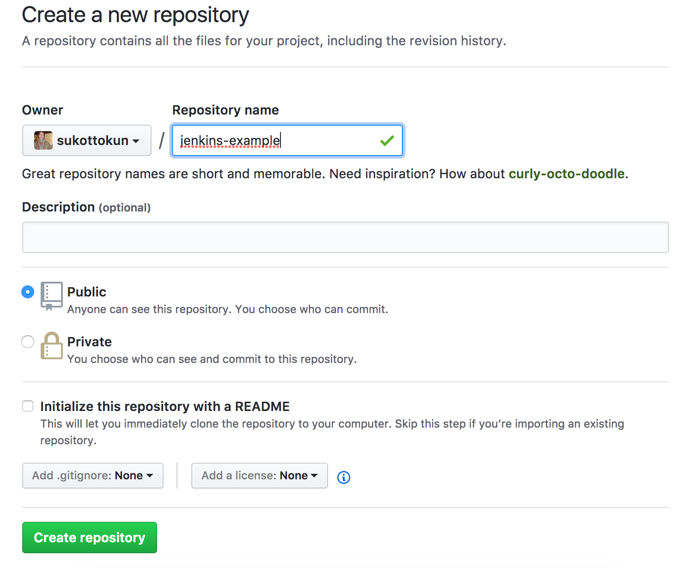

[Jenkins](https://jenkins.io) is an open source Continuous Integration (CI) server which can be used to build, test, and deploy code on any Drupal and WordPress website on Pantheon. Unlike hosted services such as [CircleCI](https://circleci.com/), it is a Java application installed and run on a server, and requires regular upkeep and maintenance. However, it is very customizable and can even run non-CI related tasks, such as calling periodic cron jobs.

In this guide, we'll configure your existing Jenkins server to automatically test and deploy Drupal 8 to a Multidev environment on Pantheon following a code push to your GitHub repository. Jenkins will run tests against both the pull request and Pantheon's master branch and display the results.

While this guide demonstrates Continuous Integration for Drupal 8 sites, the same workflow can be applied to WordPress with a few modifications:

<Accordion id="wordpress-mods" title="WordPress Modifications" icon="wrench">

WordPress users can make use of this guide with a few modifications:

- Install [WP-CLI](https://wp-cli.org/) on the Jenkins instance instead of Drush.
- Create the local copy of the new site from [https://github.com/pantheon-systems/example-wordpress-composer](https://github.com/pantheon-systems/example-wordpress-composer). 
- Specify WordPress when creating the Pantheon site: `terminus site:create $SITE "My Site" "WordPress"`
- Use WP-CLI commands for any build steps.

</Accordion>

## Before You Begin

You will need:

- Root access to a server running Jenkins.
- Install the following applications, both locally and on the Jenkins server. Verify the default Jenkins user has the ability to run them on the Jenkins server from the command line.
  - [Git](https://git-scm.com/)
  - [Composer](https://getcomposer.org/)
  - [Drush](http://docs.drush.org/en/8.x/install-alternative)
  - [Terminus](https://github.com/pantheon-systems/terminus#installing-with-composer)
  - [Terminus Build Tools plugin](https://github.com/pantheon-systems/terminus-build-tools-plugin)

    Verify you can run Terminus, Drush and Composer commands as the Jenkins user. Note that Terminus and Drush will need to be accessible from standard `PATH` directories.
- Be sure the default Jenkins user has a [private key](https://stackoverflow.com/questions/37331571/how-to-setup-ssh-keys-for-jenkins-to-publish-via-ssh) in its `$HOME/.ssh` directory, and a user with the matching public key installed on Pantheon. Clone a Pantheon site to the Jenkins user's home directory to test.
- The Jenkins user's git user name and email mail should be set in **Manage Jenkins**, **Configure System**
- In the Jenkins user's $HOME/.ssh/config (if this file doesn't exist, create it), add these two lines:

  ```http
    Host *
        StrictHostKeyChecking no
  ```

- The following Jenkins plugins should be enabled: [Git](https://wiki.jenkins-ci.org/display/JENKINS/Github+Plugin) , [Github](https://wiki.jenkins-ci.org/display/JENKINS/GitHub+Plugin), [Github Pull Request Builder](https://wiki.jenkins-ci.org/display/JENKINS/GitHub+pull+request+builder+plugin), [Environment Injector](https://wiki.jenkins-ci.org/display/JENKINS/EnvInject+Plugin), [Conditional Build Step](https://wiki.jenkins-ci.org/display/JENKINS/Conditional+BuildStep+Plugin), [Run Condition](https://wiki.jenkins-ci.org/display/JENKINS/Run+Condition+Plugin), and [Rebuild](https://wiki.jenkins.io/display/JENKINS/Rebuild+Plugin).
- We recommended using matrix-based security when using Jenkins. Anonymous users should have read access to Jenkins projects.
- Ability to create a Drupal site on Pantheon, with [Multidev](/multidev) enabled.
- A [GitHub](https://github.com) account.

## Create A New Site

### Local Project Instantiation

1. From your local terminal, use Composer to make a new local project based on our example, which contains Drupal 8, Behat, and other configuration settings:

  <Alert title="Note" type="info">

  In this example our project is call called `my-site`, so we begin by setting a local environment variable to this value. Adjust this any other variables to match your site settings.

  </Alert>

  ```bash{promptUser: user}
  SITE="my-site"
  composer create-project pantheon-systems/example-drops-8-composer $SITE
  cd $SITE
  composer prepare-for-pantheon
  ```

1. Initialize a local Git repository within your project.

  ```bash{promptUser: user}
  git init
  git add -A .
  git commit -m "Initial commit."
  ```

### Create and configure a GitHub Repository

1. From the GitHub dashboard, [create a new repository](https://github.com/new), without creating a `README` or `.gitignore` file.

    

1. From your local command line, connect your local project to this repository as `origin`, and push the code to the master branch. Remember to replace the URL path:

  ```bash{promptUser: user}
  git remote add origin git@github.com:YOUR-ORG/YOUR-PROJECT.git
  git push -u origin master
  ```

At this point, you should be able to create a local branch, commit a change, and push to GitHub. On GitHub, you should then be able to open a pull request successfully.

### Create a Pantheon Site

Now we will spin up a Drupal 8 site on Pantheon with Terminus, then overwrite the default install with the code from our GitHub repository. In the commands below, replace the value for `--org=` with your organization's name.

1. From your local terminal, use terminus to create a site on Pantheon:

  ```bash{promptUser: user}
  terminus site:create $SITE "My Site" "Drupal 8" --org="My Team"
  terminus connection:set $SITE.dev git
  ```

1. Add the Pantheon remote repository address and push the code to it:

  ```bash{promptUser: user}
  PANTHEON_REPO=$(terminus connection:info $SITE.dev --field=git_url)
  git remote add pantheon $PANTHEON_REPO
  git push --force pantheon master
  ```

1. Complete the Drupal site configuration on Pantheon, replacing the values for `--site-mail`, `--account-mail`, and `--account-name`:

  ```bash{promptUser: user}
  terminus build:env:install --site-mail="your email" --site-name="My Drupal Site" --account-mail="<your email>" --account-name="admin" $SITE.dev
  ```

1. Verify the site is installed and working:

  ```bash{promptUser: user}
  terminus env:view $SITE.dev
  ```

  Now the master branch of GitHub, your local, and Pantheon are in sync.

## Configure Jenkins

### GitHub/Jenkins Integration

1. From the main Jenkins menu on the left side, select **Credentials**, then **System**. Click on **Global credentials**, then **Add Credentials**. Here we will add our GitHub and Terminus tokens.

    

2. In a new browser tab, go to your GitHub account. Go to [Settings](https://github.com/settings/profile). Under **Developer Settings** click on **Personal access tokens**  and generate a new token. This should have all **repo**  and **admin:repo-hook** options:

    

    Copy the generated token. Be careful, as you will not be able to view it again.

3. Back in Jenkins, create your new credential with the following options:

    - **Kind**: Secret Text
    - **Scope**: Global
    - **Secret**: Paste the GitHub token you created.
    - **ID**: blank
    - **Description**: GitHub

    Press OK to add the new credential to the system.

4. Create another credential for a Terminus Token, using  either an existing token or [create a new token](/machine-tokens) from your Jenkins user dashboard:

    - **Kind**: Secret Text
    - **Scope**: Global
    - **Secret**: Paste the Terminus token you created.
    - **ID**: blank
    - **Description**: Terminus

    After saving both, your credentials will be accessible for secure use.

    

    <Alert title="Note" type="info">
    Keep your Terminus token handy, you'll need to enter it again later.
    </Alert>

5. Return to the main Jenkins dashboard and select **Manage Jenkins**, then **Configure System**.

6. Scroll to the **GitHub Servers** section  and click on **Add GitHub Server**.

7. Leave the **API URL** as `https://api.github.com`. For **Credentials**, click the drown-down menu and select your GitHub credentials.

8. Click **Test Connection** and you should see the GitHub username which created the token.

9. Click **Save**.

### Create the Jenkins Project

1. Log into the Jenkins dashboard as an admin user. Click on **New Item**.

    

2. Give the project a name with no spaces. Select **Freestyle Project** and click **OK** to save.

    

3. The next page lets you configure options for this project. In the **General** tab, select "GitHub project" and enter the repository URL (e.g. `https://github.com/YOUR-ORG/YOUR-PROJECT`).

4. In the **Source Code Management** tab select **Git**, then **Advanced**. Add the following information:

    - **Repository URL**: The path to the .git file of your repository, e.g. `https://github.com/YOUR-ORG/YOUR-PROJECT.git`
    - **Name**: `origin`
    - **Refspec**: blank
    - **Branch specifier**: `origin/*`
    - **Additional Behaviours**: Add **Prune stale remote-tracking branches**:

    

5. We want code changes to trigger our build (as opposed to setting up a periodic build, for example). Under **Build Triggers**, Check the box labelled, "GitHub hook trigger for GITScm polling".

6. Under **Build Environment**, check the box labelled "Inject environment variables to the build process."

7. In the **Properties File Path** field, enter the path to your Jenkins environment variables file. On Debian-based systems, it's usually `/var/lib/jenkins/envVars.properties`. If it doesn't already exist, create an empty file.

8. In the **Properties Content** field, add the following variable one per line, with no quotation marks:

    - **SITE_ID=**your-site-name

    

9. Check "Use secret text(s) or file(s)" option. A new button called **Bindings** will appear. add a secret text binding. Name it **TERMINUS_TOKEN** and select the Terminus secret text credential from the dropdown:

    

### Add Build Steps

Under the **Build** tab is a button labeled **Add build step**. These tasks will execute in sequence, and the job will quit if any fail. Add these in separate build steps, selecting **Execute shell** for all but steps 1 and 6.

1. Set build status to "pending" on GitHub commit

1. Jenkins logs into Pantheon:

  ```bash
  #!/bin/bash
  echo "Logging into Terminus"
  terminus auth:login --machine-token=${TERMINUS_TOKEN}
  ```

1. Verifies the dev site is awake and in git mode. Note that these are separate build steps:

  ```bash
  echo "Waking Dev environment."
  terminus env:wake -n ${SITE_ID}.dev
  ```

  ```bash
  echo "Setting site to git mode."
  terminus connection:set ${SITE_ID}.dev git
  ```

1. Jenkins creates a Multidev and pushes the new code to this environment

  ```bash
  echo "Creating multidev"
  cd ${WORKSPACE}
  terminus build:env:create ${SITE_ID}.dev ci-${BUILD_ID} --yes
  ```

  ```bash
  echo "Run database updates and clear cache"
  terminus drush -n ${SITE_ID}.ci-${BUILD_ID} -- updatedb -y
  terminus drush ${SITE_ID}.ci-${BUILD_ID} cr
  ```

1. Then the test suite we include with the example is run.

  ```bash
  echo "Running behat"
  TERMINUS_ENV=ci-$BUILD_ID TERMINUS_SITE=$SITE_ID $WORKSPACE/tests/scripts/run-behat
  ```

1. Add one **Conditional step (single)** build task, to merge the code from the Pantheon Multidev to the pantheon/master, i.e. your dev site on Pantheon. This will only happen when changing the master branch.

   - Under **Run?** select **Regular expression match**.

     - **Expression**: `(?i).*origin/master.*`

     - **Label**: `${ENV,var="GIT_BRANCH"}`

   - Under **Builder** select **Execute Shell**

     - Command:

      ```bash
      echo "Merging multi-dev changes to master"
      terminus build:env:merge -n ${SITE_ID}.ci-${BUILD_ID} --yes
      ```

    Your conditional step should look like this:
    

7. Finally, a cleanup task:

    ```bash
    echo "Cleaning up multidev & branches"
    git -C ${WORKSPACE} remote remove pantheon
    git -C ${WORKSPACE} remote prune origin
    terminus build:env:delete:ci ${SITE_ID} --keep=2  --yes
    ```

### Add Post-build Actions

Under **Post-build Actions** is another button labelled **Add post-build action**. Click on it and select the option "Set GitHub commit status (universal)". In the fields that appear, choose the following options:

- **Commit SHA**: "Latest build revision".

- **Repositories**: "Any defined in job repository".

- **Commit context**: "From GitHub property with fallback to job name".

- **Status Result**: "One of default messages and statuses".

- **Status backref**: "Backref to the build"

Finally, hit **Save** to complete the configuration of your Jenkins build process.

Now on your local computer, create a new branch and makes a change to it. When you commit and push to GitHub, a build should initiate. You should see the results of the test, which link to the Jenkins job:


If a test fails, you can see the details by clicking the job, then "Console Output"


## Conclusion

If you usually use only the Pantheon repository, be sure to now push to your new origin repo on GitHub. You can still add the Pantheon repo as a remote to take advantage of Multidev and work on your own environment. As you add new features, continue to add new tests.
