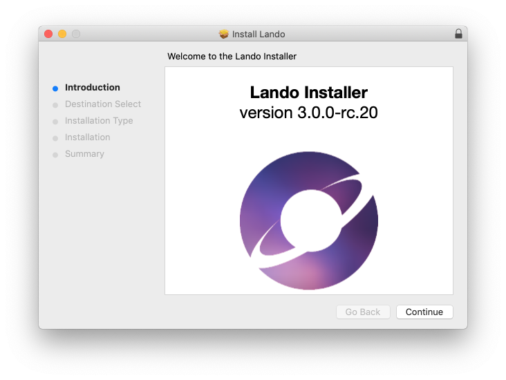
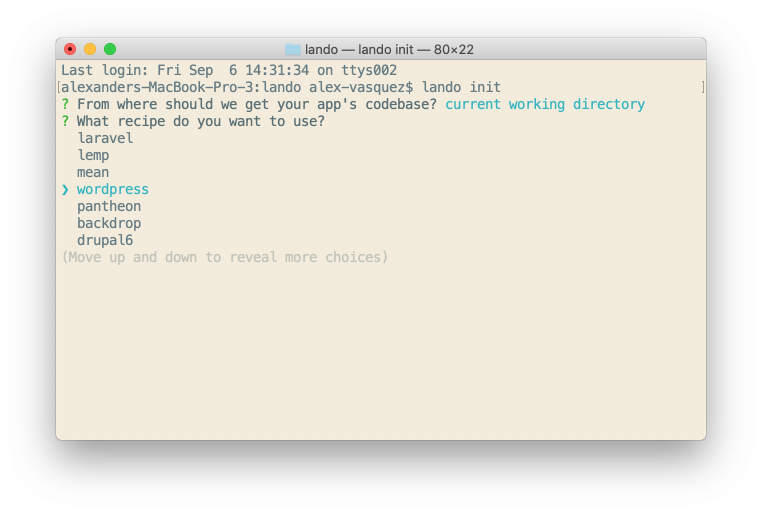
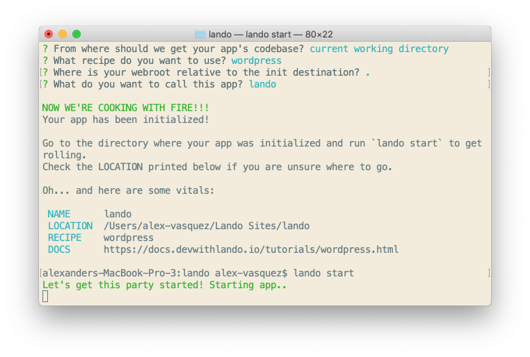

This guide will help you get up and running with [Lando](https://lando.dev/), an Open Source development tool intended for developers who prefer a painless, easily customizable local server environment configuration they can track in their source control repositories.

<Enablement title="Try Localdev" link="https://pantheon.io/localdev?docs">

Pantheon has been building our own local development tool! Localdev is built using Lando, has a friendly GUI, and is great for WordPress and Drupal sites. Click above to try it out, or check out the [docs](/guides/localdev).

</Enablement>


## Before You Begin

Be sure that you have:

- An existing WordPress site on Pantheon, or [create](https://dashboard.pantheon.io/sites/create) one.
- Having a working knowledge of local server environments is helpful but not entirely necessary.
- While you’re at it, be sure to check out [Lando getting started guide](https://docs.lando.dev/contrib/contrib-intro.html) and [Lando CLI usage](https://docs.lando.dev/basics/usage.html).
- Please note that [Pantheon's Support Team](/guides/support) doesn't provide support for Lando.

Installing Lando is straight forward. Be sure to check its [system requirements](https://docs.devwithlando.io/installation/system-requirements.html) to ensure you can proceed. Note that Lando does not currently provide a Graphical User Interface (**GUI**). Everything is managed from the command line.

## Download and Install Lando

1. Download the appropriate [Lando release](https://github.com/lando/lando/releases) for your Operating System.

2. Click to open the installer package. The installer has a few pre-flight checks it runs before getting started.

  

Once you finish following any system prompts, the Lando installation script will work its magic and install itself on your computer.

## Getting Started

You’ll manage your Lando instances via the command-line. A short list of useful Lando commands can be found [here](https://docs.devwithlando.io/cli/usage.html). If you ever need a refresher, simply pull up your terminal and type:

```bash
lando --help
```

The Lando command is installed globally so you can run it from anywhere within your terminal.

<Alert type="info" title="Note">

It’s always a good idea to keep your project's site files and folders organized. Keep your website projects in separate folders from one another.

</Alert>

Create a separate folder to hold your Lando-powered installations rather than mixing with installs managed by other server environments.

## Install WordPress Locally

Getting started with Lando can be disorienting at first. Fear not, mighty developer, that’s why this documentation exists! We’ll begin by installing and spinning up a fresh WordPress site locally, without Pantheon integration.

Note that you can follow these same basic steps with an existing Pantheon Drupal site, just replace the starting recipe.

1. Open your terminal and get to the directory where you plan to run your fancy Lando WP site:

  ```bash
  cd ~/projects/my-wp-site
  ```

1. Initialize the lando site:

  ```bash
  lando init
  ```

1. You may choose to start from your current directory or you can clone from Pantheon, Github, or another remote repository, or zip file. For this step, we’ll choose **current working directory**.

1. Next, you’ll choose WordPress as your starting recipe.

  

1. For your webroot, you may press enter and Lando will spin up the site from your current directory.

1. Enter the name of the site. Use something you’ll remember!

  Your local site has been created but you're still not done! You still need to start the app, download WordPress and then install WordPress. Sure, it’s a few steps but the command-line practice is good for bone growth and keyboard-punching-dexterity.

1. Start Lando:

  ```bash
  lando start
  ```

  This starts your Lando app and gives you some basic information like your Appserver URLs to access the site in your local browser of choice:

  

1. Download the WordPress Core:

  ```bash
  lando wp core download
  ```

  This command downloads the current stable release of WordPress and unpacks it in your current working directory. This step isn’t necessary if you started with a Git or Pantheon repository instead of the current working directory.

  <Alert type="info" title="Note">

  This is where we talk a little bit about WP-CLI, Lando, and You. To use WP-CLI commands in Lando, simply prefix your `wp` command with `lando` and you’re good to go, Lando will run your WP-CLI command all nice like.

  </Alert>

1. Your WP configuration file still needs to be created. You can actually do this from the command-line. However, we’re going to go to do this the ol’ fashioned way through the browser.

1. In your browser, enter in the URL given to you above: `http://yourappname.lndo.site`. You’ll notice WordPress’s _Famous Five Minute install_ screen.

1. Click next after choosing your preferred language and click let’s go on the following screen.

1. In Lando, for a WordPress installation without Pantheon, the Database, Username, and Password are all `wordpress` and Database Host is `database` (all values are case-sensitive). Enter your credentials and complete the installation process.

Congrats! You now have Lando installed with WordPress!

<Alert type="info" title="Note">

You can find your site’s login details simply by typing `lando info` in your terminal.

</Alert>

### Installing WordPress Using the Pantheon Recipe

Using Lando with Pantheon provides a few key advantages:

- It closely mimics Pantheon’s tech stacks and environments for your local environment, getting you as close to a one-to-one development setup as possible.

- The recipe also installs [Terminus](/terminus) (if you don’t already have it installed), Pantheon’s powerful web server management CLI.

- And if that wasn’t enough, you can push and pull changes directly into Lando from any of your Pantheon environments.

To use this Lando recipe you must have:

- An account with Pantheon, which you can [register](https://pantheon.io/register) for free

- Pantheon hosted site ready to go. You can either use an existing Pantheon site or [spin up a new one](/guides/quickstart/create-new-site)

- A unique Pantheon [machine token](/machine-tokens)


1. From the directory of the WordPress site created in the section above, stop the Lando instance (if still running):

  ```bash
  lando stop
  ```

1. In your project directory, create a new directory for your WordPress + Pantheon integrated environment, and `cd` to it.

1. Initiate a new Lando site, specifying Pantheon as the source:

  ```bash
  lando init --source pantheon
  ```

  The only difference between this and `lando init` is that defining the source as pantheon allows you to skip a couple of prompts.

1. When prompted, paste in a Pantheon machine token you created for Lando. Note that most Terminal emulators use **CTRL/Command + V** to paste, and you will not see any characters added, `*` or otherwise.

1. Choose the Pantheon site you want to pull from to create your local site.

  <Alert type="info" title="Note">

  Lando creates your local environment, mirroring your dev environment closely, and then clones down the site’s codebase (this part of the process does not include media files in the uploads folder or the site’s database). This will take a few minutes or so depending on the site’s size.

  </Alert>

1. Once complete, you can run the site locally:

  ```bash
  lando start
  ```

With your site started, you’ll have your local site URL so you can access it from your browser. But now you can also pull the code, media files, and the database from the site’s Pantheon environment.

### Pushing and Pulling Your Changes

Certainly, one of the most awesome benefits of using Lando with the Pantheon recipe is the ability to _push_ your changes from your local site to your various Pantheon environments (including live and multidev instances).

To initiate a push from your local environment simply type `lando push`; conversely, type `lando pull` to perform a pull. Either action will have Lando prompt you for which environments you wish to pull/push your codebase, files, and database from or to.

<Alert type="info" title="Note">

Your **database** refers to your app's database. Your **code** refers to your app’s codebase. That is, any files that you would track within your site’s source control repository. Your **media** refers to assets and files stored within the /uploads folder; generally speaking, it’s a good idea to NOT include your media files in your repository as your repo’s size can get out of hand quickly.

</Alert>

From your terminal environment:

1. Pull changes from Pantheon:

  ```bash
  lando pull
  ```

1. For our purposes, you will choose **dev** but it’s important to note you *can* pull your files from any Pantheon environment, including multi-dev environments.

1. For the next prompt, you’ll be asked where or if you want to pull the database. Again, choose **dev**.

1. In the next prompt, again, choose **dev** for files.

Lando also runs a search and replace on the database **siteurl** and **sitename** table fields and replaces Pantheon’s values with your local values.

  <Alert type="info" title="Note">

  Sometimes, it’s a good idea to do your own search and replace on your local site once a pull has finished. Also, it can be a good idea to run a search replace on a site on Pantheon you pushed to. Here’s how you can do both!

  ```bash
  lando wp search-replace 'yourpantheondevurl.com' 'yourlocalapp.lndo.site'
  ```

  OR

  ```bash
  terminus wp yourpantheonsitename.dev -- search-replace 'yourlocalapp.lndo.site' 'yourpantheondevurl.com'
  ```

  </Alert>
