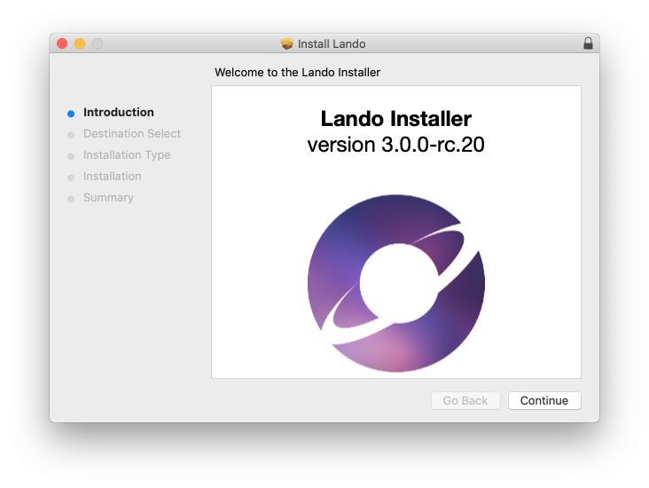

This guide will help you get up and running with [Lando](https://lando.dev/), an Open Source development tool intended for developers who prefer a painless, easily customizable local server environment configuration they can track in their source control repositories.

<Alert type="info" title="Note">

Lando does not currently provide a Graphical User Interface (GUI). Everything is managed from the command line.

</Alert>

## Before You Begin

Be sure that you have:

- An existing WordPress site on Pantheon, or [create](https://dashboard.pantheon.io/sites/create) one.
- Having a working knowledge of local server environments is helpful but not entirely necessary.
- While you’re at it be sure to check out [Lando getting started guide](https://docs.devwithlando.io/dev/started.html) and [Lando CLI usage](https://docs.lando.dev/basics/usage.html).

Installing Lando is straight forward. Be sure to check its [system requirements](https://docs.devwithlando.io/installation/system-requirements.html) to ensure you can proceed.

## Downloading and Install Lando

- The latest release of Lando for your OS can be found [here](https://github.com/lando/lando/releases). Download the appropriate release for your Operating System.
- Click to open the installer package. The installer has a few pre-flight checks it runs before getting started.

Once you finish following any system prompts, the Lando installation script will work its magic and install itself on your computer.

## Getting Started

You’ll manage your Lando instances via the command line. A shortlist of useful Lando commands can be found [here](https://docs.devwithlando.io/cli/usage.html). If you ever need a refresher, simply pull up your terminal and type `lando --help` and you will find the default commands returned. The Lando command is installed globally so you can run it from anywhere within your terminal.

<Alert type="info" title="Note">

It’s always a good idea to keep your projects’ site files and folders organized. Keep your website projects in separate folders from one another.

</Alert>

Create a separate folder to hold your Lando-powered installations rather than mixing with installs managed by other server environments.

## Installing WordPress Locally

Getting started with Lando can be disorienting at first. Fear not, mighty developer, that’s why this documentation exists! We’ll begin by installing and spinning up a fresh WordPress without Pantheon integration.

1. Open your terminal and get to the directory where you plan to run your fancy Lando WP site.
1. While in your terminal simply type `lando init`.

   

  You may choose to start from your current directory or you can clone from Pantheon, Github, or another remote repository, or zip file. For this step, we’ll choose Current Working Directory. 

1. Next, you’ll choose WordPress as your starting recipe.

  

1. For your webroot, you may press enter and Lando will spin up the site from your current directory.

1. Enter the name of the site. Use something you’ll remember!

  Your local site has been created but your still not done! You still need to start the app, download WordPress and then install WordPress. Sure, it’s a few steps but the command line practice is good for bone growth and keyboard-punching-dexterity.

1. In your terminal type `lando start`. This starts your lando app and gives you some basic information like your Appserver URLs to access the site in your local browser of choice.

Then type `lando wp core download`. This will download the core files for your website. This step isn’t necessary if you started with a Git or Pantheon repository instead of the current working directory.

  <Alert type="info" title="Note">

  This is where we talk a little bit about WP-CLI, Lando, and You. To use WP-CLI commands in Lando, simply prefix your wp command with lando and you’re good to go, Lando will run your WP-CLI command all nice like. 
  </Alert>

1. The `lando wp core download` command downloads the current stable release of WordPress and unpacks it in your current working directory.

1. Your WP configuration file still needs to be created. You can actually do this from the command line. However, we’re going to go to do this the ol’ fashioned way through the browser.

1. In your browser, enter in the URL given to you above: _http://yourappname.lndo.site_. You’ll notice WordPress’s _Famous Five Minute install_ screen.

1. Click next after choosing your preferred language and click Let’s Go on the following screen.

1. In Lando, for a WordPress installation without Pantheon, the Database, Username, and Password are all `wordpress` and Database Host is `database` (the all values are case-sensitive). Enter your credentials and complete the installation process! Congrats! You now have Lando installed with WordPress!

<Alert type="info" title="Note">

You can find your site’s login details simply by typing `lando info` in your terminal.

</Alert>

### Installing WordPress Using the Pantheon Recipe

Using Lando with Pantheon provides a couple of key advantages: One, it closely mimics Pantheon’s tech stacks and environments for your local environment, getting you as close to a one-to-one development setup as possible. The recipe also installs [Terminus] (if you don’t already have it installed), Pantheon’s powerful web server management API. And if that wasn’t enough, you can push and pull changes directly into Lando from any of your Pantheon environments.

To use this Lando recipe you must have an account with Pantheon, which you can register for free. Also, you need to have a Pantheon hosted instance ready to go. So you can either use an existing Pantheon site or spin up a whole new one.

1. For the WordPress site you created in the previous section, run `lando stop` in your terminal from within that site’s directory. And create a new directory for your WordPress + Pantheon integrated environment.

1. In your terminal, you may either type `lando init --source pantheon` or `lando init`. The only difference is that defining the source as pantheon allows you to skip a couple of prompts.

1. Choose your Pantheon account email from the following prompt and click/press Enter.

   \(img)

1. Next, choose the Pantheon site you want to pull from to create your local site.

  <Alert type="info" title="Note">

  Lando creates your local environment, mirroring your dev environment closely, and the clones down the site’s codebase (this part of the process does not include media files in the uploads folder or the site’s database). This part will take a few minutes or so depending on the site’s size on Pantheon.

  </Alert>

1. At this point, you should run `lando start`.

With your site started, you’ll have your local site URL so you can access it from your browser. But now you can also pull the code, media files, and the database from the site’s Pantheon environment.

### Pushing and Pulling Your Changes

Certainly, one of the most awesome benefits of using Lando with the Pantheon recipe is the ability to _push_ your changes from your local site to your various Pantheon environments (yes, including live and multi-dev instances).
To initiate a push from your local environment simply type `lando push`; conversely, type `lando pull` to perform a pull. Either action will have Lando prompt you for which environments you wish to pull/push your codebase, files, and database from or to.

<Alert type="info" title="Note">

Your _database_ refers to your app's database. Your _code_ refers to your app’s codebase. That is, any files that you would track within your site’s source control repository. Your _media_ refers to assets and files stored within the /uploads folder; generally speaking, it’s a good idea to NOT include your media files in your repository as your repo’s size can get out of hand quickly.

</Alert>

1. In your terminal, type `lando pull`.

1. For our purposes, you will choose dev but it’s important to note you CAN pull your files from any Pantheon environment, including multi-dev environments.

1. For the next prompt, you’ll be asked where or if you want to pull the database. Again, choose _dev_.

1. In the next prompt, again, choose _dev_ for files.

Lando also runs a search and replace on the database _siteurl_ and _sitename_ table fields and replaces Pantheon’s values with your local values.

  <Alert type="info" title="Note">

  Sometimes, it’s just a good do your own search and replace on your local site once a pull has finished. Also, it can be a good idea to run a search replace on a site on Pantheon you pushed to. Here’s how you can do both!

  `lando wp search-replace 'yourpantheondevurl.com' 'yourlocalapp.lndo.site'`

  -OR-

  `terminus wp yourpantheonsitename.dev -- search-replace 'yourlocalapp.lndo.site' ‘yourpantheondevurl.com'`

  </Alert>
