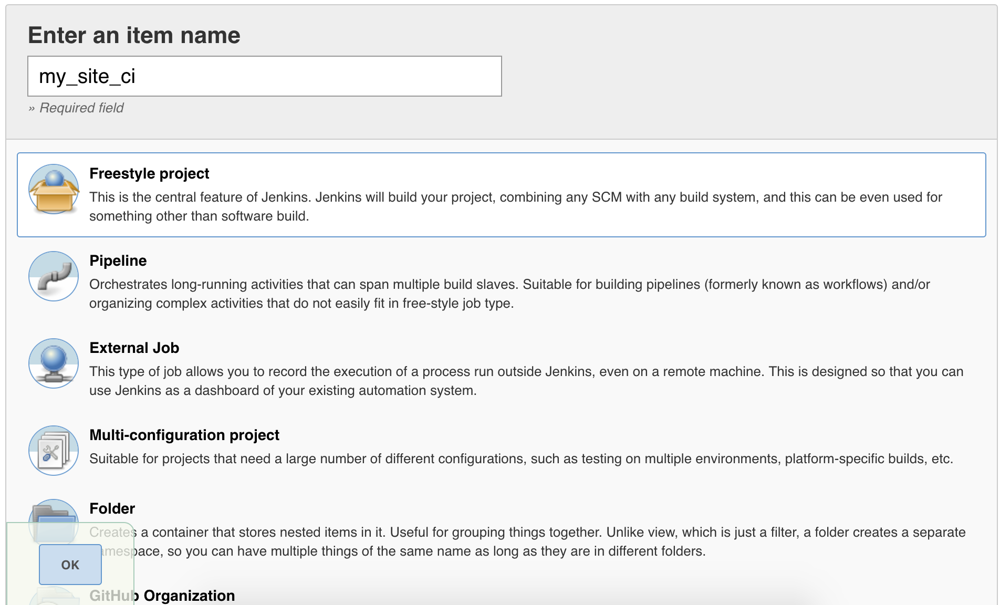
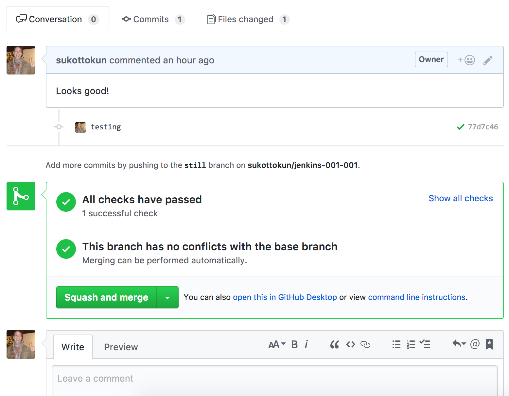

This section provides information on how to configure your Jenkins server to test and deploy code changes to Pantheon automatically.

[Jenkins](https://jenkins.io) is an open source Continuous Integration (CI) server that can be used to build, test, and deploy code on any Drupal and WordPress website on Pantheon. Unlike hosted services such as [CircleCI](https://circleci.com/), it is a Java application installed and run on a server, and requires regular upkeep and maintenance. Jenkins is customizable and can run non-CI related tasks, such as calling periodic cron jobs.

You can use Terminus and Jenkins to script much of your development work. For example, a post-commit hook can trigger Jenkins to create a Multidev environment with the latest code on your master branch and the content from Live. This process can even run automated browser tests using [Selenium](https://github.com/SeleniumHQ/selenium).

The sections below show you how to configure your existing Jenkins server to automatically test and deploy Drupal 8 to a Multidev environment on Pantheon following a code push to your GitHub repository. Jenkins runs tests against both the pull request and Pantheon's master branch and displays the results. The same workflow can be applied to WordPress with a few modifications:

<Accordion id="wordpress-mods" title="WordPress Modifications" icon="wrench">

WordPress users must make a few modifications:

- Install [WP-CLI](https://wp-cli.org/) on the Jenkins instance instead of Drush.
- Create a local copy of the new site from [https://github.com/pantheon-systems/example-wordpress-composer](https://github.com/pantheon-systems/example-wordpress-composer). 
- Specify WordPress when creating the Pantheon site: `terminus site:create $SITE "My Site" "WordPress"`
- Use WP-CLI commands for any build steps.

</Accordion>

## Before You Begin

Be sure that you have:

- Root access to a server running Jenkins.
- Installed the following applications, both locally and on the Jenkins server. Verify the default Jenkins user has the ability to run these applications on the Jenkins server from the command line.
  - [Git](https://git-scm.com/)
  - [Composer](https://getcomposer.org/)
  - [Drush](http://docs.drush.org/en/8.x/install-alternative)
  - [Terminus](https://github.com/pantheon-systems/terminus#installing-with-composer)
  - [Terminus Build Tools plugin](https://github.com/pantheon-systems/terminus-build-tools-plugin)

    - Verify you can run Terminus, Drush, and Composer commands as the Jenkins user. Note that Terminus and Drush must be accessible from standard `PATH` directories.
- Confirmed that the default Jenkins user has a [private key](https://stackoverflow.com/questions/37331571/how-to-setup-ssh-keys-for-jenkins-to-publish-via-ssh) in its `$HOME/.ssh` directory, and a user with the matching public key installed on Pantheon. Clone a Pantheon site to the Jenkins user's home directory to test.
- Set the Jenkins user's Git user name and email in **Manage Jenkins**, **Configure System**
- Added the lines below in the Jenkins user's `$HOME/.ssh/config` (if this file doesn't exist, you must create it).

  ```http
    Host *
        StrictHostKeyChecking no
  ```

- Enabled the following Jenkins plugins:
  - [Git](https://plugins.jenkins.io/github/)
  - [GitHub](https://wiki.jenkins-ci.org/display/JENKINS/GitHub+Plugin)
  - [GitHub Pull Request Builder](https://plugins.jenkins.io/ghprb/)
  - [Environment Injector](https://plugins.jenkins.io/envinject/)
  - [Conditional Build Step](https://plugins.jenkins.io/conditional-buildstep/)
  - [Run Condition](https://plugins.jenkins.io/run-condition/)
  - [Rebuild](https://plugins.jenkins.io/rebuild/)
- Matrix-based security (recommended when using Jenkins). Anonymous users should have read access to Jenkins projects.
- Ability to create a Drupal site on Pantheon with [Multidev](/guides/multidev) enabled.
- A [GitHub](https://github.com) account.

## Create A New Site

### Local Project Instantiation

1. Open your local terminal and use Composer to make a new local project based on the example, which contains Drupal 8, Behat, and other configuration settings:

  <Alert title="Note" type="info">

  In this example, the project is called `my-site`. Set a local environment variable to this value. Adjust this and other variables to match your site settings.

  </Alert>

  ```bash{promptUser: user}
  SITE="my-site"
  composer create-project pantheon-systems/example-drops-8-composer $SITE
  cd $SITE
  composer prepare-for-pantheon
  ```

1. Initialize a local Git repository within your project:

  ```bash{promptUser: user}
  git init
  git add -A .
  git commit -m "Initial commit."
  ```

### Create and Configure a GitHub Repository

1. Navigate to the GitHub dashboard, and [create a new repository](https://github.com/new) without creating a `README` or `.gitignore` file.

    

1. Open your local command line and connect your local project to this repository as `origin`, and then push the code to the master branch. Remember to replace the URL path:

  ```bash{promptUser: user}
  git remote add origin git@github.com:YOUR-ORG/YOUR-PROJECT.git
  git push -u origin master
  ```

You should now be able to create a local branch, commit a change, and push to GitHub. You should also be able to open a pull request on GitHub successfully.

### Create a Pantheon Site

You must create a site on Pantheon for this part of the process. The example in this section uses a Drupal 9 site on Pantheon with Terminus. You must overwrite the default install with the code from your GitHub repository after you create the site. Replace the value for `--org=` with your organization's name in the commands below.

1. Use Terminus to create a site on Pantheon:

  ```bash{promptUser: user}
  terminus site:create $SITE "My Site" "Drupal 9" --org="My Team"
  terminus connection:set $SITE.dev git
  ```

1. Add the Pantheon remote repository address and push the code to it:

  ```bash{promptUser: user}
  PANTHEON_REPO=$(terminus connection:info $SITE.dev --field=git_url)
  git remote add pantheon $PANTHEON_REPO
  git push --force pantheon master
  ```

1. Complete the Drupal site configuration on Pantheon, replacing the values for `--site-mail`, `--account-mail`, and `--account-name`:

  ```bash{promptUser: user}
  terminus build:env:install --site-mail="your email" --site-name="My Drupal Site" --account-mail="<your email>" --account-name="admin" $SITE.dev
  ```

1. Verify the site is installed and working:

  ```bash{promptUser: user}
  terminus env:view $SITE.dev
  ```

Now the master branch of GitHub, your local, and Pantheon are in sync.

## Configure Jenkins

### GitHub and Jenkins Integration

1. Open the main Jenkins menu on the left side, select **Credentials**, select **System**, select **Global credentials**, and then select **Add Credentials** to add your GitHub and Terminus tokens.

    

1. Open a new browser tab and go to your GitHub account. 

1. Go to [Settings](https://github.com/settings/profile) in GitHub, select **Developer Settings**, select **Personal access tokens**, and generate a new token. This should have all **repo** and **admin:repo-hook** options:

    

1. Copy the generated token. You will not be able to view the token again.

1. Navigate back to Jenkins and create your new credential with the following options:

    - **Kind**: Secret Text
    - **Scope**: Global
    - **Secret**: Paste the GitHub token you created.
    - **ID**: blank
    - **Description**: GitHub

1. Click OK to add the new credential to the system.

1. Create another credential for a Terminus Token, using either an existing token or [a new token](/machine-tokens) from your Jenkins user dashboard:

    - **Kind**: Secret Text
    - **Scope**: Global
    - **Secret**: Paste the Terminus token you created.
    - **ID**: blank
    - **Description**: Terminus

1. Save both credentials. Your credentials will be accessible for secure use.

    

    <Alert title="Note" type="info">
    Keep your Terminus token handy, you'll need to enter it again later.
    </Alert>

1. Return to the main Jenkins dashboard, select **Manage Jenkins**, and then select **Configure System**.

1. Scroll to the **GitHub Servers** section and click **Add GitHub Server**.

1. Leave the **API URL** as `https://api.github.com`, click the **Credentials** drop-down menu, and then select your GitHub credentials.

1. Click **Test Connection** to view the GitHub username that created the token.

1. Click **Save**.

### Create the Jenkins Project

1. Log in to the Jenkins dashboard as an admin user and click **New Item**.

    

1. Give the project a name with no spaces, select **Freestyle Project**, and click **OK** to save.

    

1. Click the **General** tab, select "GitHub project" and enter the repository URL (for example, `https://github.com/YOUR-ORG/YOUR-PROJECT`).

1. Click the **Source Code Management** tab, select **Git**, select **Advanced**, and then add the following information:

    - **Repository URL**: The path to the .git file of your repository, e.g. `https://github.com/YOUR-ORG/YOUR-PROJECT.git`
    - **Name**: `origin`
    - **Refspec**: blank
    - **Branch specifier**: `origin/*`
    - **Additional Behaviours**: Add **Prune stale remote-tracking branches**:

    

1. Click  **Build Triggers** and check the box labelled **GitHub hook trigger for GITScm polling**. This allows code changes to trigger your build (as opposed to setting up a periodic build, for example).

1. Click **Build Environment** and check the box labelled **Inject environment variables to the build process**.

1. Enter the path to your Jenkins environment variables file in the **Properties File Path** field. On Debian-based systems, this is usually `/var/lib/jenkins/envVars.properties`. If it doesn't already exist, create an empty file.

1. Add the variable below with your site's name, one per line, with no quotation marks in the **Properties Content** field:

    - **SITE_ID=**your-site-name

    

1. Check the **Use secret text(s) or file(s)** option, click **Bindings**, add a secret text binding named **TERMINUS_TOKEN**, and select the Terminus secret text credential from the drop-down menu:

    

### Add Build Steps

Under the **Build** tab is a button labeled **Add build step**. These tasks execute in sequence, and the job quits if any tasks fail. Add the tasks in separate build steps, selecting **Execute shell** for all but steps 1 and 6.

1. Set build status to **pending** on GitHub commit.

1. Add Jenkins logs into Pantheon:

  ```bash
  #!/bin/bash
  echo "Logging into Terminus"
  terminus auth:login --machine-token=${TERMINUS_TOKEN}
  ```

1. Verify the Dev environment is awake: and in Git mode.

  ```bash
  echo "Waking Dev environment."
  terminus env:wake -n ${SITE_ID}.dev
  ```

1. Verify that the Dev environment is in Git mode:

  ```bash
  echo "Setting site to git mode."
  terminus connection:set ${SITE_ID}.dev git
  ```

1. Set Jenkins to create a Multidev and push the new code to this environment:

  ```bash
  echo "Creating multidev"
  cd ${WORKSPACE}
  terminus build:env:create ${SITE_ID}.dev ci-${BUILD_ID} --yes
  ```

  ```bash
  echo "Run database updates and clear cache"
  terminus drush -n ${SITE_ID}.ci-${BUILD_ID} -- updatedb -y
  terminus drush ${SITE_ID}.ci-${BUILD_ID} cr
  ```

1. Test that the suite included with the example runs:

  ```bash
  echo "Running behat"
  TERMINUS_ENV=ci-$BUILD_ID TERMINUS_SITE=$SITE_ID $WORKSPACE/tests/scripts/run-behat
  ```

1. Add one **Conditional step (single)** build task to merge the code from the Pantheon Multidev to the pantheon/master, i.e. your Dev site on Pantheon. This will only happen when changing the master branch.

   - Under **Run?** select **Regular expression match**.

     - **Expression**: `(?i).*origin/master.*`

     - **Label**: `${ENV,var="GIT_BRANCH"}`

   - Under **Builder** select **Execute Shell**

     - Command:

      ```bash
      echo "Merging multi-dev changes to master"
      terminus build:env:merge -n ${SITE_ID}.ci-${BUILD_ID} --yes
      ```

    Your conditional step should look like this:
    

1. Create a cleanup task:

    ```bash
    echo "Cleaning up multidev & branches"
    git -C ${WORKSPACE} remote remove pantheon
    git -C ${WORKSPACE} remote prune origin
    terminus build:env:delete:ci ${SITE_ID} --keep=2  --yes
    ```

### Add Post-build Actions

1. Select **Post-build Actions**, click the **Add post-build action** button, and select the option **Set GitHub commit status (universal)**, and then choose the following options:

  - **Commit SHA**: Latest build revision.

  - **Repositories**: Any defined in job repository.

  - **Commit context**: From GitHub property with fallback to job name.

  - **Status Result**: One of default messages and statuses.

  - **Status backref**: Backref to the build

1. Click **Save** to complete the Jenkins build process configuration.

1. Create a new branch on your local computer and make a change to it. 

1. Commit and push to GitHub to initiate a build. You should see the results of the test, which link to the Jenkins job:

  

  Click the job, then select **Console Output** if a test fails to see the details.

  


Be sure to push to your new origin repo on GitHub if you usually use only the Pantheon repository.You can still add the Pantheon repo as a remote to take advantage of Multidev and work on your own environment. Continue to add new tests as you add new features.

## More Resources

- [Cron for WordPress](/wordpress-cron)
- [Cron for Drupal](/drupal-cron)