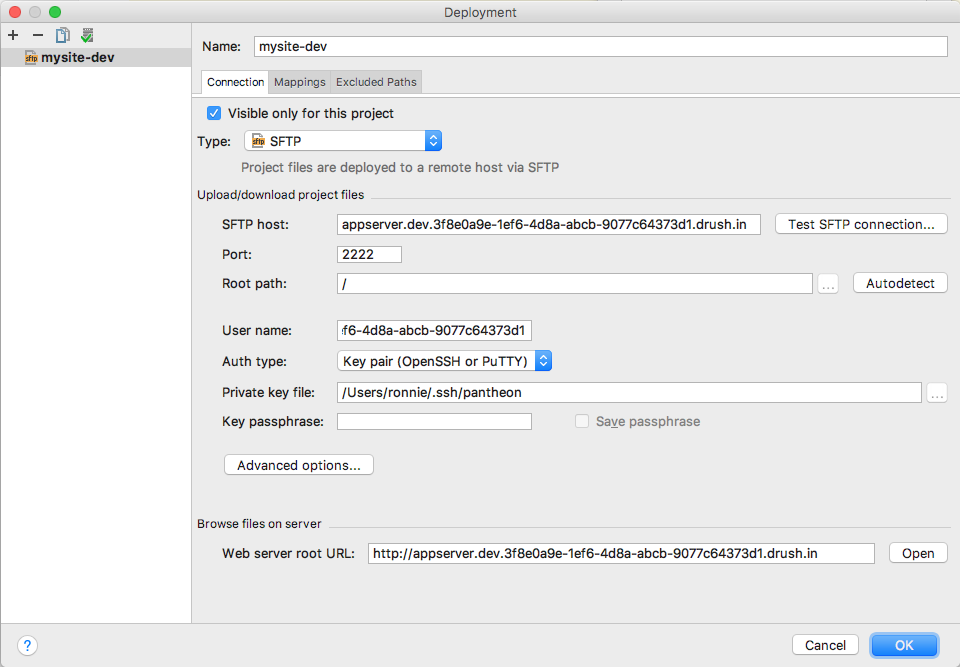
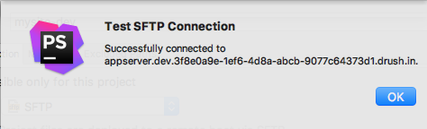

This section provides information on how to configure your local environment to build WordPress plugins or themes with [JetBrains PhpStorm](https://www.jetbrains.com/phpstorm/).

## Overview

JetBrains PhpStorm is a commercial PHP IDE that can be configured to work with WordPress sites. This allows you to build and maintain custom plugins. Follow the steps below to set up a local environment in PhpStorm to create your custom plugins and themes.

Refer to [WordPress Development using PhpStorm](https://confluence.jetbrains.com/display/PhpStorm/WordPress+Development+using+PhpStorm) for more information. The steps in this section focus on integrating and showcasing the PhpStorm workflow and is current as of PhpStorm version 2017.1.4.

## Create a WordPress site

[Create a new WordPress site](/guides/quickstart) on Pantheon if you don't already have one. This site should be empty to develop your new plugin or theme.

## Clone the Code Repository

Copy your site code to your local workstation using [SFTP](/sftp#sftp-connection-information) or clone your site codebase with [Git](/guides/git/git-config#clone-your-site-codebase).

## Create a PhpStorm Project

1. Open PhpStorm.

1. Click **Create New Project** in the startup window or go to **File Menu**, and click **New Project...** if you have an existing project open.

1. Name your project.

1. Select **WordPress Plugin** as the project type on the left sidebar.

1. Specify or browse to the file path to save your project's files. This is where PhpStorm will store working files, and should be separate from your WordPress directory.

1. Specify or browse to the root directory for your local WordPress site, and click **Create**.

    

There will be no open files in your project after you complete these steps. You can find a PHP file in the project's root with the standard plugin header for WordPress.

## Configure WP-CLI (Optional)

Many WordPress plugin developers use the command line tool [WP-CLI](https://make.wordpress.org/cli/handbook/). This is useful if you have a local development environment and want to use WP-CLI to manage it.

<Alert title="Note" type="info">
You must successfully create a project before adding WP-CLI as a Command Line Tool.
</Alert>

You can configure PhpStorm to recognize WP-CLI from within your project after you have installed WP-CLI on your local machine by following these steps:

1. Launch PhpStorm, click **Menu**, and then click **Preferences...**

1. Navigate to the Tools Section, click [Command Line Tool Support](https://www.jetbrains.com/help/phpstorm/command-line-tool-support.html), and then click the **+** icon to add an entry.

1. Choose the tool **WP-CLI**, and click **OK**.

1. Select **Executable Available** and enter the file path to your local `wp` directory.
 

1. Click **OK** to save the changes.

## Configure Your Pantheon Development Environment

1. Set your [Dev environment to SFTP mode](/sftp#sftp-mode), and click **Connection Info** to see the connection settings.

1. Open your PhpStorm project, select the **Tools Menu**, select  **Deployment**, and then click the **Configuration...** option.

1. Click **+** to [add a web server](https://www.jetbrains.com/help/phpstorm/add-server-dialog.html).

1. Enter your Pantheon site name, followed by a dash and the environment.

1. Select **SFTP** for type and click **OK**.

### Connection Tab

Use your site's [SFTP connection information](/sftp#sftp-connection-information) to configure the Connection tab:

1. **Type:** `SFTP`

1. **SFTP Host:** `appserver.dev.<Site UUID>.drush.in`

1. **Port:** `2222`

1. **User name:** `dev.<Site UUID>`

1. **Auth Type:** Select **Password** and specify password, or key pair and select your private SSH key.

1. **Root Path:** Click the **Autodetect** button and the Root Path should be automatically populated:

    

    <Alert title="Warning" type="danger">

    PhpStorm does not allow the Root Path to be left blank. Because the Pantheon platform sometimes migrates sites across app servers without warning, you must update the root path any time the binding path changes for your Dev environment.
    </Alert>

1. Click the **Test SFTP Connection...** button and make sure the connection is successful. 

1. Click **OK**.

    

### Mappings Tab

You must populate the file paths within the Mappings tab to allow correspondence between project folders:

1. **Local path:** This field is automatically populated and requires no edits.

1. **Deployment path on server:** `/code`

1. **Web path on server:** `/`

1. Click **OK**.

## Enable Automatic Upload

1. Open your PhpStorm project and select the **Tools Menu**.

1. Select **Deployment**, and then select **Automatic Upload**.

You are now ready to edit your code. Any files you change and save locally will be automatically uploaded to your Pantheon Dev environment.

## More Resources

- [Configure Your wp-config.php File](/guides/php/wp-config-php)
- [PHP on Pantheon](/guides/php)
- [SFTP Mode](/sftp#sftp-mode)