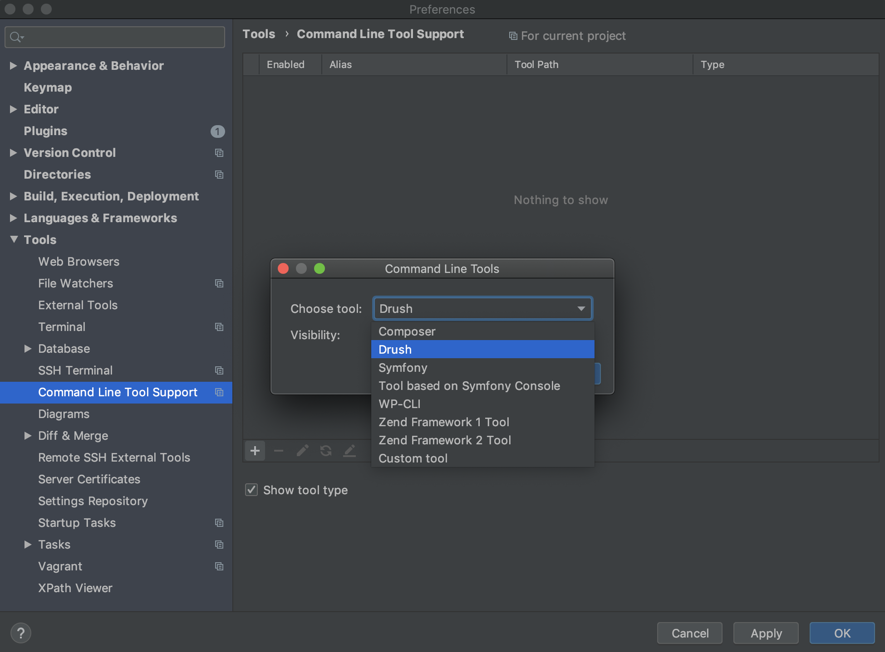

This section provides information on how to configure your local environment to build Drupal modules with [JetBrains PhpStorm](https://www.jetbrains.com/phpstorm/).

Refer to [Drupal Development Using PhpStorm](https://confluence.jetbrains.com/display/PhpStorm/Drupal+Development+using+PhpStorm) and [Developing on Pantheon with PhpStorm](https://confluence.jetbrains.com/display/PhpStorm/Developing+on+Pantheon+with+PhpStorm) for more information.

## Initial Site Setup

[Create your site on Pantheon](/guides/legacy-dashboard/create-sites) if you haven't already, and then set up your local environment.

## Clone the Code Repository

Make sure your Dev environment is in Git mode, then [clone your Git repository](/guides/git/git-config) to your local workstation.

## Create a New PhpStorm Project

1. Open PhpStorm and create a new project from existing files.

1. Open the **Create New Project: Choose Your Scenario** window, select **Source files are in a local directory, no Web server is yet configured**, and then click **next**:

  

1. Choose the [project directory](https://www.jetbrains.com/help/phpstorm/create-new-project-choose-project-directory.html).

1. Select the parent folder for all the project sources and click the **Project Root** icon, or choose **Project Root** on the menu.

1. Click **Finish**.

## Configure a PhpStorm Project

1. Ensure that PhpStorm uses [Drupal settings](https://www.jetbrains.com/help/phpstorm/drupal.html): go to **Preferences**, select **Languages & Frameworks**, and then select **PHP**.

1. Expand the **Drupal** drop-down menu.

1. Enable Drupal integration and select the Drupal installation path.

1. Set up PHP/Include Paths.

1. Select the Drupal major version.

1. Configure the correct version of PHP: go to **Preferences**, select **Languages & Frameworks**, select [**PHP**](https://www.jetbrains.com/help/phpstorm/php.html), and choose PHP Language Level with the appropriate version of PHP (e.g. 8.0).

### Drush Support

We recommend [enabling Drush support](https://confluence.jetbrains.com/display/PhpStorm/Drupal+Development+using+PhpStorm#DrupalDevelopmentusingPhpStorm-DrupalCommandLineToolDrushIntegration).

1. Open **Preferences**, select **Tools**, select [**Command Line Tool Support**](https://www.jetbrains.com/help/phpstorm/command-line-tool-support.html), and then click **Plus**.

1. Select **Choose Tool**, select **Drush**, and then specify the path.

  

## Configure On-Server Development

1. Put your [Dev environment into SFTP mode](/sftp) and then click **Connection Info** to see the connection settings.

1. Open PhpStorm, select **Build**, select **Execution**, and then select **Deployment**.

1. Click **plus** for the [add server dialog](https://www.jetbrains.com/help/phpstorm/add-server-dialog.html), and select **SFTP**.

  

1. Enter the Pantheon site name followed by a dash and the environment. For example: `anita-drupal-dev`

### Connection Tab

[Configure the server](https://www.jetbrains.com/help/phpstorm/deployment-connection-tab.html) connection tab in the following order:

1. **SFTP Host**: SFTP Host from Connection Info

1. **Port**: 2222

1. **Username**: Username from Connection Info

1. **Auth Type**: Key Pair

1. **Private Key File**: Navigate to the location of your `id_rsa` file. Example: `/Users/jon/.ssh/id_rsa`

1. Click **Test SFTP Connection...**

1. **Root Path**: Click Autodetect, navigate to the end of the detected path and add `/code` to the end.

### Mappings Tab

1. **Deployment path on server:** `/code`

1. **Web path on server:** URL of your Pantheon Dev environment. Example: `https://dev-anita-drupal.pantheonsite.io`

1. Click **OK**.

1. Go to **Tools**, select **Deployment**, select **Automatic Upload**, and then select the server you created.

Files you change and save locally will now be automatically uploaded to Pantheon.

## More Resources

- [Drush on Pantheon](/guides/drush)
- [Using Drupal with Pantheon](/develop-drupal)
- [Configure Your Drupal Settings.php File](/guides/php/settings-php)