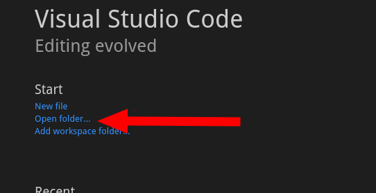

This section provides information on how to develop your Pantheon site locally with Visual Studio Code.

[Visual Studio Code](https://code.visualstudio.com/), or **VS Code**, is an open-source code editor that runs on Windows, Linux, and Mac OS.

You can set up a Pantheon site in VS Code and push local changes to your Pantheon environment with Git. You can also use the VS Code SFTP extension to sync code between your Pantheon site and local machine.

## Before You Begin

1. [Create a site](/guides/legacy-dashboard/create-sites) on Pantheon, or browse to the Dev environment Dashboard of an existing site.

1. Use [Git](/guides/git/git-config#clone-your-site-codebase), [SFTP](/guides/sftp/rsync-and-sftp), or[rsync](/guides/sftp/rsync-and-sftp) to clone your site files on the Dev environment down to your local machine.

  If you intend to upload code changes via SFTP, place your site code in a subdirectory called `code` (for example, `~/sites/mysite/code`). This aligns with the file structure on the platform when using [SFTP mode](/sftp).

1. Download and install [VS Code](https://code.visualstudio.com/).

## Create a VS Code Workspace

A Workspace in VS Code contains settings for your project, including recommended extensions, configuration for extensions, and project-specific debugging configuration.

1. Navigate to the VS Code Welcome screen, click **Open folder...** under the **Start** heading:

  

  If you have already closed the Welcome screen, click **Open...** in the **File** menu.

1. Navigate to your filesystem and select the directory containing your site (for example, `~/sites/mysite`).

1. Save this as a Workspace by selecting **Save Workspace As...** from the **File** menu.

    Workspace settings are stored in a file called `.code-workspace` at the root of your project. We recommend that you keep this file out of Git by adding it to your `.gitignore` file at either the site or global level:

  ```git:title=.gitignore
  // highlight-start
  # Ignore VSCode Workspace Files
  *.code-workspace
  // highlight-end

  # WordPress #
  ############
  wp-config-local.php
  wp-cli.local.yml
  wp-content/uploads
  wp-content/blogs.dir/
  wp-content/upgrade/

  ```

1. Click a file name in the File Explorer on the left side of VS Code to open it and make edits in the main window.

## Deploy Local Code Changes to a Pantheon Environment

You must push code changes up to your Pantheon Dev or Multidev environment. You can do this with Git or SFTP.

### Push Changes with Git (Recommended)

VS Code includes Git integration and an integrated terminal, either of which can be used to make Git changes and push them back to your Pantheon repository and Dev environment.

1. Make sure your site is in [Git mode](/guides/quickstart/connection-modes) before pushing code via Git.

1. Make changes to your local site.

1. Push your changes:

  ```bash
  git push
  ```

#### Git Version Control in VS Code

1. Open the Git menu and press **Ctrl** + **Shift** + **G** or click **View** and select **SCM**. 

1. Review your outstanding changes before you commit them with a message.

You can also switch branches. Refer to the [video on the VS Code docs](https://code.visualstudio.com/docs/introvideos/versioncontrol) for more information.

#### Integrated Terminal

1. Open the [integrated terminal](https://code.visualstudio.com/docs/editor/integrated-terminal) with **Ctrl** + **`** or click **View** and select **Terminal**. 

1. Interact with Git as you would normally, without leaving VS Code.

### Upload your Changes with SFTP

The SFTP extension for VS Code allows developers to upload code to the Pantheon Dev or Multidev environment directly from VS Code, as well as download files from the Pantheon servers.

1. Make sure your site is in [SFTP mode](/sftp#sftp-mode) before uploading code via SFTP.

1. Install the VS Code [SFTP Extension](https://marketplace.visualstudio.com/items?itemName=liximomo.sftp).

1. Open the VS Code command palette (**Ctrl/Command** + **Shift** + **P**) and run `SFTP: config` to open the SFTP config file.

1. Edit the file using the connection information from your Site Dashboard, under the **Connect with SFTP** button in **Development Mode**. Remove the `remotePath` line, as the path is subject to change and you'll be automatically directed to the correct location:

  ```json:title=sftp.json
  {
      "name": "My Site",
      "host": "appserver.dev.YOUR-SITE-UUID.drush.in",
      "protocol": "sftp",
      "port": 2222,
      "username": "dev.LOGIN-UUID",
      "uploadOnSave": true
  }
  ```

1. Include the path to your [SSH Key](/ssh-keys) if you have one added to your Pantheon account:

  ```json:title=sftp.json
  {
      "name": "My Site",
      "host": "appserver.dev.YOUR-SITE-UUID.drush.in",
      "protocol": "sftp",
      "port": 2222,
      "username": "dev.LOGIN-UUID",
      "uploadOnSave": true,
      //highlight-next-line
      "privateKeyPath": "/Users/localUser/.ssh/id_rsa"

  }
  ```

  If you aren't using a key, you'll be prompted to enter a password when using SFTP. See [Dashboard Credentials](/sftp#dashboard-credentials) for more information.

  <Alert title="Warning" type="danger">

  If you use an RSA key and get the following error, you must convert your key to PEM format: `Error while signing data with privateKey: error:06000066:public key routines:OPENSSL_internal:DECODE_ERROR`

  ```bash
  ssh-keygen -p -m PEM -f ~/.ssh/id_rsa
  ```

  This may have unintended consequences if you're using this key to authenticate to other systems. We recommend making a new key specifically for this application to convert.

  Refer to [this issue](https://github.com/liximomo/vscode-sftp/issues/594) on the [vscode-sftp](https://github.com/liximomo/vscode-sftp) plugin GitHub repo for more information.

  </Alert>

1. Set `uploadOnSave` to `true`. The next time you save changes to a file it will automatically be pushed to Pantheon.

1. [Commit your files to Git using the Pantheon Dashboard](/sftp#committing-sftp-changes).

## CMS-specific Extensions

VS Code's basic functionality can be extended by adding third-party extensions, and a number of these exist for Drupal, WordPress, and PHP. Refer to the sites below for useful CMS-specific extensions.

- Drupal: [Drupal.org - Configuring Visual Studio Code](https://www.drupal.org/docs/develop/development-tools/configuring-visual-studio-code)
- WordPress: [Delicious Brains - Using VS Code for WordPress Development](https://deliciousbrains.com/vs-code-wordpress/)

## More Resources

- [Git on Pantheon](/guides/git)
- [Drush](/guides/drush)
- [WP-CLI on Pantheon](/guides/wp-cli)

