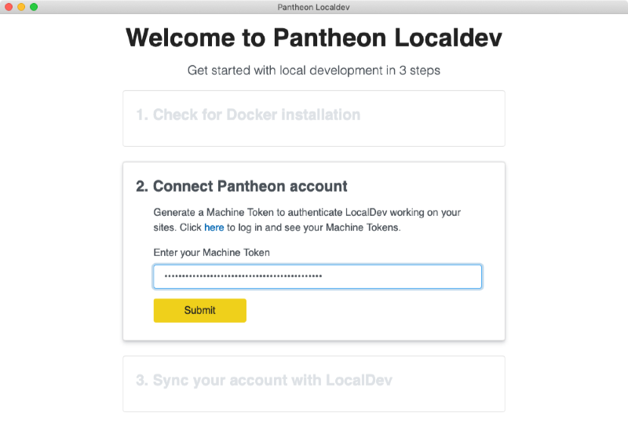

If you have an older pre-release version of Localdev already installed on your machine, remove it to avoid potential compatibility issues. Stable Lando releases include support for automatic updates.

1. Download and install the [latest Localdev](https://pantheon-localdev.s3.amazonaws.com/localdev-stable.dmg) `.dmg` file.

1. Localdev checks the Docker installation, and can install or update it for you if needed. Once it's done, click **Continue installation**.

    - If you leave the **Allow Localdev to report usage and errors** box checked, anonymous usage and errors and will be reported to help improve the application. You can change this setting again later if you change your mind.

  The Docker window may open several times instructing you to start the Docker server. You can ignore this and minimize the window.

1. [Create a machine token](/machine-tokens/#create-a-machine-token) for Localdev:

    1. Click the **here** link in Localdev's **Connect Pantheon account** step to open a browser to the **Create New Token** section of your Pantheon Dashboard.
    1. Click **Generate token** to keep the pre-populated name and create a token.
    1. Copy the **Machine Token** from the modal. This token will only be shown once, so go to the next step before you click **I understand**.
    1. In Localdev, paste the token into the box below **Enter your Machine Token** and click **Submit**.

      

1. Once Localdev successfully authenticates your account, click **Start** to sync your account with Localdev.

    - If you still have **Your new machine token is ready** in your browser from the previous step, click **I understand** there to close the modal.

1. Click **Go to Localdev** to show the Localdev dashboard.

Once Localdev is installed and synced, a list of your sites is displayed in a column on the left:

